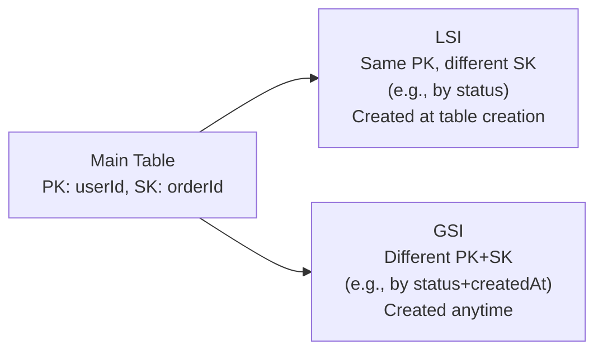

# AWS NoSQL Databases

## Amazon DynamoDB

Fully managed key-value and document store. Single-digit millisecond performance at any scale.

### Data Model

```
Table: Orders
├── Item (PK: orderId="ORD-001", SK: userId="USR-123")
│   ├── status: "PENDING"
│   ├── amount: 142.99
│   └── createdAt: 1705312800
└── Item (PK: orderId="ORD-002", SK: userId="USR-456")
    └── ...
```

- **Table:** collection of items
- **Item:** one record (max 400KB)
- **Partition Key (PK):** determines which partition the item goes to
- **Sort Key (SK):** optional second key for range queries within a partition

### Capacity Modes

| Mode | Description | Use case |
|------|-------------|---------|
| **On-demand** | Pay per request, instant scaling | Unpredictable traffic, new tables |
| **Provisioned** | Specify RCU/WCU, cheaper at steady load | Predictable traffic |

- 1 RCU = 1 strongly consistent read of ≤4KB/sec (or 2 eventually consistent reads)
- 1 WCU = 1 write of ≤1KB/sec

### Consistency Models

| Model | Description | Cost |
|-------|-------------|------|
| **Eventually Consistent** | Read may not reflect most recent write | 0.5 RCU |
| **Strongly Consistent** | Always returns latest data | 1 RCU |
| **Transactional** | ACID across multiple items | 2 RCU |

### Indexes



| | LSI (Local Secondary Index) | GSI (Global Secondary Index) |
|--|---------------------------|------------------------------|
| Partition key | Same as table | Different from table |
| Sort key | Different from table | Any attribute |
| Create when | Table creation only | Anytime |
| Consistency | Strong or eventual | Eventual only |
| Partition limit | 10GB per PK | No limit |

### DynamoDB Streams + Lambda

Change data capture — trigger Lambda on every item change:

```yaml
# Lambda EventSourceMapping
Properties:
  EventSourceArn: !GetAtt OrderTable.StreamArn
  FunctionName: !Ref ProcessOrderFunction
  StartingPosition: LATEST
  BatchSize: 100
  FilterCriteria:
    Filters:
      - Pattern: '{"dynamodb": {"NewImage": {"status": {"S": ["COMPLETED"]}}}}'
```

### Global Tables

Multi-region active-active replication:

```bash
aws dynamodb create-global-table \
  --global-table-name Orders \
  --replication-group '[
    {"RegionName": "us-east-1"},
    {"RegionName": "eu-west-1"},
    {"RegionName": "ap-northeast-1"}
  ]'
```

Each region can read and write. Conflicts resolved by "last writer wins" (timestamp-based).

### DAX — DynamoDB Accelerator

In-memory cache for DynamoDB with microsecond read latency:

```
App → DAX (μs cache hit) → DynamoDB (ms on cache miss)
```

API-compatible with DynamoDB SDK — change endpoint, no code changes. Cluster mode (3 nodes minimum for HA). Not for write-heavy workloads — DAX caches reads, not writes.

### TTL (Time to Live)

Auto-expire items without cost (deletes don't consume WCU):

```python
import time
response = table.put_item(Item={
    'sessionId': 'abc123',
    'userId': 'usr-456',
    'ttl': int(time.time()) + 86400  # expire in 24 hours
})
# Enable TTL: aws dynamodb update-time-to-live --attribute-name ttl
```

### Partition Key Design (Critical for Performance)

**Hot partition problem:** All traffic goes to one partition key → throttling even when total capacity is fine.

- ✅ High-cardinality keys: `userId`, `orderId`, `deviceId`
- ❌ Low-cardinality: `status` (only a few values → hot partition)
- ❌ Monotonically increasing: timestamps as PK → all recent writes hit same partition

**Shard trick:** `productId + random suffix` → spread across `productId_0` to `productId_9`

---

## Amazon Keyspaces (Cassandra)

Managed Apache Cassandra-compatible service. Wide-column store — rows have flexible schemas.

**Use cases:** Time-series data with high write throughput, IoT sensor data, audit logs.
**Key difference from DynamoDB:** Cassandra Query Language (CQL), wide rows, better for time-series.

## Amazon DocumentDB (MongoDB Compatible)

Managed document database, MongoDB API compatible.

**Use cases:** Content management, catalogs, user profiles (JSON documents).
**Note:** Not full MongoDB — some features unsupported. Consider Atlas MongoDB for full compatibility.

---

## Common Interview Questions

**Q: How do you choose a partition key to avoid hot partitions?**
Choose high-cardinality attributes that spread evenly (userId, orderId). Avoid status fields or timestamps as standalone PK. For time-series, add a shard suffix (`timestamp#shard_0` to `timestamp#shard_9`) and scatter-gather queries across shards. Monitor `SuccessfulRequestLatency` and `ConsumedWriteCapacityUnits` per partition key with CloudWatch.

**Q: GSI vs LSI — when to use each?**
LSI: only option if you need strong consistency on the secondary index or if you'll query within a single partition key (e.g., all orders for a user sorted by different attributes). LSI must be created at table creation. GSI: more flexible (any attributes for PK/SK, created anytime), but eventually consistent only and has its own capacity.

**Q: When DynamoDB vs RDS?**
DynamoDB: known access patterns, high throughput at scale (millions of requests/second), no complex joins, document/key-value model, variable schema. RDS: complex queries (JOINs, GROUP BY), ACID transactions across many tables, relational data model, reporting/analytics queries. DynamoDB Transactions handle multi-item ACID but within DynamoDB only.

**Q: What is the single-table design pattern?**
In DynamoDB, you often store multiple entity types in one table (no JOINs available). PK becomes the entity type + ID, SK becomes the relationship or secondary identifier. A user and their orders in the same table: PK=`USER#123`, SK=`METADATA` for profile; PK=`USER#123`, SK=`ORDER#456` for orders. Enables efficient access without cross-table queries.
