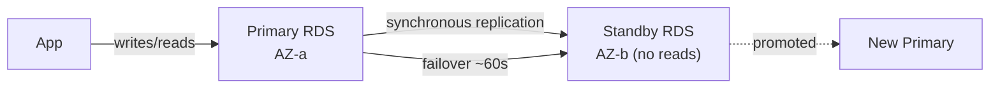
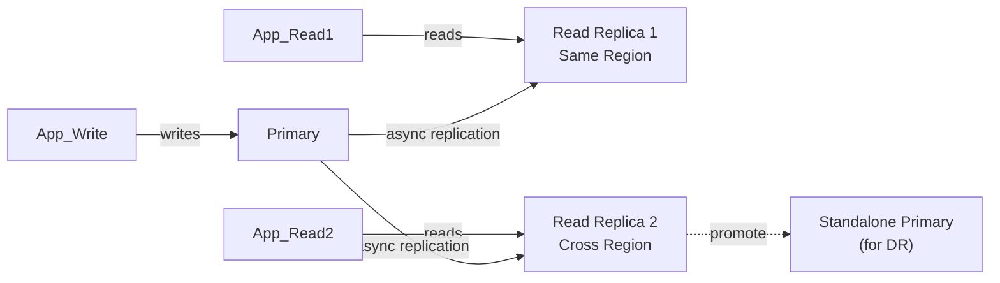
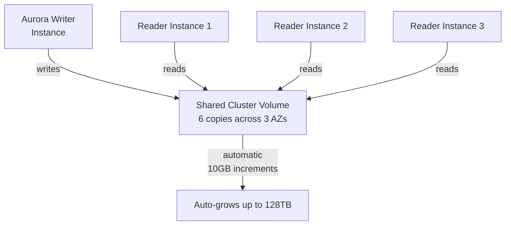

# AWS SQL Databases — RDS & Aurora

## Amazon RDS

Managed relational database service supporting: **MySQL, PostgreSQL, MariaDB, Oracle, SQL Server**.

AWS handles: OS patching, backups, failover, storage scaling.

You handle: schema design, query optimization, parameter tuning.

### High Availability — Multi-AZ



- Synchronous replication to a standby in a different AZ
- Automatic failover in ~60-120 seconds on primary failure
- Standby receives NO read traffic (it's a failover target only)
- DNS endpoint updates automatically after failover

### Read Replicas



- Up to 5 read replicas per RDS instance (15 for Aurora)
- **Asynchronous** replication — reads may lag behind writes
- Can be cross-region (disaster recovery)
- Can be promoted to standalone primary

| | Multi-AZ | Read Replica |
|--|---------|-------------|
| **Purpose** | High availability | Read scaling + DR |
| **Replication** | Synchronous | Asynchronous |
| **Read traffic** | ❌ No reads from standby | ✅ Yes |
| **Failover** | Automatic | Manual promotion |
| **Cross-region** | ❌ | ✅ |

### Key Features

- **Automated backups:** 1-35 day retention, PITR (point-in-time recovery)
- **Storage autoscaling:** Automatically grows storage (no downtime)
- **Enhanced Monitoring:** OS-level metrics (60 metrics vs basic 5)
- **Performance Insights:** Wait events, top SQL queries
- **Parameter Groups:** DB engine config (e.g., `innodb_buffer_pool_size`)

### RDS Proxy

Connection pooling layer for serverless workloads (Lambda → RDS):

```
Lambda functions → RDS Proxy → RDS Primary
(1000s of connections) → (pool of 100 connections)
```

**Problem:** Lambda scales to thousands of instances, each opening a DB connection. RDS connection limit (e.g., 100 for t3.medium) exhausted quickly.

**RDS Proxy:** Pools connections, multiplexes thousands of Lambda functions onto a small connection pool. Also supports IAM auth and Secrets Manager rotation.

---

## Amazon Aurora

AWS-native relational database — MySQL and PostgreSQL compatible, but rebuilt from scratch for the cloud.

### Aurora Architecture



- **6-way replication:** 2 copies per AZ, 3 AZs — tolerates 2 AZ failures for writes, 3 for reads
- **Storage auto-grows:** 10GB increments, up to 128TB, no downtime
- **Up to 15 read replicas** (vs 5 for RDS)
- **Failover:** < 30 seconds (vs 60-120s for RDS Multi-AZ) — reader is promoted
- **Cluster endpoint:** Auto-routes writes to primary, reads to replicas

### Aurora vs RDS

| Feature | Aurora | RDS |
|---------|-------|-----|
| Replication | 6-way (3 AZs) | 2-way (Multi-AZ) |
| Read replicas | Up to 15 | Up to 5 |
| Storage | Auto-grow to 128TB | Provision up to 64TB |
| Failover | < 30s | 60-120s |
| Cost | ~20% more than RDS | Base |
| Compatibility | MySQL + PostgreSQL | Multiple engines |
| Serverless option | ✅ Aurora Serverless v2 | ❌ |

### Aurora Serverless v2

Scales compute in **fine-grained ACU (Aurora Capacity Units)** increments — ideal for variable/unpredictable load:

```bash
aws rds create-db-cluster \
  --engine aurora-postgresql \
  --serverless-v2-scaling-configuration MinCapacity=0.5,MaxCapacity=128
```

0.5 ACU = ~1GB RAM. Scales in < 1 second.

### Aurora Global Database

Cross-region with < 1 second replication lag:

```
us-east-1 (Primary)  →  eu-west-1 (Secondary, read-only)
                     →  ap-northeast-1 (Secondary, read-only)
```

- RPO ≈ 1 second, RTO < 1 minute (promote secondary in DR)
- Reads served locally in each region (low latency for global users)

---

## Common Interview Questions

**Q: RDS Multi-AZ vs Read Replica — what's the difference?**
Multi-AZ: synchronous standby for high availability — automatic failover but no read traffic. Read Replica: asynchronous copy for read scaling — you direct reads there explicitly, can promote manually for DR. Multi-AZ = HA, Read Replica = scaling + DR. Aurora combines both: all readers share the same storage, failover < 30s.

**Q: When to choose Aurora over RDS?**
Aurora for: high-availability requirements (< 30s failover), > 5 read replicas needed, storage > 64TB, global multi-region reads, or serverless variable load. RDS for: Oracle/SQL Server (Aurora doesn't support), cost-sensitive workloads (Aurora is ~20% more), or specific DB engine features not in Aurora.

**Q: What is RDS Proxy and when do you need it?**
RDS Proxy pools connections between application clients (especially Lambda) and RDS/Aurora. Essential when Lambda (or any auto-scaling compute) creates more DB connections than the instance can handle. Also supports Secrets Manager rotation without application restarts — keeps existing connections alive during rotation.

**Q: How do you achieve RPO ≈ 0 with Aurora?**
Aurora Global Database: < 1 second replication lag between primary and secondary regions. In a disaster, promote the secondary — data loss ≈ 1 second. For truly zero RPO, you'd need distributed transactions across regions (very complex). Aurora Global's RPO of < 1s is acceptable for most SLAs.
