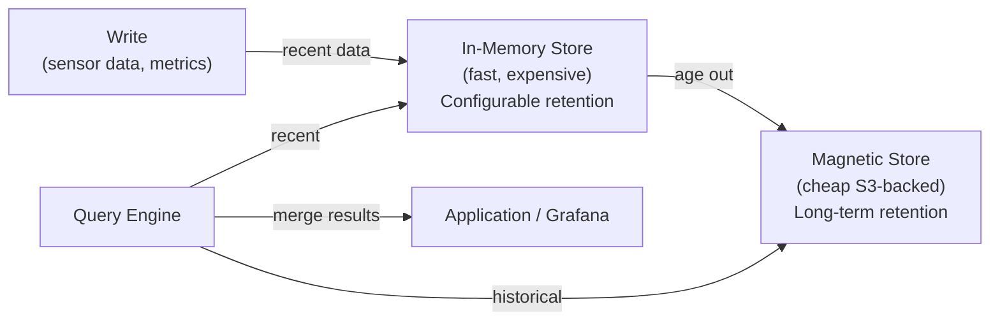

# Amazon Timestream — Time Series Database

> Managed time series database optimized for IoT, DevOps metrics, and application telemetry. Auto-tiers data from in-memory (hot) to magnetic storage (cold) based on age.

## Why Time Series Databases?

Traditional DBs store rows — querying time-series data requires scanning millions of rows. Time series DBs are purpose-built for:

- **High write throughput** (millions of data points/second)
- **Time-based queries** (last 5 minutes, hourly averages, rate of change)
- **Data tiering** (recent data fast, old data cheap)
- **Built-in time functions** (interpolation, smoothing, binning)

## Architecture — Automatic Data Tiering



- **Memory store:** Fast reads, configurable retention (hours to days)
- **Magnetic store:** Cost-effective, configurable retention (days to years)
- Automatic tiering — no manual intervention

## Data Model

```
Database → Table → Records

Record:
  - Dimensions: key-value metadata (immutable labels, like Prometheus labels)
    e.g., region=us-east-1, service=payment-api, host=ip-10-0-1-15
  - Measure: the actual value being recorded
    e.g., cpu_utilization=72.5, latency_ms=142
  - Time: timestamp (nanosecond precision)
```

Multi-measure records (multiple metrics in one write — more efficient):

```python
import boto3

client = boto3.client('timestream-write', region_name='us-east-1')

record = {
    'Dimensions': [
        {'Name': 'region', 'Value': 'us-east-1'},
        {'Name': 'service', 'Value': 'payment-api'},
        {'Name': 'host', 'Value': 'ip-10-0-1-15'}
    ],
    'MeasureName': 'system_metrics',
    'MeasureValueType': 'MULTI',
    'MeasureValues': [
        {'Name': 'cpu_utilization', 'Value': '72.5', 'Type': 'DOUBLE'},
        {'Name': 'memory_used_mb', 'Value': '2048', 'Type': 'BIGINT'},
        {'Name': 'latency_p99_ms', 'Value': '145.2', 'Type': 'DOUBLE'}
    ],
    'Time': str(int(time.time() * 1000)),
    'TimeUnit': 'MILLISECONDS'
}
client.write_records(DatabaseName='metrics', TableName='system', Records=[record])
```

## SQL Query Language with Time Functions

```sql
-- Average CPU per host over last hour
SELECT host, AVG(cpu_utilization) as avg_cpu
FROM metrics.system
WHERE time BETWEEN ago(1h) AND now()
GROUP BY host

-- Binned 5-minute averages
SELECT bin(time, 5m) as time_bin, service, AVG(latency_p99_ms)
FROM metrics.system
WHERE time > ago(24h)
GROUP BY time_bin, service
ORDER BY time_bin ASC

-- Detect if metric is missing (gap detection)
SELECT host, interpolate(cpu_utilization, LAST) as filled_cpu
FROM metrics.system
WHERE time BETWEEN ago(6h) AND now()

-- Rate of change
SELECT service,
  DERIVATIVE(AVG(requests_total), 1m) as requests_per_minute
FROM metrics.system
WHERE time > ago(1h)
GROUP BY service, bin(time, 1m)
```

## Scheduled Queries

Pre-compute expensive aggregations and store results in another Timestream table — reduces query latency for dashboards:

```sql
-- Scheduled query: pre-compute hourly P99 latency
SELECT bin(time, 1h) as hour, service,
  approx_percentile(latency_ms, 0.99) as p99_latency
FROM metrics.system
WHERE time BETWEEN @scheduled_query_start AND @scheduled_query_end
GROUP BY bin(time, 1h), service
```

## Grafana Integration

Timestream is a native Grafana data source (no Prometheus needed):

```yaml
# Grafana data source config
datasources:
  - name: Timestream
    type: grafana-timestream-datasource
    jsonData:
      defaultRegion: us-east-1
      defaultDatabase: metrics
      defaultTable: system
```

## Timestream vs Alternatives

| Feature | Amazon Timestream | InfluxDB | Prometheus |
|---------|------------------|----------|------------|
| Managed | ✅ Fully | ❌ Self-hosted | ❌ Self-hosted |
| Storage tiering | ✅ Auto (memory + S3) | Manual | Manual (Thanos) |
| Query language | SQL + time functions | Flux / InfluxQL | PromQL |
| Long-term retention | ✅ (magnetic store) | Paid feature | Via Thanos/Mimir |
| Write throughput | Very high | Very high | High |
| Pull vs push | Push only | Both | Pull (push via PushGW) |
| Cost model | Per write + query | Infra cost | Infra cost |
| Use case | AWS-native, IoT, DevOps | Self-managed time series | K8s metrics, alerting |

## Pricing

- **Writes:** $0.50 per million write records
- **Memory store:** $50.54/GB-month
- **Magnetic store:** $0.03/GB-month
- **Queries:** $10 per TB of data scanned

## Common Interview Questions

**Q: Why use Timestream vs DynamoDB for time-series data?**
Timestream has native time functions (rate(), interpolate(), bin(), time_series()), automatic storage tiering (no manual TTL + Glacier setup), and is optimized for sequential time-series writes. DynamoDB requires custom schema design for time-series (shard keys + sort by timestamp), manual TTL for aging, and has no built-in time aggregation functions. At scale, Timestream is more efficient and cheaper for true time-series workloads.

**Q: How does Timestream's automatic tiering work?**
You configure two retention periods: memory store retention (e.g., 3 days) and magnetic store retention (e.g., 365 days). Data older than memory retention automatically moves to the magnetic store (S3-backed). Queries transparently span both stores — Timestream merges results. Memory reads are fast (μs); magnetic reads are slower but cheap ($0.03/GB vs $50/GB-month).

**Q: What are scheduled queries and when to use them?**
Scheduled queries pre-compute expensive aggregations (hourly averages, percentiles) on a schedule and store results in a new Timestream table. Dashboards then query the pre-computed table instead of scanning raw data — reduces dashboard load time from seconds to milliseconds and significantly cuts query costs (less data scanned).

**Q: Timestream vs Prometheus for DevOps metrics?**
Prometheus is pull-based, designed for K8s scraping and alerting, with PromQL optimized for rate/ratio calculations. Timestream is push-based, managed, with long-term retention built in. Use Prometheus for K8s metrics + alerting (Alertmanager), use Timestream for IoT sensor data, application telemetry from Lambda/ECS, or when you need SQL-like queries and multi-year retention without managing Thanos/Mimir.
