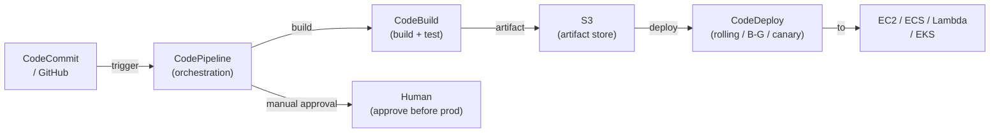
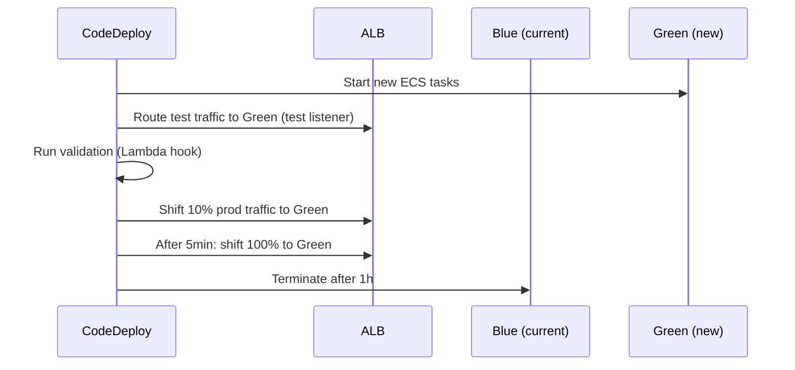

# AWS CI/CD — CodePipeline, CodeBuild, CodeDeploy

## AWS Native CI/CD Stack



## CodePipeline — Orchestration

Defines stages and actions — coordinates the entire pipeline:

```yaml
# CloudFormation: CodePipeline definition
Type: AWS::CodePipeline::Pipeline
Properties:
  Name: my-app-pipeline
  Stages:
    - Name: Source
      Actions:
        - Name: GitHubSource
          ActionTypeId:
            Category: Source
            Owner: ThirdParty
            Provider: GitHub
            Version: "1"
          Configuration:
            Owner: my-org
            Repo: my-app
            Branch: main
            OAuthToken: !Ref GitHubToken

    - Name: Build
      Actions:
        - Name: BuildAndTest
          ActionTypeId:
            Category: Build
            Owner: AWS
            Provider: CodeBuild
            Version: "1"
          InputArtifacts:
            - Name: SourceCode
          OutputArtifacts:
            - Name: BuildOutput

    - Name: ApproveDeployProd
      Actions:
        - Name: ManualApproval
          ActionTypeId:
            Category: Approval
            Owner: AWS
            Provider: Manual
            Version: "1"
          Configuration:
            NotificationArn: !Ref ApprovalSNSTopic

    - Name: DeployProd
      Actions:
        - Name: ECSDeployProd
          ActionTypeId:
            Category: Deploy
            Owner: AWS
            Provider: ECS
            Version: "1"
          Configuration:
            ClusterName: prod-cluster
            ServiceName: my-service
```

## CodeBuild — Build Service

Fully managed build environment. Runs `buildspec.yml` from the repo root:

```yaml
# buildspec.yml
version: 0.2

phases:
  install:
    runtime-versions:
      docker: 20
    commands:
      - pip install -r requirements-test.txt

  pre_build:
    commands:
      - aws ecr get-login-password | docker login --username AWS --password-stdin $ECR_REGISTRY
      - IMAGE_TAG=$(echo $CODEBUILD_RESOLVED_SOURCE_VERSION | cut -c 1-8)

  build:
    commands:
      - docker build -t $ECR_REGISTRY/my-app:$IMAGE_TAG .
      - docker push $ECR_REGISTRY/my-app:$IMAGE_TAG
      - pytest tests/ --junitxml=test-results.xml

  post_build:
    commands:
      - printf '[{"name":"my-container","imageUri":"%s"}]' \
          $ECR_REGISTRY/my-app:$IMAGE_TAG > imagedefinitions.json

artifacts:
  files:
    - imagedefinitions.json

reports:
  unit-tests:
    files:
      - test-results.xml
    file-format: JUNITXML

cache:
  paths:
    - /root/.pip/**/*   # cache Python packages between builds
```

## CodeDeploy — Deployment Automation

### Deployment Strategies

| Target | Strategy | Description |
|--------|----------|-------------|
| **EC2** | In-place | Stop old, start new (downtime) |
| **EC2** | Blue/Green | Launch new ASG, test, shift LB, terminate old |
| **ECS** | Canary | e.g., 10% then 100% over 5 minutes |
| **ECS** | Linear | e.g., 10% every 1 minute |
| **ECS** | All-at-once | Shift all traffic at once |
| **Lambda** | Canary/Linear | Shift traffic between Lambda versions |

### ECS Blue-Green with CodeDeploy



### appspec.yml (ECS)

```yaml
version: 0.0
Resources:
  - TargetService:
      Type: AWS::ECS::Service
      Properties:
        TaskDefinition: !Sub "arn:aws:ecs:${AWS::Region}:${AWS::AccountId}:task-definition/my-app:${TaskDefRevision}"
        LoadBalancerInfo:
          ContainerName: my-container
          ContainerPort: 8080
Hooks:
  - BeforeAllowTraffic: arn:aws:lambda:us-east-1:123:function:ValidateGreenDeployment
  - AfterAllowTraffic: arn:aws:lambda:us-east-1:123:function:PostDeployMonitoring
```

## CodeArtifact — Package Registry

Managed npm/Maven/PyPI/NuGet repository:

```bash
# Connect npm to CodeArtifact
aws codeartifact login --tool npm \
  --domain my-domain \
  --domain-owner 123456789012 \
  --repository my-repo

# Publish package
npm publish

# Upstream repos: CodeArtifact can proxy Docker Hub / npm registry
# Cache packages internally — avoids external dependency, faster builds
```

## AWS CI/CD vs GitHub Actions vs Jenkins

| Feature | AWS CodePipeline | GitHub Actions | Jenkins |
|---------|-----------------|----------------|---------|
| Managed | ✅ | ✅ | ❌ |
| AWS integration | Native IAM | OIDC | Manual |
| Pricing | $1/pipeline/month | Free (2000 min/mo) | Server cost |
| Flexibility | Moderate | Very high | Maximum |
| Secrets | AWS Secrets Manager | GitHub Secrets | Vault/plugins |
| Multi-cloud | ❌ (AWS-native) | ✅ | ✅ |
| Ecosystem | CodeBuild/Deploy | 10,000+ actions | 1,000+ plugins |

## Common Interview Questions

**Q: CodeDeploy blue-green vs canary — when to use each?**
Blue-green: all-or-nothing switch (deploy full new stack, test, then cut over at once) — best for big releases with clear go/no-go decision points. Canary: gradual shift (10% → 50% → 100%) — best for continuous delivery where you want to catch issues with a small blast radius before full rollout. ECS blue-green uses a second target group for zero-downtime.

**Q: How does CodeDeploy lifecycle hooks work?**
appspec.yml defines hooks at lifecycle events (BeforeInstall, AfterInstall, BeforeAllowTraffic, AfterAllowTraffic for ECS). CodeDeploy calls the specified Lambda function or script. If the hook returns an error, the deployment fails and CodeDeploy rolls back. Use AfterAllowTraffic for synthetic monitoring after traffic shifts.

**Q: How do you cache dependencies in CodeBuild?**
`cache: paths:` in buildspec.yml. Supports two types: S3 (persist between builds across all instances, slower) and local cache (within the same build fleet — faster but not guaranteed). Cache `node_modules/`, `~/.m2/`, `/root/.pip/` to significantly reduce build times.

**Q: Manual approval in CodePipeline — how to implement?**
Add a stage with an `Approval` action type. CodePipeline sends a notification to SNS → triggers email/Slack. The pipeline pauses (up to 7 days) until an IAM user with `codepipeline:PutApprovalResult` permission approves or rejects via console, CLI, or API. Can include a review URL and comments.
