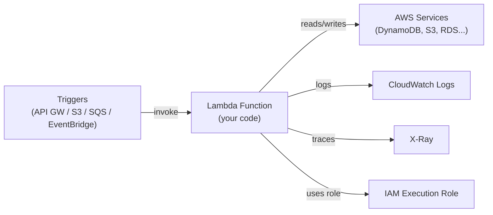

# AWS Lambda

> Serverless compute: run code without managing servers. Pay per execution (100ms increments). Scales automatically from 0 to thousands of concurrent executions.

## Architecture



## Core Concepts

| Concept | Description |
|---------|-------------|
| **Handler** | Entry point function (e.g., `handler(event, context)`) |
| **Event** | Input payload (JSON from trigger) |
| **Context** | Runtime info (function name, memory, time remaining) |
| **Execution role** | IAM role for function permissions |
| **Timeout** | Max 15 minutes (default 3 seconds) |
| **Memory** | 128MB to 10GB (CPU scales with memory) |
| **Concurrency** | Reserved (guaranteed) or unreserved |
| **Cold start** | First invocation of new execution environment |

## Lambda Function — Python Example

```python
import json
import boto3
import os

dynamodb = boto3.resource('dynamodb')
table = dynamodb.Table(os.environ['TABLE_NAME'])

def handler(event, context):
    # event = the trigger payload (API GW, SQS, S3 etc.)
    print(f"Event: {json.dumps(event)}")
    
    # Process SQS records (batch processing)
    if 'Records' in event:
        for record in event['Records']:
            body = json.loads(record['body'])
            process_message(body)
    
    return {
        'statusCode': 200,
        'body': json.dumps({'status': 'processed'})
    }

def process_message(message):
    table.put_item(Item={
        'id': message['id'],
        'data': message['data']
    })
```

## Deployment via AWS CLI / SAM

```bash
# Package and deploy with SAM
sam build
sam deploy \
  --stack-name my-lambda-app \
  --region us-east-1 \
  --capabilities CAPABILITY_IAM

# Deploy via CLI (zip + update)
zip function.zip lambda_function.py

aws lambda create-function \
  --function-name my-function \
  --runtime python3.12 \
  --role arn:aws:iam::123:role/lambda-role \
  --handler lambda_function.handler \
  --zip-file fileb://function.zip \
  --timeout 30 \
  --memory-size 256 \
  --environment "Variables={TABLE_NAME=my-table}"

# Update code
aws lambda update-function-code \
  --function-name my-function \
  --zip-file fileb://function.zip
```

## SAM Template (Infrastructure as Code)

```yaml
# template.yaml
AWSTemplateFormatVersion: '2010-09-09'
Transform: AWS::Serverless-2016-10-31

Globals:
  Function:
    Timeout: 30
    MemorySize: 256
    Runtime: python3.12
    Environment:
      Variables:
        TABLE_NAME: !Ref MyTable

Resources:
  ApiFunction:
    Type: AWS::Serverless::Function
    Properties:
      Handler: app.handler
      Events:
        Api:
          Type: Api
          Properties:
            Path: /api/{proxy+}
            Method: any
      Policies:
        - DynamoDBCrudPolicy:
            TableName: !Ref MyTable

  SqsConsumerFunction:
    Type: AWS::Serverless::Function
    Properties:
      Handler: consumer.handler
      Events:
        SQSEvent:
          Type: SQS
          Properties:
            Queue: !GetAtt MyQueue.Arn
            BatchSize: 10

  MyTable:
    Type: AWS::DynamoDB::Table
    Properties:
      TableName: my-data
      BillingMode: PAY_PER_REQUEST
      AttributeDefinitions:
        - AttributeName: id
          AttributeType: S
      KeySchema:
        - AttributeName: id
          KeyType: HASH

  MyQueue:
    Type: AWS::SQS::Queue
```

## Concurrency & Cold Starts

```bash
# Reserve concurrency (guarantee capacity, limit max)
aws lambda put-function-concurrency \
  --function-name my-function \
  --reserved-concurrent-executions 100

# Provisioned concurrency (pre-warm execution environments — eliminates cold starts)
aws lambda put-provisioned-concurrency-config \
  --function-name my-function \
  --qualifier LIVE \
  --provisioned-concurrent-executions 10
```

**Cold start causes:** JVM (Java/Kotlin), large deployment packages, VPC attachment (adds ENI creation time).
**Cold start fixes:** (1) Provisioned concurrency. (2) Use smaller runtimes (Python/Node vs Java). (3) Keep packages slim. (4) Avoid VPC unless necessary (or use VPC endpoints).

## Lambda Layers

```bash
# Create a layer (shared code/libraries)
zip -r layer.zip python/

aws lambda publish-layer-version \
  --layer-name my-dependencies \
  --zip-file fileb://layer.zip \
  --compatible-runtimes python3.12

# Attach layer to function
aws lambda update-function-configuration \
  --function-name my-function \
  --layers arn:aws:lambda:us-east-1:123:layer:my-dependencies:1
```

## Common Interview Questions

**Q: Lambda cold start — what is it and how do you reduce it?**
Cold start: when Lambda invokes a function for the first time (or after inactivity), it provisions a new execution environment — download code, start runtime, run init code. Adds 100ms to several seconds. Reduce: (1) Provisioned concurrency (pre-warms instances, costs money). (2) Keep functions small (less to download/init). (3) Move heavy initialization outside the handler (module-level code runs once per instance). (4) Avoid Java runtimes for latency-sensitive paths. (5) Avoid VPC unless needed.

**Q: Lambda vs ECS Fargate — when to use each?**
Lambda: event-driven workloads, short duration (< 15 min), variable/spiky traffic (scales to 0), per-request billing. Fargate: long-running processes, containers, workloads that need > 15 min, consistent traffic (idle cost vs Lambda no-idle). Lambda is cheaper at low volume; Fargate is cheaper at high sustained volume. Lambda is better for async processing, Fargate for services with long-lived connections (WebSocket, gRPC streaming).

**Q: How do you handle Lambda timeouts for slow downstream services?**
(1) Set aggressive Lambda timeout (e.g., 29 seconds for a 30-second SQS visibility timeout). (2) Use async patterns: Lambda writes to SQS, another Lambda processes. (3) Use Step Functions for multi-step workflows with retry logic. (4) Implement circuit breakers in code to fail fast when downstream is slow. Never set Lambda timeout higher than the trigger's timeout (SQS: visibility timeout, API GW: 29 seconds).
