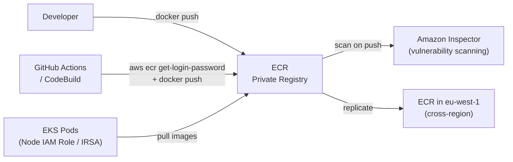

# Amazon ECR — Elastic Container Registry

> Private, managed Docker container registry. Fully integrated with ECS, EKS, and Lambda — no credentials needed within the same account.

## Architecture



## Authentication

```bash
# Authenticate Docker to ECR (token valid 12 hours)
aws ecr get-login-password --region us-east-1 \
  | docker login --username AWS --password-stdin \
    123456789012.dkr.ecr.us-east-1.amazonaws.com

# Build and push
docker build -t my-app:v1.2.3 .
docker tag my-app:v1.2.3 123456789012.dkr.ecr.us-east-1.amazonaws.com/my-app:v1.2.3
docker push 123456789012.dkr.ecr.us-east-1.amazonaws.com/my-app:v1.2.3
```

For CI/CD with GitHub Actions (OIDC — no stored credentials):

```yaml
- name: Configure AWS credentials
  uses: aws-actions/configure-aws-credentials@v4
  with:
    role-to-assume: arn:aws:iam::123:role/GitHubActionsRole
    aws-region: us-east-1

- name: Login to ECR
  uses: aws-actions/amazon-ecr-login@v2

- name: Build and push
  run: |
    docker build -t $ECR_REGISTRY/my-app:$IMAGE_TAG .
    docker push $ECR_REGISTRY/my-app:$IMAGE_TAG
```

## Image Scanning

| Type | Engine | What it scans | Cost |
|------|--------|--------------|------|
| **Basic scanning** | Clair (open source) | OS package vulnerabilities | Free |
| **Enhanced scanning** | Amazon Inspector | OS + programming language vulnerabilities, on push + continuously | Inspector pricing |

```bash
# Configure enhanced scanning
aws ecr put-registry-scanning-configuration \
  --scan-type ENHANCED \
  --rules '[{
    "repositoryFilters": [{"filter": "*", "filterType": "WILDCARD"}],
    "scanFrequency": "SCAN_ON_PUSH"
  }]'

# Get scan results
aws ecr describe-image-scan-findings \
  --repository-name my-app \
  --image-id imageTag=v1.2.3
```

## Lifecycle Policies

Automatically delete old/untagged images to reduce storage costs:

```json
{
  "rules": [
    {
      "rulePriority": 1,
      "description": "Keep only last 10 tagged releases",
      "selection": {
        "tagStatus": "tagged",
        "tagPrefixList": ["v"],
        "countType": "imageCountMoreThan",
        "countNumber": 10
      },
      "action": {"type": "expire"}
    },
    {
      "rulePriority": 2,
      "description": "Delete untagged images older than 1 day",
      "selection": {
        "tagStatus": "untagged",
        "countType": "sinceImagePushed",
        "countUnit": "days",
        "countNumber": 1
      },
      "action": {"type": "expire"}
    }
  ]
}
```

## Image Immutability

Prevent tag overwrite — enforces immutable image tags (prevents `latest` tag abuse):

```bash
aws ecr put-image-tag-mutability \
  --repository-name my-app \
  --image-tag-mutability IMMUTABLE
```

With IMMUTABLE: pushing `v1.2.3` again fails if that tag already exists. Forces semantic versioning.

## Cross-Account ECR Access

```json
{
  "Statement": [{
    "Effect": "Allow",
    "Principal": {
      "AWS": "arn:aws:iam::TARGET-ACCOUNT:root"
    },
    "Action": [
      "ecr:GetDownloadUrlForLayer",
      "ecr:BatchGetImage",
      "ecr:BatchCheckLayerAvailability"
    ]
  }]
}
```

EKS pods in the target account must have IAM permission to `ecr:GetAuthorizationToken` from the target account.

## Cross-Region Replication

Replicate images to other regions for faster pulls:

```bash
aws ecr put-replication-configuration \
  --replication-configuration '{
    "rules": [{
      "destinations": [
        {"region": "eu-west-1", "registryId": "123456789012"},
        {"region": "ap-northeast-1", "registryId": "123456789012"}
      ]
    }]
  }'
```

## Pull-Through Cache

Cache Docker Hub/ECR Public images in your private ECR — useful for airgapped environments and to avoid Docker Hub rate limits:

```bash
aws ecr create-pull-through-cache-rule \
  --ecr-repository-prefix "dockerhub" \
  --upstream-registry-url "registry-1.docker.io"

# Pull via ECR (caches and serves from ECR on subsequent pulls)
docker pull 123456789.dkr.ecr.us-east-1.amazonaws.com/dockerhub/library/nginx:latest
```

## ECR vs Docker Hub for Enterprise

| Feature | ECR | Docker Hub |
|---------|-----|-----------|
| Auth | IAM (no extra credentials) | Username/password or token |
| Rate limits | None (within AWS) | 100/6h (unauthenticated), 200/6h (free) |
| Private repos | ✅ | ✅ (paid) |
| Vulnerability scanning | ✅ Inspector | ✅ Docker Scout |
| Cost | $0.10/GB/month storage + transfer | $7-25/user/month |
| AWS integration | Native (EKS/ECS no creds) | Manual credential setup |

## Common Interview Questions

**Q: How does ECR auth work with EKS pods in the same account?**
Nodes have an IAM role (node IAM role). ECR grants pull access to IAM principals. EKS nodes include `ecr:GetAuthorizationToken`, `ecr:BatchGetImage` in their policy. kubelet refreshes the ECR auth token automatically — no imagePullSecrets needed in pod specs for same-account ECR.

**Q: Cross-account ECR — how do you configure it?**
Two steps: (1) ECR repository resource policy allows the other account's principal to pull. (2) The IAM role in the other account (node role or IRSA) has `ecr:GetAuthorizationToken` permission (must be on `*` — it's a registry-level action, not repository-level). The node must also have the ECR GetAuthorizationToken to get the temporary token.

**Q: What are ECR lifecycle policies and why are they important?**
Without lifecycle policies, your ECR repository fills with every image ever pushed — paying for storage of images from years ago. Lifecycle policies auto-delete: untagged images after N days, keep only the last N tagged images, or expire images by age. Essential for cost management in active repos.

**Q: ECR enhanced scanning vs basic scanning?**
Basic (Clair): scans OS packages on push, free, covers CVEs in packages like openssl, curl. Enhanced (Inspector): scans OS + programming language dependencies (npm, pip, go.sum), scans continuously (re-evaluates when new CVEs are published), provides exploitability context and severity scoring. Enhanced is recommended for production.
