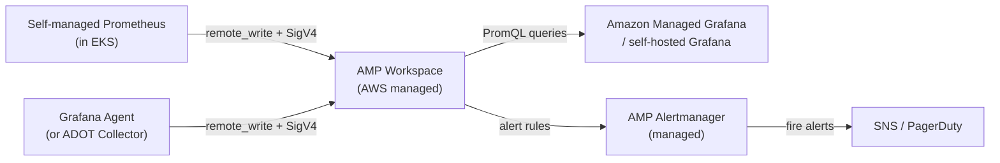

# Amazon Managed Service for Prometheus (AMP)

> Fully managed, Prometheus-compatible monitoring service. No server to run — just `remote_write` from your existing Prometheus setup and query via PromQL.

## How It Works



## Workspace

A workspace is the unit of tenancy — each workspace is isolated:

```bash
# Create a workspace
aws amp create-workspace --alias my-prod-metrics

# Get workspace ID and endpoint
aws amp list-workspaces
# Returns: workspaceId, prometheusEndpoint
```

Endpoint format: `https://aps-workspaces.{region}.amazonaws.com/workspaces/{workspaceId}`

## Authentication — SigV4

AMP uses IAM + SigV4 signing (not username/password). Three ways to authenticate:

**1. Prometheus with SigV4 proxy sidecar:**

```yaml
# prometheus.yml
remote_write:
  - url: http://localhost:8005/workspaces/ws-abc/api/v1/remote_write

# sigv4proxy sidecar in pod
containers:
  - name: sigv4-proxy
    image: public.ecr.aws/aws-observability/aws-sigv4-proxy:latest
    args:
      - --name=aps
      - --region=us-east-1
      - --host=aps-workspaces.us-east-1.amazonaws.com
      - --port=:8005
```

**2. Grafana Agent (native SigV4 support):**

```yaml
metrics:
  configs:
    - name: default
      remote_write:
        - url: https://aps-workspaces.us-east-1.amazonaws.com/workspaces/ws-abc/api/v1/remote_write
          sigv4:
            region: us-east-1
```

**3. ADOT Collector:**

```yaml
exporters:
  prometheusremotewrite:
    endpoint: "https://aps-workspaces.us-east-1.amazonaws.com/workspaces/ws-abc/api/v1/remote_write"
    auth:
      authenticator: sigv4auth
```

## IAM Permissions

IRSA (IAM Role for Service Account) for Prometheus pods:

```json
{
  "Version": "2012-10-17",
  "Statement": [{
    "Effect": "Allow",
    "Action": [
      "aps:RemoteWrite",
      "aps:QueryMetrics",
      "aps:GetSeries",
      "aps:GetLabels",
      "aps:GetMetricMetadata"
    ],
    "Resource": "arn:aws:aps:us-east-1:123456:workspace/ws-abc"
  }]
}
```

## AMP Alertmanager

Managed Alertmanager — define alert rules and routing in AMP without running your own Alertmanager:

```bash
# Upload alertmanager config
aws amp put-alertmanager-definition \
  --workspace-id ws-abc \
  --data fileb://alertmanager.yaml

# Upload recording/alert rules
aws amp create-rule-groups-namespace \
  --workspace-id ws-abc \
  --name production-rules \
  --data fileb://rules.yaml
```

## AMP vs Self-managed Prometheus

| Feature | AMP | Self-managed Prometheus |
|---------|-----|------------------------|
| Ops burden | None | High (HA, storage, scaling) |
| Scaling | Automatic | Manual (Thanos/Mimir) |
| Multi-tenancy | Per workspace | Requires Mimir/Cortex |
| Retention | Up to 150 days | Configurable (S3 + Thanos) |
| Auth | IAM SigV4 | Basic auth / TLS |
| Cost | Per sample ingested + queries | EC2/EKS infra |
| PromQL | 100% compatible | Native |

**Use AMP when:** AWS-only, want zero ops, team doesn't have Prometheus expertise.

**Use self-managed when:** multi-cloud, need full control, advanced Mimir features, or have existing Prometheus infrastructure.

## Pricing

- **Ingestion:** $0.9 per 1M active metric samples (first 2B samples/month cheaper)
- **Storage:** $0.03/metric sample/month
- **Queries:** $0.01 per 1M metric samples queried

## Common Interview Questions

**Q: How does AMP authentication work?**
AMP uses AWS IAM with SigV4 request signing — no API keys or passwords. Your Prometheus or Grafana Agent assumes an IAM role (via IRSA on EKS) that has `aps:RemoteWrite` permission. Requests are signed with the role's temporary credentials.

**Q: AMP vs Mimir — when to choose?**
AMP when AWS-only and want managed service (no ops). Mimir when: multi-cloud, need true multi-tenancy within one cluster, want query sharding for billion-series scale, or need to self-host for cost/control. Mimir has more advanced features; AMP has zero operational overhead.

**Q: Can you use existing Grafana dashboards with AMP?**
Yes — AMP is 100% PromQL compatible. Add AMP as a Prometheus data source in Grafana (using SigV4 auth plugin) and all existing dashboards work without modification.

**Q: What's the retention limit on AMP?**
Up to 150 days. For longer retention, you'd need to also remote_write to Mimir/Thanos with cold storage in S3, or query S3 via Athena.
