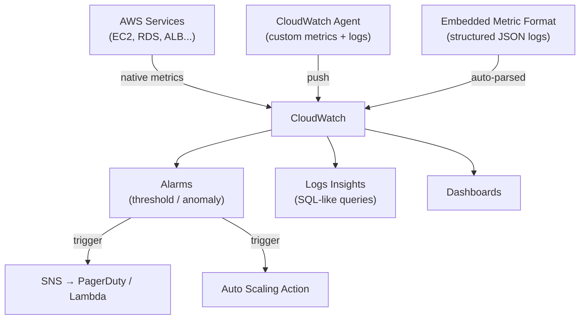

# Amazon CloudWatch

> AWS-native observability service. Metrics, logs, alarms, and dashboards for every AWS service — zero setup for managed services.

## Architecture



## Metrics

- **Namespace:** grouping (`AWS/EC2`, `AWS/EKS`, `MyApp/API`)
- **Dimensions:** filters (`InstanceId=i-abc123`, `ClusterName=prod`)
- **Resolution:** Standard (1 min) or High Resolution (1 sec, ~3x cost)
- **Retention:** 3hr for 1-sec, 15 days for 1-min, 63 days for 5-min, 15 months for 1-hour

## CloudWatch Logs

| Concept | Description |
|---------|-------------|
| **Log Group** | Container (e.g., `/aws/eks/cluster/application`) |
| **Log Stream** | Sequence from one source (one pod, one instance) |
| **Retention** | Set per log group (1 day to 10 years) |
| **Metric Filters** | Extract metrics from log patterns (count "ERROR") |
| **Subscriptions** | Stream to Lambda, Kinesis, Firehose in near-real-time |

### Logs Insights Queries

```sql
-- Top 10 slowest API calls
fields @timestamp, @message
| parse @message "latency: * ms" as latency
| stats avg(latency), max(latency) by bin(5m)
| sort max_latency desc | limit 10

-- Error rate by hour
fields @timestamp
| filter level = "ERROR"
| stats count() as errors by bin(1h)
```

## Alarms

```yaml
Type: AWS::CloudWatch::Alarm
Properties:
  MetricName: CPUUtilization
  Namespace: AWS/EC2
  Statistic: Average
  Period: 300           # 5-min periods
  EvaluationPeriods: 3  # 3 consecutive breaches
  Threshold: 80
  ComparisonOperator: GreaterThanThreshold
  TreatMissingData: breaching
  AlarmActions:
    - !Ref ScaleUpPolicy
```

**Composite Alarms:** fire on `ALARM(cpu) AND ALARM(memory)` — reduces noise.

**Anomaly Detection:** ML baseline, alarm when metric falls outside expected band.

## CloudWatch Agent (Custom Metrics)

EC2/EKS nodes don't publish memory/disk by default — install agent:

```json
{
  "metrics": {
    "namespace": "CWAgent",
    "metrics_collected": {
      "mem": {"measurement": ["mem_used_percent"]},
      "disk": {"measurement": ["used_percent"], "resources": ["/"]}
    }
  },
  "logs": {
    "logs_collected": {
      "files": {
        "collect_list": [{
          "file_path": "/var/log/app/*.log",
          "log_group_name": "/ec2/my-app"
        }]
      }
    }
  }
}
```

## Container Insights (EKS)

```bash
aws eks create-addon \
  --cluster-name my-cluster \
  --addon-name amazon-cloudwatch-observability
```

Provides dashboards for: node/pod CPU+memory, container restarts, filesystem usage.

## Embedded Metric Format (EMF)

Write structured JSON to stdout → metrics auto-extracted (no PutMetricData API call):

```python
import json
print(json.dumps({
    "_aws": {
        "Timestamp": 1609459200000,
        "CloudWatchMetrics": [{
            "Namespace": "MyApp",
            "Dimensions": [["Service"]],
            "Metrics": [{"Name": "Latency", "Unit": "Milliseconds"}]
        }]
    },
    "Service": "payment-api",
    "Latency": 142.7
}))
```

## CloudWatch vs Prometheus/Grafana

| Feature | CloudWatch | Prometheus + Grafana |
|---------|-----------|----------------------|
| Setup | Zero for AWS services | Requires deployment |
| Multi-cloud | AWS only | Any target |
| Query language | Metrics Insights SQL | PromQL |
| Dashboards | Basic | Very rich |
| Alert routing | SNS (basic) | Alertmanager |
| Long-term retention | 15 months | Configurable |

## Common Interview Questions

**Q: When CloudWatch vs Prometheus/Grafana on AWS?**
CloudWatch for AWS-service metrics (RDS, ALB, Lambda) — zero setup. Prometheus+Grafana for application metrics, multi-cluster K8s, rich PromQL queries. Most teams use both: CloudWatch for infra, Prometheus for app metrics, unified in Grafana.

**Q: What is Embedded Metric Format?**
EMF embeds CloudWatch metric definitions in structured log lines. The agent auto-extracts metrics without PutMetricData API calls — useful for Lambda (avoids cold-start overhead) and for correlating log context with metric spikes.

**Q: How do Subscriptions work?**
A subscription filter on a Log Group streams matching events in near-real-time to Kinesis, Firehose, or Lambda. Used for: real-time anomaly detection, S3 archiving, SIEM forwarding.

**Q: Composite Alarm vs standard alarm?**
Standard: fires on one metric threshold. Composite: fires on logical combination of alarms (`ALARM(A) AND ALARM(B)`). Reduces noise — page only when multiple indicators are bad simultaneously.
