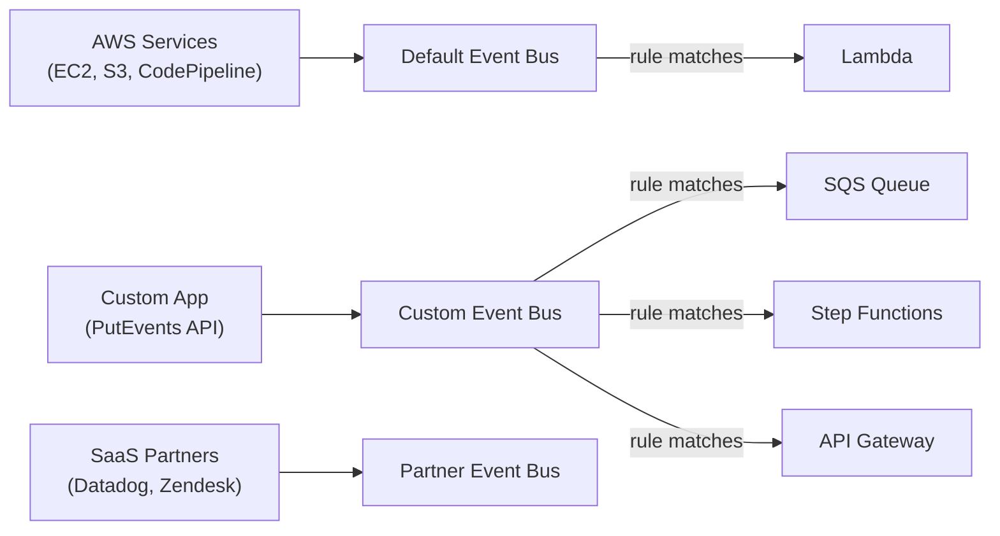

# Amazon EventBridge

> Serverless event bus that routes events from AWS services, custom apps, and 200+ SaaS partners to targets. The evolution of CloudWatch Events.

## Core Concepts



## Event Structure

```json
{
  "version": "0",
  "id": "abc-123",
  "source": "aws.ec2",
  "account": "123456789012",
  "time": "2024-01-15T10:00:00Z",
  "region": "us-east-1",
  "detail-type": "EC2 Instance State-change Notification",
  "detail": {
    "instance-id": "i-abc123",
    "state": "terminated"
  }
}
```

## Rules — Event Pattern Matching

```json
{
  "source": ["aws.ec2"],
  "detail-type": ["EC2 Instance State-change Notification"],
  "detail": {
    "state": ["terminated", "stopped"]
  }
}
```

Advanced pattern with numeric filter:

```json
{
  "source": ["myapp.orders"],
  "detail": {
    "amount": [{"numeric": [">", 1000]}],
    "status": ["PENDING"],
    "customer.tier": [{"exists": true}]
  }
}
```

## Scheduled Rules

```json
{
  "ScheduleExpression": "cron(0 12 * * ? *)",
  "Targets": [{"Id": "daily-report", "Arn": "arn:aws:lambda:..."}]
}
```

## Schema Registry

Auto-discovers event schemas and generates code bindings (TypeScript/Python/Java):

```bash
aws schemas get-code-binding-source \
  --registry-name discovered-schemas \
  --schema-name myapp.orders@OrderCreated \
  --language Python36
```

## EventBridge Pipes

Point-to-point integration without Lambda boilerplate:

```
SQS Source → [Content Filter] → [Enrich (Lambda)] → [Transform] → Target
```

```yaml
Type: AWS::Pipes::Pipe
Properties:
  Source: !GetAtt OrderQueue.Arn
  SourceParameters:
    SqsQueueParameters:
      BatchSize: 10
  Filter:
    Filters:
      - Pattern: '{"body": {"amount": [{"numeric": [">", 100]}]}}'
  Target: !GetAtt ProcessOrderFunction.Arn
```

## Archive & Replay

```bash
# Archive events for 30 days
aws events create-archive \
  --archive-name my-archive \
  --event-source-arn arn:aws:events:us-east-1:123:event-bus/default \
  --retention-days 30

# Replay after a bug fix
aws events start-replay \
  --replay-name fix-replay \
  --source arn:aws:events:us-east-1:123:archive/my-archive
```

## EventBridge vs SNS vs SQS

| Feature | EventBridge | SNS | SQS |
|---------|------------|-----|-----|
| Pattern | Event routing (rule-based) | Pub/sub fan-out | Message queuing |
| Content filtering | ✅ Rich (nested JSON, numeric) | ✅ Attribute-based | ❌ |
| Schema registry | ✅ | ❌ | ❌ |
| SaaS integrations | ✅ 200+ | ❌ | ❌ |
| Replay | ✅ Archive + replay | ❌ | DLQ only |
| Use case | Event-driven microservices | Fan-out notifications | Decoupled processing |

## Common Interview Questions

**Q: EventBridge vs CloudWatch Events?**
Same API under the hood — EventBridge is the rebrand. EventBridge adds: custom event buses, 200+ SaaS partner integrations, Schema Registry, Pipes, and better cross-account support.

**Q: How does content-based filtering work?**
Rules match against the `detail` field JSON. EventBridge evaluates patterns server-side before routing — no Lambda needed for filtering. Supports: exact match, prefix, numeric ranges, exists/not-exists, and `anything-but` negation.

**Q: When to use EventBridge Pipes vs Lambda+SQS?**
Pipes eliminate boilerplate polling code. Instead of Lambda polling SQS → filtering → calling another Lambda, configure: SQS source → filter → enrichment → target. Good for simple point-to-point routing without custom retry logic.

**Q: How do you debug a missing event?**
1. Check archive (if enabled) and replay
2. Add CloudWatch Logs target to rule temporarily
3. Check CloudWatch Metrics: `FailedInvocations`, `ThrottledRules`
4. Verify IAM: rule needs permission to invoke the target
