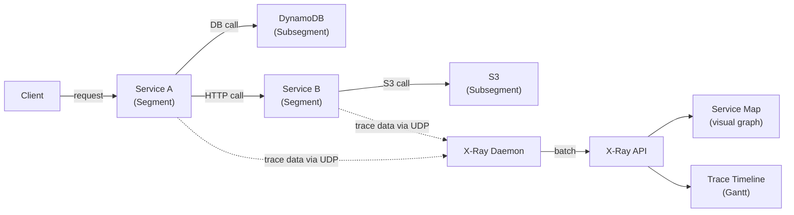

# AWS X-Ray

> Distributed tracing service for AWS. Traces requests end-to-end across microservices to find latency bottlenecks and errors.

## Key Concepts



| Term | Definition |
|------|-----------|
| **Trace** | Full journey of one request (unique trace ID propagated via header) |
| **Segment** | One service's contribution to a trace |
| **Subsegment** | Granular operation (DB query, HTTP call, S3 operation) |
| **Annotation** | Indexed key-value (filterable: `user.tier = "premium"`) |
| **Metadata** | Non-indexed data (full payload — not searchable) |

## Sampling Rules

X-Ray doesn't trace every request. Default: **first request/sec + 5% of subsequent requests**:

```json
{
  "version": 2,
  "rules": [
    {
      "description": "Payment requests — 100%",
      "url_path": "/api/payment*",
      "fixed_target": 1,
      "rate": 1.0
    },
    {
      "description": "Health checks — skip",
      "url_path": "/health",
      "fixed_target": 0,
      "rate": 0.0
    }
  ],
  "default": {"fixed_target": 1, "rate": 0.05}
}
```

## X-Ray Daemon (EKS)

```yaml
containers:
  - name: xray-daemon
    image: amazon/aws-xray-daemon
    ports:
      - containerPort: 2000
        protocol: UDP
    resources:
      limits:
        memory: 24Mi
      requests:
        cpu: 32m
        memory: 24Mi
```

## ADOT vs X-Ray SDK

| Approach | Pros | Cons |
|---------|------|------|
| **X-Ray SDK** | AWS-native, deep integration | Vendor lock-in |
| **ADOT** ✅ | Vendor-neutral OTel standard, export to any backend | More setup |

ADOT (AWS Distro for OpenTelemetry) is the recommended approach for new apps:

```yaml
apiVersion: opentelemetry.io/v1alpha1
kind: OpenTelemetryCollector
metadata:
  name: adot-collector
spec:
  mode: daemonset
  config: |
    receivers:
      otlp:
        protocols:
          grpc:
            endpoint: 0.0.0.0:4317
    exporters:
      awsxray:
        region: us-east-1
    service:
      pipelines:
        traces:
          receivers: [otlp]
          exporters: [awsxray]
```

## Annotations vs Metadata

```python
import aws_xray_sdk.core as xray

# Annotation — indexed, filterable
xray.put_annotation("user_tier", "premium")
xray.put_annotation("order_id", order_id)

# Metadata — stored but not searchable
xray.put_metadata("request_payload", {"items": [...], "total": 142.99})
```

## X-Ray vs Jaeger vs Tempo

| Feature | X-Ray | Jaeger | Tempo |
|---------|-------|--------|-------|
| Managed | ✅ AWS | ❌ Self | ❌ Self |
| AWS service integration | Native | Via OTEL | Via OTEL |
| Vendor lock-in | High | None | None |
| UI | X-Ray console | Jaeger UI | Grafana |

## Common Interview Questions

**Q: Is the X-Ray daemon required?**
Required for the X-Ray SDK (SDK sends trace data via UDP to daemon on port 2000; daemon batches and sends to X-Ray API). Not required for ADOT Collector (calls X-Ray API directly). Run as sidecar or DaemonSet on EKS.

**Q: How does sampling reduce cost without losing critical traces?**
Default 5% captures statistically significant sample for performance analysis. Set rate=1.0 for critical operations (payments, auth). Set rate=0.0 for health checks. Sampling happens client-side before trace data even hits the daemon.

**Q: X-Ray vs Jaeger — when to choose?**
X-Ray when AWS-only and want zero ops (managed, IAM auth, native AWS service maps). Jaeger when multi-cloud, self-hosting for cost control, or committed to open standards. Best practice: instrument with ADOT (OTel standard) so you can switch exporters without changing app code.

**Q: How do you find the root cause of a slow request?**
1. Filter traces by high latency in Service Map
2. Click the slow trace → Trace Timeline (Gantt chart of all segments)
3. Find the segment with the longest bar
4. Look at subsegments (e.g., DB query = 2s out of 2.1s total)
5. Use annotations to correlate with specific users or request attributes
