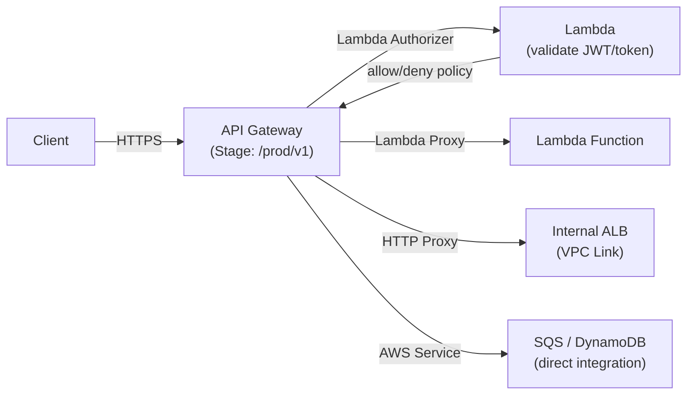

# AWS API Gateway

> Fully managed API front door. Handles auth, throttling, caching, transformations, and routing for REST, HTTP, and WebSocket APIs.

## API Types Comparison

| | REST API | HTTP API | WebSocket API |
|--|---------|---------|---------------|
| **Latency** | ~6ms | ~1ms | — |
| **Cost** | $3.50/million | $1.00/million | $1.00/million |
| **Features** | Full (caching, transformations, usage plans) | Lightweight | Bidirectional |
| **Auth** | IAM, Lambda, Cognito | JWT, Lambda, IAM | Lambda, IAM |
| **Use when** | Need full features | Lambda/HTTP backend, lower cost | Real-time (chat, live updates) |

## REST API Architecture



## Integration Types

| Type | Description | Use case |
|------|-------------|---------|
| **Lambda Proxy** | API GW passes full request to Lambda as event | Most common |
| **HTTP Proxy** | Forward to backend URL | Existing services |
| **AWS Service** | Call AWS APIs directly (SQS PutMessage, DynamoDB Query) | Reduce Lambda cost |
| **Mock** | Return static response without backend | Documentation, testing |

## Authorization Options

### IAM Authorization (SigV4)

```bash
# Client must sign requests with AWS credentials
curl --aws-sigv4 "aws:amz:us-east-1:execute-api" \
  --user "$AWS_ACCESS_KEY_ID:$AWS_SECRET_ACCESS_KEY" \
  https://abc123.execute-api.us-east-1.amazonaws.com/prod/api
```

### Lambda Authorizer (Custom Token Validation)

```python
def handler(event, context):
    token = event['authorizationToken']  # Bearer token from header
    # Validate token (JWT, opaque, API key, etc.)
    if validate_token(token):
        return {
            'principalId': 'user123',
            'policyDocument': {
                'Statement': [{
                    'Effect': 'Allow',
                    'Action': 'execute-api:Invoke',
                    'Resource': event['methodArn']
                }]
            },
            'context': {'user_tier': 'premium'}  # passed to Lambda backend
        }
    raise Exception('Unauthorized')
```

### JWT Authorizer (HTTP API — no Lambda needed)

```yaml
# CloudFormation
Auth:
  DefaultAuthorizer: CognitoAuthorizer
  Authorizers:
    CognitoAuthorizer:
      IdentitySource: $request.header.Authorization
      JwtConfiguration:
        Audience:
          - !Ref UserPoolClient
        Issuer: !Sub "https://cognito-idp.${AWS::Region}.amazonaws.com/${UserPool}"
```

## Stages & Deployments

```bash
# Deploy to stage
aws apigateway create-deployment \
  --rest-api-id abc123 \
  --stage-name prod

# Canary release — 10% to new deployment
aws apigateway update-stage \
  --rest-api-id abc123 \
  --stage-name prod \
  --patch-operations '[{
    "op": "replace",
    "path": "/canarySettings/percentTraffic",
    "value": "10"
  }]'
```

## Usage Plans & API Keys

Rate limiting and quotas per API key (for external developers):

```bash
aws apigateway create-usage-plan \
  --name "Standard Tier" \
  --throttle '{"rateLimit": 100, "burstLimit": 200}' \
  --quota '{"limit": 10000, "period": "MONTH"}'
```

## Throttling

- **Account level:** 10,000 RPS (requests per second), 5,000 burst
- **Stage/route level:** Override per endpoint
- **Usage plan level:** Per API key

When throttled: client receives `429 Too Many Requests`

## Response Caching (REST API only)

```bash
aws apigateway update-stage \
  --rest-api-id abc123 \
  --stage-name prod \
  --patch-operations \
    '[{"op":"replace","path":"/*/*/caching/enabled","value":"true"},
      {"op":"replace","path":"/*/*/caching/ttlInSeconds","value":"300"}]'
```

Cache key: by default URL + query strings. Add headers to cache key per method.

## VPC Link (Private Integration)

Connect API Gateway to internal resources (ALB/NLB inside VPC) without exposing them publicly:

```yaml
VpcLink:
  Type: AWS::ApiGatewayV2::VpcLink
  Properties:
    Name: internal-alb-link
    SubnetIds: !Ref PrivateSubnets
    SecurityGroupIds: !Ref VPCLinkSG
```

## API Gateway vs ALB

| | API Gateway | ALB |
|--|------------|-----|
| Cost | $1-3.50/million requests | $0.008/LCU-hour (~$5-15/month) |
| Auth | IAM, Lambda, JWT, Cognito | OIDC/Cognito (basic) |
| Throttling | ✅ Per-route, per-key | ❌ |
| Request transform | ✅ (mapping templates, VTL) | ❌ |
| WebSocket | ✅ | ❌ |
| gRPC | ❌ | ✅ |
| Use case | External APIs, auth, rate limiting | Internal routing, gRPC, WebSockets |

## Common Interview Questions

**Q: REST API vs HTTP API — when to choose?**
HTTP API (default choice): cheaper ($1 vs $3.50/million), lower latency, supports JWT auth natively, simpler configuration. REST API when: need response caching, request/response transformation (mapping templates), usage plans with API keys, WAF integration, custom authorizer caching, or private integrations with VPC Link for REST.

**Q: How does a Lambda Authorizer work?**
API Gateway calls the authorizer Lambda with the token before routing to the backend. The authorizer returns an IAM policy (ALLOW or DENY) and optionally a context object (key-value pairs passed to the backend). API Gateway caches the policy by token for up to 3600s — set TTL=0 to disable caching for dynamic permissions.

**Q: What happens when API Gateway throttling kicks in?**
API Gateway returns 429 Too Many Requests with a `Retry-After` header. Account-level throttle: 10K RPS steady state, 5K burst. Clients should implement exponential backoff. For external APIs, set per-API-key throttles via Usage Plans so one bad actor doesn't impact all customers.

**Q: How do you connect API Gateway to a private EKS service?**
Use VPC Link: create an NLB inside your VPC pointed at your EKS service → create a VPC Link in API Gateway pointing to the NLB → API Gateway routes requests through the VPC Link to the NLB → NLB routes to EKS pods. Traffic never leaves AWS network. Requires the API GW endpoint to be in the same region.
