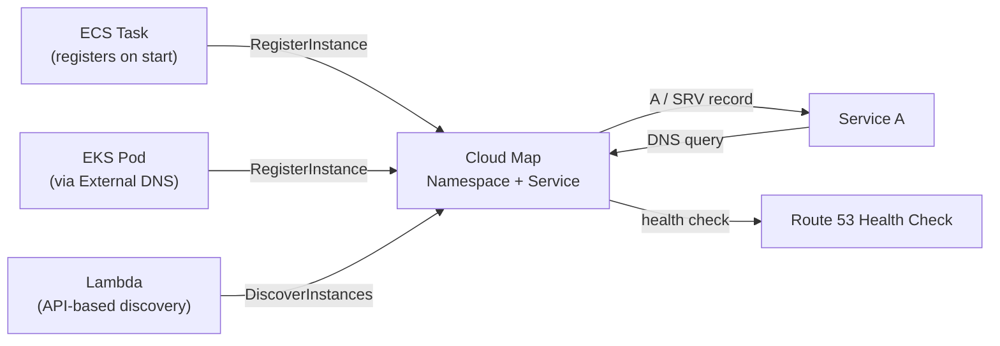

# AWS Cloud Map

> Service discovery for cloud resources. Register services by name — other services find them by querying Cloud Map via DNS or API, without hard-coded IP addresses.

## Core Concepts



| Concept | Description |
|---------|-------------|
| **Namespace** | DNS domain or API namespace (`prod.internal`) |
| **Service** | Logical group (e.g., `payment-service`) |
| **Service Instance** | Registered endpoint (IP:port or ARN) with attributes |

## Namespace Types

| Type | Discovery method | DNS name |
|------|-----------------|---------|
| **DNS (public)** | Route 53 public hosted zone | `service.namespace.example.com` |
| **DNS (private VPC)** | Route 53 private hosted zone | `service.prod.internal` |
| **API (HTTP)** | `DiscoverInstances` API call only | No DNS |

```bash
# Create a private DNS namespace
aws servicediscovery create-private-dns-namespace \
  --name prod.internal \
  --vpc vpc-abc123

# Create a service in the namespace
aws servicediscovery create-service \
  --name payment-service \
  --dns-config '{
    "NamespaceId": "ns-abc123",
    "DnsRecords": [
      {"Type": "A", "TTL": 10},
      {"Type": "SRV", "TTL": 10}
    ]
  }' \
  --health-check-custom-config '{"FailureThreshold": 1}'
```

## Registering Instances

```bash
# Manual registration (for EC2 or custom services)
aws servicediscovery register-instance \
  --service-id srv-abc123 \
  --instance-id my-instance-1 \
  --attributes '{
    "AWS_INSTANCE_IPV4": "10.0.1.15",
    "AWS_INSTANCE_PORT": "8080",
    "version": "2.1.0"
  }'
```

**ECS auto-registration:** Enable service discovery in ECS service definition — ECS registers/deregisters tasks automatically on start/stop.

**EKS with ExternalDNS:** ExternalDNS controller watches K8s Services and Ingresses, registers them in Cloud Map automatically.

## Querying — DNS vs API

**DNS discovery (low latency, cached):**

```bash
# A record — returns IP addresses
dig payment-service.prod.internal A

# SRV record — returns host:port
dig payment-service.prod.internal SRV
```

**API discovery (rich filtering by attributes):**

```python
import boto3

client = boto3.client('servicediscovery')
response = client.discover_instances(
    NamespaceName='prod.internal',
    ServiceName='payment-service',
    MaxResults=10,
    QueryParameters={'version': '2.1.0'},  # filter by custom attribute
    HealthStatus='HEALTHY'
)
instances = response['Instances']
```

## Health Checks

Cloud Map supports two types:

| Type | How | Use case |
|------|-----|---------|
| **Route 53 health check** | External HTTP/TCP check from Route 53 | Public endpoints |
| **Custom health** | Your service reports health via `UpdateInstanceCustomHealthStatus` | VPC-only services |

```bash
# Report instance unhealthy (stops routing traffic)
aws servicediscovery update-instance-custom-health-status \
  --service-id srv-abc123 \
  --instance-id my-instance-1 \
  --status UNHEALTHY
```

## Cloud Map with App Mesh

App Mesh Virtual Nodes use Cloud Map for service discovery:

```yaml
spec:
  serviceDiscovery:
    awsCloudMap:
      namespaceName: prod.internal
      serviceName: payment-service
      attributes:
        - key: version
          value: v1
```

## Cloud Map vs Traditional Service Discovery

| Feature | Cloud Map | Consul | CoreDNS (K8s) |
|---------|----------|--------|---------------|
| Managed | ✅ AWS | ❌ Self | ❌ Self |
| Health checking | ✅ | ✅ Rich | Via K8s readiness |
| Multi-region | ✅ | ✅ | Per-cluster only |
| Custom attributes | ✅ | ✅ | Limited |
| Pricing | Per instance registered | Infra cost | Free (in K8s) |
| AWS integration | Native (ECS auto-register) | Manual | K8s only |

## Common Interview Questions

**Q: Cloud Map vs Route 53 Service Discovery — are they different?**
Same thing — Cloud Map is the branded product name for what was called Route 53 Auto Naming / Service Discovery. They use the same API. "Route 53 Service Discovery" and "AWS Cloud Map" refer to the same service.

**Q: When would you use Cloud Map over an ALB/NLB?**
ALB/NLB for external-facing or high-traffic services (more features, connection draining). Cloud Map for service-to-service discovery inside a VPC — especially useful when you need direct service-to-service calls without a load balancer hop (lower latency, simpler billing). Also necessary when App Mesh Virtual Nodes need to find service instances.

**Q: How does health check affect service discovery?**
Failed health checks mark instances as UNHEALTHY. Cloud Map excludes UNHEALTHY instances from DNS responses and DiscoverInstances results (when `HealthStatus=HEALTHY` filter is used). For DNS, unhealthy instances are removed from the record set, so clients don't route to them. TTL should be low (10-30s) to ensure failed instances are removed quickly.

**Q: Cloud Map + ECS — how does auto-registration work?**
When you enable service discovery in an ECS service, ECS calls Cloud Map's `RegisterInstance` API each time a new task starts (using the task's IP and port). When the task stops (successfully or crashes), ECS calls `DeregisterInstance`. This keeps Cloud Map in sync with running tasks without manual intervention.
