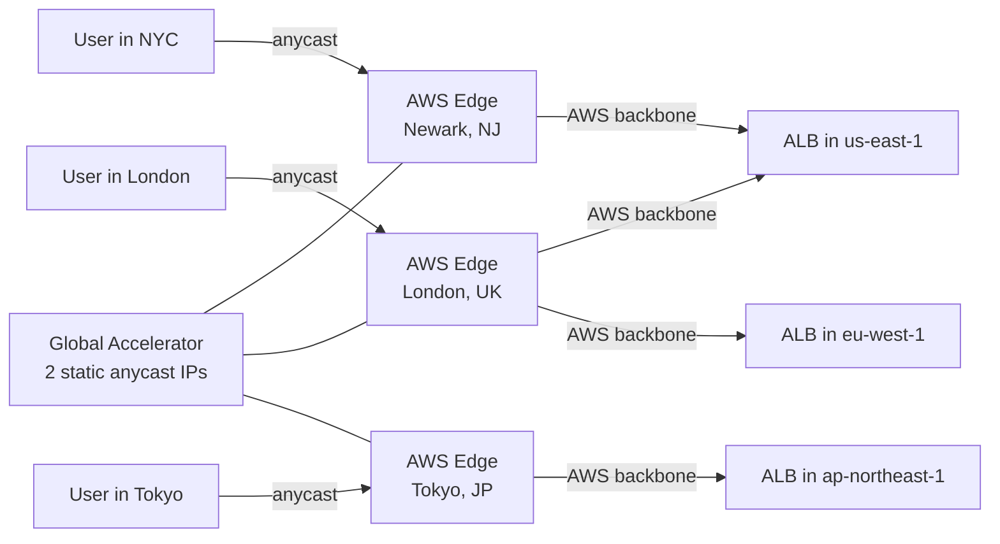

# AWS Global Accelerator

> Global anycast network that routes user traffic to the nearest AWS edge, then over AWS's private backbone to your endpoint — bypassing the congested public internet.

## How It Works



**Key mechanism:** Two static anycast IP addresses. All users worldwide connect to the same IPs — BGP routing delivers them to the nearest AWS edge (100+ Points of Presence). Traffic then rides the AWS private backbone (not the public internet) to your endpoint.

**Why this matters:** Public internet routing is unpredictable — packets may take suboptimal paths, experience congestion, or high packet loss. AWS backbone has SLA-backed performance with fewer hops.

## Endpoints

Global Accelerator supports:

| Endpoint Type | Notes |
|---------------|-------|
| **Application Load Balancer** | Most common — HTTP/HTTPS |
| **Network Load Balancer** | TCP/UDP |
| **EC2 Instance** | Directly to instance |
| **Elastic IP** | Static IP endpoint |

## Traffic Controls

### Endpoint Groups (per region)

```bash
aws globalaccelerator create-endpoint-group \
  --listener-arn arn:aws:globalaccelerator::123:accelerator/abc/listener/def \
  --endpoint-group-region us-east-1 \
  --traffic-dial-percentage 100 \
  --endpoint-configurations '[{
    "EndpointId": "arn:aws:elasticloadbalancing:us-east-1:123:loadbalancer/app/prod-alb/abc",
    "Weight": 100
  }]'
```

### Traffic Dial — Blue/Green Across Regions

```bash
# Shift 10% of traffic to new region for canary
aws globalaccelerator update-endpoint-group \
  --endpoint-group-arn arn:aws:globalaccelerator::123:... \
  --traffic-dial-percentage 10   # 10% of users globally go to this region
```

Traffic dial controls the **percentage of traffic** routed to an endpoint group (region). Use for gradual regional failover or blue-green deployment across regions.

## Automatic Failover

Global Accelerator continuously health-checks endpoints. When an endpoint fails:

- Unhealthy endpoint removed from routing **within 30 seconds** (configurable)
- Traffic automatically shifted to healthy endpoints in same or other regions
- No DNS TTL wait (unlike Route 53 — changes propagate immediately via BGP)

This is faster than Route 53 failover, which depends on DNS TTL (can be minutes).

## Global Accelerator vs CloudFront vs Route 53

| Feature | Global Accelerator | CloudFront | Route 53 Latency Routing |
|---------|-------------------|------------|--------------------------|
| Purpose | Anycast routing to origin | CDN (cache at edge) | DNS-based routing |
| Caches content | ❌ (pure routing) | ✅ | ❌ |
| Protocols | TCP, UDP, HTTP | HTTP/HTTPS only | Any |
| Static IPs | ✅ (2 anycast IPs) | ❌ (dynamic CW IPs) | ❌ |
| Failover speed | ~30s (health check) | Minutes (DNS TTL) | Minutes (DNS TTL) |
| Price | $0.025/hour + data transfer | Per GB + requests | DNS queries |
| Use case | Gaming, non-HTTP, IP whitelisting | Static sites, API caching | Multi-region DNS routing |

**Choose Global Accelerator when:**
- Non-HTTP protocols (UDP gaming, IoT MQTT, custom TCP)
- Need static IPs (for firewall whitelisting)
- Need faster failover than DNS TTL allows
- Global users + high latency sensitivity

**Choose CloudFront when:**
- HTTP/HTTPS content that can be cached
- Cost optimization (cache = fewer origin hits)

## Static IPs — The Key Differentiator

GA provides **2 static anycast IP addresses** that never change:

```bash
# These IPs don't change for the lifetime of the accelerator
ga_ips=$(aws globalaccelerator list-accelerators \
  --query 'Accelerators[0].IpSets[0].IpAddresses' \
  --output text)
# e.g., 75.2.26.189 and 99.83.147.30
```

Use case: clients (partner systems, mobile apps) hard-code these IPs for firewall rules. Unlike CloudFront, you can whitelist GA IPs in corporate firewalls.

## Common Interview Questions

**Q: Global Accelerator vs CloudFront — core difference?**
CloudFront caches content at edge POPs (great for static content, reduces origin load). Global Accelerator routes all requests to the origin but via the AWS backbone (no caching — for dynamic content, APIs, non-HTTP). Use CloudFront when caching helps. Use GA when you need fast routing for dynamic/real-time traffic or non-HTTP protocols.

**Q: Why do the static IPs matter?**
Many enterprises and partners whitelist inbound IPs in their firewalls. CloudFront uses dynamic IPs that change frequently — you'd need to maintain long IP lists. GA's 2 static anycast IPs mean partners only need to whitelist 2 IPs, and those IPs never change even if you change regions or endpoints.

**Q: How does a traffic dial enable blue-green across regions?**
Set traffic dial to 0% on the old region's endpoint group → all traffic shifts to the new region. Or set it to 10% on the new region while old stays at 100% — users are gradually shifted. Unlike DNS-based methods, dial changes take effect within seconds (no TTL wait). Roll back is instant — set old region back to 100%.

**Q: How does Global Accelerator handle regional failover?**
Global Accelerator health-checks all endpoints every 30 seconds. When an endpoint group's health drops below the configured threshold, GA automatically removes it from routing and distributes traffic across healthy endpoint groups. No DNS changes needed — the anycast IP routes change at the BGP level within ~30 seconds.
