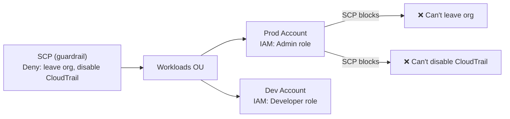

- AWS Organizations is a service that allows you to centrally manage and govern multiple AWS accounts. It helps with:
  - Grouping multiple AWS accounts into one organization
  - Applying policies across accounts (like service control policies)
  - Consolidated billing (one bill for all accounts)
  - Managing accounts through Organizational Units (OUs)

| Term                                | Description                                                                                               |
| ----------------------------------- | --------------------------------------------------------------------------------------------------------- |
| **Organization**                    | A collection of AWS accounts with one **management (root) account** and zero or more **member accounts**  |
| **Management Account**              | The first account created; used to create/manage the organization and billing                             |
| **Member Account**                  | An AWS account that is part of the organization but not the management account                            |
| **Organizational Unit (OU)**        | A group of accounts within the org. You can apply policies to an OU, and all accounts inside inherit them |
| **Service Control Policies (SCPs)** | Used to manage permissions at the account/OU level — acts as a **guardrail**                              |
| **Consolidated Billing**            | Combines bills for all accounts into a single payment method (no extra cost)                              |

# Typical AWS Org Structure

```
Root Account
├── Security OU
│   ├── Logging Account
│   └── GuardDuty Account
├── Infrastructure OU
│   ├── Network Account
│   └── Shared Services Account
├── Workloads OU
│   ├── Dev Account
│   ├── QA Account
│   └── Prod Account
```

# Enable AWS SSO
**IAM Identity Center:**
- Enable SSO and get the URL
- Create a group 
- Add Users to it 
- Define Permission set 
  - Predefined Permission set
  - Customized Permission Set
- Define the Session Timeout
- Assign Group to an AWS account
  - Assighn Permission Set to the group

---

## Service Control Policies (SCPs)

SCPs set the **maximum permissions** for accounts in an OU. They don't grant permissions — IAM still controls what's allowed. SCPs are guardrails:



```json
// SCP: Prevent disabling GuardDuty and CloudTrail (security guardrail)
{
  "Version": "2012-10-17",
  "Statement": [
    {
      "Sid": "DenyDisableSecurityServices",
      "Effect": "Deny",
      "Action": [
        "guardduty:DeleteDetector",
        "guardduty:DisassociateFromMasterAccount",
        "cloudtrail:DeleteTrail",
        "cloudtrail:StopLogging",
        "config:DeleteConfigurationRecorder"
      ],
      "Resource": "*"
    },
    {
      "Sid": "DenyLeavingOrganization",
      "Effect": "Deny",
      "Action": "organizations:LeaveOrganization",
      "Resource": "*"
    }
  ]
}
```

```bash
# Create and attach SCP
aws organizations create-policy \
  --name "DenySecurityChanges" \
  --type SERVICE_CONTROL_POLICY \
  --content file://security-scp.json

aws organizations attach-policy \
  --policy-id p-abc123 \
  --target-id ou-root-xxxxx   # attach to OU or account
```

## Multi-Account Strategy — AWS Landing Zone

```
Root Account (management only — no workloads)
├── Security OU
│   ├── Log Archive Account     ← centralized S3 bucket for all CloudTrail/Config logs
│   └── Security Tooling Account ← GuardDuty master, Security Hub, Inspector
├── Infrastructure OU
│   ├── Networking Account       ← Transit Gateway, Route 53, Shared VPCs
│   └── Shared Services Account  ← ECR, internal tooling
└── Workloads OU
    ├── SDLC OU
    │   ├── Dev Account
    │   ├── QA Account
    │   └── Staging Account
    └── Production OU
        ├── Prod-US Account
        └── Prod-EU Account
```

**Why separate accounts?**
- Blast radius isolation (security incident in Dev can't reach Prod)
- Independent billing and cost tracking
- SCPs per OU (Dev has fewer restrictions than Prod)
- Separate AWS service limits
- Regulatory compliance (HIPAA, PCI — isolated environments)

## AWS Control Tower

Automates multi-account setup with best-practice guardrails:

```bash
# Control Tower sets up:
# - Landing Zone (recommended OU structure)
# - Account Factory (self-service account vending)
# - Guardrails (pre-configured SCPs + Config rules)
# - Centralized logging (CloudTrail, Config to Log Archive)
# - Audit account
# - SSO integration

# Enroll existing accounts
aws controltower register-organizational-unit \
  --organizational-unit-id ou-xxxx-xxxxxxxx
```

**Control Tower guardrails types:**
- **Preventive** — SCPs that block actions (e.g., deny disabling CloudTrail)
- **Detective** — Config rules that detect violations (e.g., detect S3 buckets without encryption)
- **Proactive** — CloudFormation hooks that block non-compliant resources before creation

## Consolidated Billing

```
Management Account → one monthly bill for all member accounts
├── Volume discounts: All accounts combined for tier pricing
│   S3: total across all accounts → higher tier = lower price per GB
├── Reserved Instance sharing: RI in one account applies to others
└── Savings Plans sharing: Compute Savings Plans apply org-wide
```

**Cost allocation:** Use Cost Allocation Tags + AWS Cost Explorer to see costs per account, per OU, per tag.

## AWS Organizations Delegation

```bash
# Delegate GuardDuty management to Security account
aws guardduty enable-organization-admin-account --admin-account-id 123456789

# Delegate Security Hub
aws securityhub enable-organization-admin-account --admin-account-id 123456789

# Delegate AWS Config aggregator
aws configservice put-configuration-aggregator \
  --configuration-aggregator-name org-aggregator \
  --organization-aggregation-source '{
    "RoleArn": "arn:aws:iam::123:role/ConfigOrganizationAggregationRole",
    "AllAwsRegions": true
  }'
```

Delegated admin patterns allow Security/Audit accounts to see all member accounts without touching the management account.

## Common Interview Questions

**Q: SCP vs IAM Policy — what's the difference?**
SCPs set the maximum permissions boundary for an entire account — they constrain what IAM policies in that account can do. An SCP `Deny` cannot be overridden by any IAM policy, even `AdministratorAccess`. SCPs don't grant permissions on their own; IAM policies still grant. Example: SCP allows only `us-east-1` → even an admin IAM user can't launch in `eu-west-1`.

**Q: Why use multiple AWS accounts instead of multiple VPCs?**
Accounts provide stronger isolation: separate billing, separate IAM namespaces, separate service limits, SCPs as hard guardrails, blast radius containment (a compromised IAM role in Dev can't reach Prod). VPC isolation is network-level only; accounts are governance-level. Landing Zone with Control Tower automates this at scale.

**Q: What is a delegated administrator in AWS Organizations?**
You can delegate the management of specific services (GuardDuty, Security Hub, Config, IAM Access Analyzer) from the management account to a designated Security account. This follows least-privilege for the management account — it should only manage the organization itself, not run security tooling. The delegated admin can see findings and manage service settings across all member accounts.


