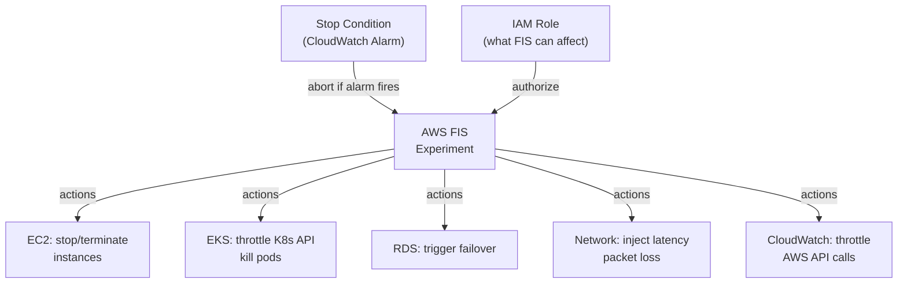

# AWS Fault Injection Service (FIS)

> Managed chaos engineering service. Run controlled fault injection experiments to improve application resilience — test how systems behave under real-world failure scenarios before those failures happen in production.

## Why Chaos Engineering?

"Hope is not a strategy." Systems that have never been tested under failure conditions often have untested assumptions:
- "Our multi-AZ setup handles AZ failures" — but has it ever been tested?
- "The application retries on DB connection errors" — under load?
- "Health checks detect and replace unhealthy pods" — within our SLO?

FIS lets you validate these assumptions in a controlled way.

## Architecture



## Experiment Template

```json
{
  "description": "Simulate AZ failure — kill 50% of instances in us-east-1a",
  "targets": {
    "prod-ec2-az-a": {
      "resourceType": "aws:ec2:instance",
      "resourceTags": {"Environment": "production"},
      "filters": [
        {"path": "Placement.AvailabilityZone", "values": ["us-east-1a"]},
        {"path": "State.Name", "values": ["running"]}
      ],
      "selectionMode": "PERCENT(50)"
    }
  },
  "actions": {
    "terminate-half-az-a": {
      "actionId": "aws:ec2:terminate-instances",
      "targets": {"Instances": "prod-ec2-az-a"},
      "startAfter": []
    }
  },
  "stopConditions": [
    {
      "source": "aws:cloudwatch:alarm",
      "value": "arn:aws:cloudwatch:us-east-1:123:alarm/slo-error-rate-breach"
    }
  ],
  "roleArn": "arn:aws:iam::123:role/FIS-ExperimentRole",
  "tags": {"project": "reliability-testing"}
}
```

## Action Types

| Action Category | Available Actions |
|-----------------|------------------|
| **EC2** | Stop instances, terminate instances, reboot instances, CPU/memory stress, network latency, packet loss |
| **ECS** | Stop tasks, drain container instances |
| **EKS** | Throttle Kubernetes API, terminate node groups |
| **RDS** | Reboot, failover (Multi-AZ), failover Aurora cluster |
| **Networking** | Disrupt connectivity (VPC route table manipulation) |
| **CloudWatch** | Throttle API calls (simulate AWS quota exhaustion) |
| **SSM** | Run SSM documents (arbitrary commands on instances) |

## Stop Conditions — Safety Guardrail

**Critical — always configure before running.**

Stop conditions automatically abort the experiment if a CloudWatch alarm fires:

```bash
# Create alarm that detects excessive errors (stop condition)
aws cloudwatch put-metric-alarm \
  --alarm-name "fis-stop-condition-error-rate" \
  --metric-name ErrorRate \
  --namespace MyApp \
  --threshold 5 \
  --comparison-operator GreaterThanThreshold \
  --evaluation-periods 2 \
  --period 60 \
  --alarm-actions arn:aws:sns:us-east-1:123:ops-alerts
```

Use this alarm ARN as the stop condition in your experiment template. If error rate exceeds 5% during the experiment, FIS immediately stops — preventing runaway impact.

## IAM Role for FIS

FIS needs an IAM role that defines what resources it can affect:

```json
{
  "Version": "2012-10-17",
  "Statement": [
    {
      "Effect": "Allow",
      "Principal": {"Service": "fis.amazonaws.com"},
      "Action": "sts:AssumeRole"
    }
  ]
}

// Permissions:
{
  "Statement": [
    {"Effect": "Allow", "Action": ["ec2:StopInstances", "ec2:TerminateInstances"], "Resource": "*",
     "Condition": {"StringEquals": {"aws:ResourceTag/Environment": "staging"}}},  // only staging!
    {"Effect": "Allow", "Action": ["rds:RebootDBInstance", "rds:FailoverDBCluster"], "Resource": "*"}
  ]
}
```

**Scope IAM permissions to non-production initially.** Add production access only after validating in staging.

## Common Experiment Scenarios

| Scenario | FIS Actions | What you learn |
|----------|-------------|---------------|
| **AZ failure** | Terminate instances in one AZ | Does multi-AZ actually work? How long to recover? |
| **DB failover** | RDS failover + Aurora failover | RTO of DB failover, app retry behavior |
| **CPU stress** | EC2 CPU stress injection | Does HPA scale? Do health checks detect? |
| **Network latency** | 500ms latency injection | Timeout configurations, cascade failure risk |
| **K8s API throttle** | Throttle K8s API 50% | How does the app behave when K8s API is slow? |
| **Dependency down** | Terminate downstream service | Circuit breaker? Graceful degradation? |

## FIS vs Other Chaos Tools

| | AWS FIS | Gremlin | LitmusChaos | Chaos Monkey |
|--|---------|---------|-------------|-------------|
| Managed | ✅ | ✅ (SaaS) | ❌ | ❌ |
| AWS-native | ✅ | Partial | ❌ | ❌ |
| K8s support | ✅ (EKS) | ✅ | ✅ (native) | ❌ |
| Cost | Per experiment | $9K+/year | Free (OSS) | Free (OSS) |
| Safety guardrails | CloudWatch alarms | ✅ | ✅ | ❌ |
| Cloud-managed actions | ✅ (RDS failover, etc.) | Partial | ❌ | ❌ |

## Game Days

A structured exercise using FIS (and manual scenarios) to test entire system reliability:

1. **Define hypothesis** ("System maintains <1% error rate during AZ failure")
2. **Prepare observability** (dashboards, alerts, runbooks ready)
3. **Run experiments** (FIS scenarios + manual drain/failovers)
4. **Measure outcomes** (did the hypothesis hold? RTO/RPO?)
5. **Document gaps** (missed alerting, slow recovery, incorrect runbooks)
6. **Remediate** (fix discovered issues before next game day)

## Common Interview Questions

**Q: How do you safely run chaos experiments in production?**
Three layers of safety: (1) Stop conditions — CloudWatch alarms abort the experiment if impact exceeds threshold. (2) Blast radius control — use PERCENT() selection to limit how many resources are affected. (3) Start in business hours — have team monitoring dashboards during the experiment for rapid manual intervention if needed. Also: start with Read replicas/secondary instances before primary resources.

**Q: What is a stop condition in FIS?**
A CloudWatch alarm that, when in ALARM state, automatically stops the FIS experiment. It's the key safety mechanism — you pre-define "if things get too bad (error rate > X%), abort the experiment automatically." Without stop conditions, an experiment could run to completion while your service is completely down.

**Q: FIS vs Gremlin vs LitmusChaos — when to use each?**
FIS when: AWS-native, need managed RDS failover/ASG actions, IAM-based auth, no additional tooling cost. Gremlin when: comprehensive chaos catalog, excellent UI/UX, multi-cloud, team wants SaaS experience. LitmusChaos when: Kubernetes-native, CNCF project, GitOps integration (ChaosExperiment CRDs), open-source/no-cost. FIS is the natural choice for AWS-focused teams.

**Q: What does a game day look like?**
A time-boxed (half-day to full-day) exercise where the team deliberately breaks things to test resilience. Typical flow: brief the team on scenarios → run experiments (AZ failures, DB failovers, high CPU) → observe and measure (error rates, latency, MTTR) → compare against hypotheses → debrief and capture action items. Repeat quarterly to validate improvements.
