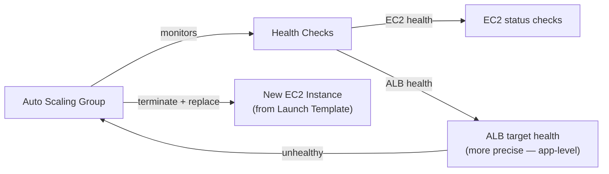
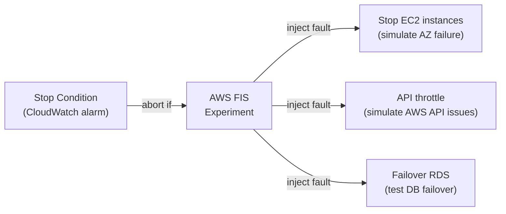

# AWS Auto Recovery & Reliability Mechanisms

## EC2 Auto Recovery

For single EC2 instances (stateful apps, databases) — recover the same instance on hardware failure:

```bash
# Create CloudWatch alarm to auto-recover EC2 on system failure
aws cloudwatch put-metric-alarm \
  --alarm-name "ec2-auto-recover-i-abc123" \
  --metric-name StatusCheckFailed_System \
  --namespace AWS/EC2 \
  --period 60 \
  --evaluation-periods 2 \
  --threshold 1 \
  --comparison-operator GreaterThanOrEqualToThreshold \
  --alarm-actions arn:aws:automate:us-east-1:ec2:recover \
  --dimensions Name=InstanceId,Value=i-abc123
```

**What recovery preserves:** Same Instance ID, private/public IPs, Elastic IPs, EBS volumes, security groups.

**What it can't recover:** Instance store data (ephemeral), instances with instance store-backed AMIs.

**Recover vs Reboot vs Terminate:**
- `Reboot`: soft restart (same physical host)
- `Recover`: move to new physical hardware (hardware failure)
- `Terminate`: delete instance (for ASG replacement)

---

## Auto Scaling Groups (ASG) — Self-Healing

ASG automatically replaces unhealthy instances — the primary reliability mechanism for stateless workloads:



### Health Check Types

| Type | What it checks | Recommended for |
|------|---------------|----------------|
| **EC2** | Instance status (hardware/OS) | Simple, broad |
| **ELB** | ALB/NLB target health (HTTP response) | Production (catches app failures) |
| **Custom** | Lambda-based custom logic | Specific business health checks |

**Always use ELB health checks in production** — EC2 checks only detect hardware/OS failures, not application crashes. An app that's running but returning 500s appears healthy to EC2 checks.

### Instance Refresh (Rolling ASG Updates)

Replace all instances in an ASG with a new Launch Template version — zero-downtime:

```bash
aws autoscaling start-instance-refresh \
  --auto-scaling-group-name my-asg \
  --preferences '{
    "MinHealthyPercentage": 80,
    "InstanceWarmup": 60,
    "CheckpointPercentages": [25, 50, 75, 100],
    "CheckpointDelay": 300
  }'
```

**Checkpoints:** Pause at 25%, 50%, 75% to verify new instances are healthy before continuing. Auto-cancels if health check fails.

### Warm Pools — Reduce Scale-Out Latency

Pre-initialize instances so they're ready when needed:

```bash
aws autoscaling put-warm-pool \
  --auto-scaling-group-name my-asg \
  --pool-state Stopped \          # keep pre-initialized instances stopped (pay for storage not compute)
  --min-size 2                    # always have 2 warm instances ready
```

Without warm pool: scale-out = launch instance + boot OS + install software + warmup app = 3-10 minutes.
With warm pool: scale-out = start pre-initialized instance + warmup app = 30-60 seconds.

### ASG Scaling Policies

| Policy | Trigger | Use case |
|--------|---------|---------|
| **Target Tracking** | Maintain a metric (e.g., CPU=50%) | General purpose, simple |
| **Step Scaling** | Different actions per threshold breach level | Fine-grained control |
| **Simple Scaling** | Single threshold, cooldown | Legacy, don't use |
| **Scheduled Scaling** | Time-based | Predictable load (business hours) |

```yaml
# Target Tracking — maintain 50% CPU
Type: AWS::AutoScaling::ScalingPolicy
Properties:
  AutoScalingGroupName: !Ref ASG
  PolicyType: TargetTrackingScaling
  TargetTrackingConfiguration:
    PredefinedMetricSpecification:
      PredefinedMetricType: ASGAverageCPUUtilization
    TargetValue: 50.0
    ScaleInCooldown: 300   # wait 5min before scaling in
    ScaleOutCooldown: 60   # scale out quickly
```

---

## AWS Fault Injection Service (FIS) — Chaos Engineering

Controlled fault injection to test reliability:



### Experiment Template

```json
{
  "description": "Simulate AZ failure — terminate 30% of instances in AZ-a",
  "targets": {
    "ec2-instances": {
      "resourceType": "aws:ec2:instance",
      "filters": [
        {"path": "Placement.AvailabilityZone", "values": ["us-east-1a"]},
        {"path": "State.Name", "values": ["running"]}
      ],
      "selectionMode": "PERCENT(30)"
    }
  },
  "actions": {
    "terminate-instances": {
      "actionId": "aws:ec2:terminate-instances",
      "targets": {"Instances": "ec2-instances"}
    }
  },
  "stopConditions": [
    {
      "source": "aws:cloudwatch:alarm",
      "value": "arn:aws:cloudwatch:us-east-1:123:alarm/critical-error-rate"
    }
  ],
  "roleArn": "arn:aws:iam::123:role/FISExperimentRole"
}
```

**Stop Conditions:** If the alarm fires during the experiment, FIS automatically stops — safety guardrail. Always set stop conditions before running in production.

---

## RDS Failover

**RDS Multi-AZ failover (~60-120s):**
- CloudWatch alarm detects primary failure
- AWS promotes standby to primary
- DNS endpoint updated (same hostname, new IP)
- Application reconnects automatically (retry logic required)

**Aurora failover (<30s):**
- Reader replica promoted to writer
- DNS cluster endpoint updated
- Fastest failover of any managed DB option

---

## Common Interview Questions

**Q: EC2 Auto Recovery vs ASG self-healing — which to use?**
Auto Recovery: for stateful single instances (Redis, databases, monitoring agents) where you need to keep the same IP and attached EBS — hardware failure recovery only. ASG: for stateless applications — automatically replaces any unhealthy instance and maintains desired capacity. ASG is the right default; Auto Recovery for specific stateful cases.

**Q: ASG health check types — why prefer ELB over EC2?**
EC2 health check detects hardware and OS failures (instance status checks). ELB health check detects application-level failures — if your app crashes but the instance is running, EC2 check says healthy, ELB check correctly identifies it as unhealthy and triggers replacement. Always use ELB health checks for web applications.

**Q: How do you safely run FIS experiments in production?**
Three safety layers: (1) Stop conditions — CloudWatch alarm aborts the experiment if error rate/latency spikes beyond threshold. (2) Limit blast radius — use PERCENT(10-30%) selection mode, not 100%. (3) Run during business hours initially — you want teams online to respond. Start in staging, graduate to production during low-traffic periods. Document runbooks before running.

**Q: What is a warm pool and when should you use it?**
Warm pool keeps pre-initialized EC2 instances in a Stopped state (pay only storage). When ASG scale-out triggers, warm pool instances start in seconds instead of minutes. Use when: your application has a long warmup time (JVM startup, model loading, large software install) and you need fast scale-out response. Trade-off: you pay ~$0.002-0.01/GB-month for stopped EBS volumes.
