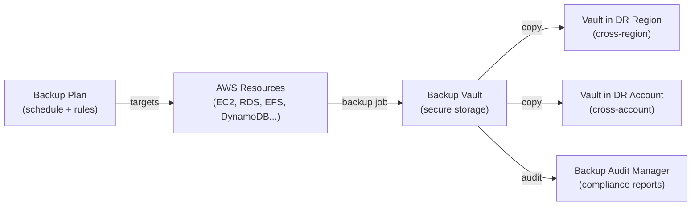

# AWS Backup

> Centralized backup service across AWS services. One place to define, schedule, and monitor backups — with cross-region and cross-account copy for disaster recovery.

## Architecture



## Backup Plan

A backup plan defines: what to back up, when, and how long to keep it:

```json
{
  "BackupPlanName": "production-backup-plan",
  "Rules": [
    {
      "RuleName": "daily-backups",
      "TargetBackupVaultName": "prod-vault",
      "ScheduleExpression": "cron(0 5 * * ? *)",  // daily at 5am UTC
      "StartWindowMinutes": 60,
      "CompletionWindowMinutes": 180,
      "Lifecycle": {
        "DeleteAfterDays": 35          // keep for 35 days (PITR window)
      },
      "CopyActions": [
        {
          "DestinationBackupVaultArn": "arn:aws:backup:eu-west-1:123:backup-vault/dr-vault",
          "Lifecycle": {"DeleteAfterDays": 90}  // keep DR copy longer
        }
      ]
    },
    {
      "RuleName": "monthly-backups",
      "ScheduleExpression": "cron(0 5 1 * ? *)",  // 1st of each month
      "Lifecycle": {
        "MoveToColdStorageAfterDays": 30,
        "DeleteAfterDays": 365
      }
    }
  ]
}
```

## Backup Vault Lock

Protection against accidental deletion and ransomware:

```bash
# Lock vault with WORM (Write Once Read Many) policy
aws backup put-backup-vault-lock-configuration \
  --backup-vault-name prod-vault \
  --min-retention-days 7 \
  --max-retention-days 365 \
  --changeable-for-days 3  # 3-day grace period before lock is permanent
```

After the grace period, **not even AWS can delete the backups** — critical for:
- Ransomware protection (attacker can't delete backups even with account compromise)
- SEC Rule 17a-4 compliance (WORM for financial records)

## Supported Services

| Service | Backup Type |
|---------|------------|
| **EC2** | AMI snapshot (EBS volumes) |
| **EBS** | Volume snapshot (incremental) |
| **RDS / Aurora** | Automated snapshot (storage layer) |
| **DynamoDB** | On-demand backup (point-in-time) |
| **EFS** | File system backup (rsync-based) |
| **FSx** | Windows/Lustre file system backup |
| **S3** | S3 Backup (uses S3 versioning) |
| **DocumentDB** | Cluster snapshot |
| **Neptune** | Cluster snapshot |

## Tag-Based Backup Assignment

Automatically include resources in backup plans by tag:

```bash
# Assign backup plan to all resources with tag Backup=daily
aws backup create-backup-selection \
  --backup-plan-id plan-abc123 \
  --backup-selection '{
    "SelectionName": "prod-resources",
    "IamRoleArn": "arn:aws:iam::123:role/AWSBackupRole",
    "ListOfTags": [{
      "ConditionType": "STRINGEQUALS",
      "ConditionKey": "Backup",
      "ConditionValue": "daily"
    }]
  }'
```

## Cross-Account Backup (DR)

Protect against account-level threats (accidental deletion, compromised account):

```bash
# Create cross-account vault access policy
aws backup put-backup-vault-access-policy \
  --backup-vault-name prod-vault \
  --policy '{
    "Statement": [{
      "Effect": "Allow",
      "Principal": {"AWS": "arn:aws:iam::DR-ACCOUNT:root"},
      "Action": ["backup:CopyIntoBackupVault"],
      "Resource": "*"
    }]
  }'
```

## EBS Snapshots vs AWS Backup

| | AWS Backup | EBS Data Lifecycle Manager (DLM) |
|--|-----------|----------------------------------|
| Scope | Multi-service (EC2, RDS, DFS, S3...) | EBS volumes only |
| Scheduling | Cron expression | DLM policy schedule |
| Cross-region | ✅ Copy action | ✅ Cross-region copy |
| Cross-account | ✅ | ✅ |
| Compliance | ✅ Audit Manager | ❌ |
| Vault lock | ✅ WORM | ❌ |
| Use when | Unified backup for multiple services | EBS-only, simpler setup |

## RDS Backup Types

| | Automated Backups | Manual Snapshots |
|--|------------------|-----------------|
| Triggered by | AWS automatically | You (or AWS Backup) |
| Retention | 1-35 days | Until deleted |
| Survives DB deletion | ❌ (deleted with DB) | ✅ Persist independently |
| PITR | ✅ (within retention window) | ❌ (point-in-time snapshot only) |
| Storage | AWS managed S3 | AWS managed S3 |

**Important:** Automated backups are deleted when the RDS instance is deleted. Always create a final manual snapshot before deleting production databases.

## Common Interview Questions

**Q: AWS Backup vs service-native snapshots (e.g., RDS automated backups)?**
AWS Backup provides unified management across services — one backup plan, one vault, one audit trail. Service-native backups (RDS automated, EBS DLM) are more granular but separate. Use AWS Backup when: you need cross-service consistency, compliance reporting (Backup Audit Manager), vault lock for immutability, or cross-account copy for DR.

**Q: What is Backup Vault Lock and when do you need it?**
Vault Lock makes backups immutable (WORM). Once locked, no one — not even AWS — can delete backups within the minimum retention period. Required for: ransomware protection (attackers who compromise an account can't delete backups), SEC 17a-4/FINRA compliance (financial records), HIPAA (healthcare records). Set with a grace period (3 days) to fix mistakes before lock becomes permanent.

**Q: How do you design backup for DR with cross-account and cross-region?**
Best practice: 3-2-1 rule (3 copies, 2 media types, 1 offsite). In AWS: primary backup in prod account + primary region → copy to DR region (cross-region) → copy to isolated DR account (cross-account). The DR account should have limited access (break-glass credentials) so a compromised prod account can't delete DR backups. Test restores quarterly.

**Q: RDS automated backups — what's the maximum retention?**
35 days. For longer retention, use AWS Backup's monthly backup rule to create snapshots archived to cold storage for 1 year. Automated backups support PITR within the retention window; long-term snapshots only restore to that snapshot's point-in-time.
