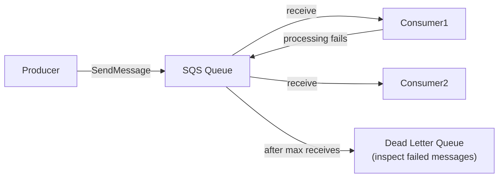
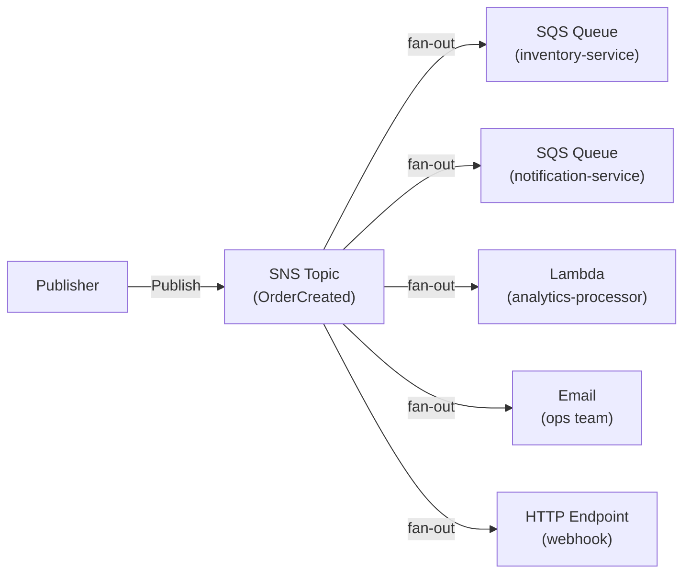
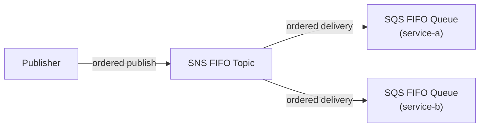

# AWS SQS & SNS — Messaging Services

## SQS — Simple Queue Service

Decoupled async message queue. Producers put messages in; consumers pull them out.

### Queue Types

| | Standard Queue | FIFO Queue |
|--|---------------|-----------|
| **Ordering** | Best-effort (mostly in order) | Strict (exactly in order) |
| **Delivery** | At-least-once (rare duplicates) | Exactly-once |
| **Throughput** | Unlimited | 3,000 msg/s with batching (9,000 with high throughput mode) |
| **Deduplication** | ❌ (idempotent consumers needed) | ✅ (5-min dedup window) |
| **Use case** | High throughput, order doesn't matter | Financial transactions, ordering matters |

### Key SQS Concepts



**Visibility timeout:** After a consumer receives a message, the message becomes invisible to other consumers. If the consumer doesn't delete it within the timeout (default 30s), the message becomes visible again (for retry). Set it to > max processing time.

**Long polling:** Instead of returning empty responses, SQS waits up to 20 seconds for messages to arrive — reduces empty receive costs by 95%.

**Dead Letter Queue (DLQ):** After `maxReceiveCount` delivery attempts, failed messages are moved to the DLQ. Use for debugging, alerting on persistent failures.

### SQS Configuration

```bash
# Create standard queue with DLQ
aws sqs create-queue \
  --queue-name my-queue \
  --attributes '{
    "VisibilityTimeout": "60",
    "MessageRetentionPeriod": "345600",
    "RedrivePolicy": "{\"deadLetterTargetArn\":\"arn:aws:sqs:us-east-1:123:my-dlq\",\"maxReceiveCount\":\"3\"}",
    "ReceiveMessageWaitTimeSeconds": "20"
  }'
```

### SQS with Lambda

Lambda polls SQS and processes batches — connection draining and retries are handled automatically:

```yaml
# Lambda EventSourceMapping
Properties:
  EventSourceArn: !GetAtt MyQueue.Arn
  FunctionName: !Ref ProcessorFunction
  BatchSize: 10                      # process up to 10 messages at once
  MaximumBatchingWindowInSeconds: 5  # wait 5s to accumulate batch
  FunctionResponseTypes:
    - ReportBatchItemFailures         # return failed message IDs for partial retry
```

SQS scaling with Lambda: Lambda creates one concurrent execution per active message group (FIFO) or scales based on messages in queue (Standard). Each function instance processes one batch at a time.

---

## SNS — Simple Notification Service

Publish-subscribe (pub/sub) fan-out. One message to a topic → delivered to all subscribers simultaneously.

### SNS Architecture



**Fan-out pattern:** Publish once → many consumers receive asynchronously. Classic pattern for decoupled microservices.

### SNS Message Filtering

Reduce unnecessary processing — subscribers only receive messages matching their filter:

```json
{
  "Attributes": {
    "FilterPolicy": "{\"order.type\": [\"premium\"], \"amount\": [{\"numeric\": [\">=\", 100]}]}"
  }
}
```

Without filtering: all subscribers receive all messages. With filtering: `inventory-service` only receives `order.type=premium` orders.

### SNS FIFO + SQS FIFO — Ordered Fan-Out



Use when: multiple consumers need the same messages in strict order (financial events, sequential state machine steps).

---

## SQS vs SNS vs EventBridge

| | SQS | SNS | EventBridge |
|--|-----|-----|-------------|
| **Pattern** | Queue (pull) | Pub/sub (push) | Event bus (rule-based) |
| **Consumers** | Single consumer group | Many subscribers simultaneously | Many targets per rule |
| **Persistence** | Up to 14 days | No (push only) | Archive up to years |
| **Filtering** | ❌ (consumer filters) | ✅ (subscription filter policy) | ✅ (content-based patterns) |
| **Fan-out** | ❌ (one consumer gets each message) | ✅ | ✅ |
| **Ordering** | FIFO option | FIFO option | No ordering |
| **Use case** | Work queues, task distribution | Notifications, fan-out | Event-driven microservices, SaaS |

## Common Interview Questions

**Q: SQS Standard vs FIFO — when to use each?**
Standard: when ordering doesn't matter, need maximum throughput (unlimited), and your consumers are idempotent (handle rare duplicate delivery). FIFO: financial transactions, order processing steps, state machine events — where processing out of order causes data corruption. FIFO is slower and costlier — don't use it unless ordering is genuinely required.

**Q: How does the SQS visibility timeout work?**
When a consumer receives a message, SQS makes it invisible for `VisibilityTimeout` seconds. If the consumer successfully processes and deletes the message within the timeout, it's gone. If the consumer crashes or takes too long, the timeout expires → message becomes visible again for another consumer. Set visibility timeout to at least 6x your average processing time to prevent unnecessary retries.

**Q: What is a DLQ and how do you configure it?**
Dead Letter Queue receives messages that fail delivery after `maxReceiveCount` attempts. Configure via `RedrivePolicy` on the source queue. Set CloudWatch alarm on `ApproximateNumberOfMessagesVisible` in the DLQ to alert on failures. Use the DLQ redrive feature (SQS console) to replay DLQ messages back to the source queue after fixing the consumer bug.

**Q: SNS fan-out pattern — how do you use it with SQS?**
SNS topic → multiple SQS queue subscriptions. Each queue = one independent consumer group. Benefits: publish once, multiple services process independently; if one consumer is slow/down, others continue; each queue can have its own visibility timeout and DLQ. This is the standard pattern for event-driven microservices on AWS.
