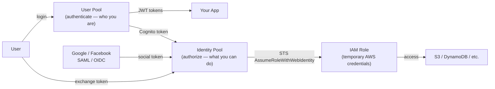

# Amazon Cognito

> Managed user identity service. Handles signup/signin for web and mobile apps. Two distinct services: **User Pools** (authentication) and **Identity Pools** (authorization for AWS resources).

## User Pools vs Identity Pools



| | User Pool | Identity Pool |
|--|-----------|--------------|
| **Purpose** | Authentication (signup, signin, MFA) | Authorization (AWS resource access) |
| **Output** | JWT tokens (Access, ID, Refresh) | Temporary IAM credentials (STS) |
| **Manages** | User directory | IAM role mapping |
| **Use case** | Login for your app | Direct AWS SDK calls from client |

## User Pools

Full-featured user directory + authentication:

```bash
# Create user pool
aws cognito-idp create-user-pool \
  --pool-name my-app-users \
  --policies '{"PasswordPolicy":{"MinimumLength":8,"RequireMFA":false}}' \
  --mfa-configuration OPTIONAL \
  --auto-verified-attributes email

# App client (for frontend to authenticate against)
aws cognito-idp create-user-pool-client \
  --user-pool-id us-east-1_abc123 \
  --client-name my-spa \
  --generate-secret false \
  --supported-identity-providers COGNITO Google \
  --allowed-o-auth-flows code \
  --allowed-o-auth-scopes openid email profile
```

### JWT Tokens from User Pools

| Token | Contents | Lifetime |
|-------|----------|---------|
| **ID Token** | User claims (email, groups, custom attributes) | 1 hour |
| **Access Token** | Scopes, groups — for authorizing API calls | 1 hour |
| **Refresh Token** | Opaque — used to get new Access/ID tokens | Up to 10 years |

### Hosted UI

Cognito provides a pre-built login/signup UI (OAuth 2.0 flow) at:
`https://your-domain.auth.us-east-1.amazoncognito.com/login`

## Identity Pools

Exchange any identity token for temporary AWS credentials:

```javascript
// Frontend: get AWS credentials from Cognito
const credentials = new AWS.CognitoIdentityCredentials({
  IdentityPoolId: 'us-east-1:abc-123',
  Logins: {
    'cognito-idp.us-east-1.amazonaws.com/us-east-1_abc': idToken
  }
});

// Credentials include: accessKeyId, secretAccessKey, sessionToken
const s3 = new AWS.S3({ credentials });
await s3.getObject({ Bucket: 'my-bucket', Key: `users/${userId}/data` }).promise();
```

IAM policy for the authenticated role:

```json
{
  "Statement": [{
    "Effect": "Allow",
    "Action": ["s3:GetObject", "s3:PutObject"],
    "Resource": "arn:aws:s3:::my-bucket/${cognito-identity.amazonaws.com:sub}/*"
  }]
}
```

## Lambda Triggers

Customize the auth flow with Lambda functions:

| Trigger | When | Use case |
|---------|------|----------|
| Pre Sign-up | Before user is confirmed | Block disposable email domains |
| Post Confirmation | After user confirms | Create user record in DynamoDB |
| Pre Token Generation | Before JWT issued | Add custom claims to token |
| Custom Authentication | Custom challenge | TOTP, biometric auth |
| Post Authentication | After successful sign-in | Log analytics, update last-login |

```python
# Pre Token Generation — add custom claims
def handler(event, context):
    event['response']['claimsOverrideDetails'] = {
        'claimsToAddOrOverride': {
            'user_tier': get_user_tier(event['userName']),
            'tenant_id': get_tenant_id(event['userName'])
        }
    }
    return event
```

## Integration with API Gateway

```yaml
# API Gateway JWT authorizer
Auth:
  DefaultAuthorizer: CognitoAuthorizer
  Authorizers:
    CognitoAuthorizer:
      UserPoolArn: !GetAtt UserPool.Arn
      AuthorizationScopes:
        - openid
```

Frontend sends: `Authorization: Bearer <id_token>` → API Gateway validates against User Pool.

## Integration with ALB

ALB can authenticate users with Cognito before forwarding to backend:

```json
{
  "Type": "authenticate-cognito",
  "AuthenticateCognitoConfig": {
    "UserPoolArn": "arn:aws:cognito-idp:...",
    "UserPoolClientId": "abc123",
    "UserPoolDomain": "my-domain"
  },
  "Order": 1
}
```

## Common Interview Questions

**Q: User Pool vs Identity Pool — when to use which?**
User Pool: when you need user authentication for your app (login, MFA, social login) — returns JWT tokens. Identity Pool: when you need clients to directly call AWS APIs (S3, DynamoDB) with AWS credentials — exchanges any identity token for temporary IAM credentials. Often used together: User Pool for login → Identity Pool to get AWS creds.

**Q: How do you get AWS credentials from Cognito?**
User Pool authenticates → returns ID Token (JWT) → pass to Identity Pool's `GetId` + `GetCredentialsForIdentity` → returns STS credentials (access key, secret, session token, expiry 1 hour). These credentials are scoped to an IAM role the Identity Pool maps the user to (authenticated vs unauthenticated roles).

**Q: Cognito vs Auth0 / Okta?**
Cognito: native AWS, tight integration (IAM, API GW, ALB, AppSync), pay per monthly active user ($0.0055/MAU), limited customization. Auth0/Okta: richer features, better UI customization, better enterprise SSO, but separate vendor. Choose Cognito for AWS-native apps; Auth0 for complex enterprise identity needs or multi-platform apps.

**Q: How do Cognito groups work?**
User Pool groups map to IAM roles. Assign users to groups (e.g., `admins`, `editors`). The group's IAM role ARN is embedded in the ID token's `cognito:roles` claim. Identity Pool uses this to assume the correct role. Useful for role-based access control where different users need different AWS permissions.
