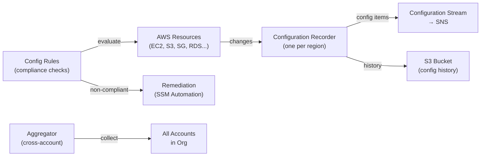

# AWS Config

> Continuous resource configuration tracking and compliance service. Records every configuration change to AWS resources — who changed what, when, and what it changed from.

## Core Concepts



## Configuration Item (CI)

A snapshot of a resource's configuration at a point in time:

```json
{
  "resourceType": "AWS::EC2::SecurityGroup",
  "resourceId": "sg-abc123",
  "configurationItemCaptureTime": "2024-01-15T10:00:00Z",
  "configurationStateId": "1234567890",
  "configuration": {
    "groupId": "sg-abc123",
    "ipPermissions": [
      {"fromPort": 22, "toPort": 22, "ipRanges": [{"cidrIp": "0.0.0.0/0"}]}
    ]
  },
  "relationships": [{"resourceType": "AWS::EC2::VPC", "resourceId": "vpc-xyz"}]
}
```

Config keeps full history — you can see what any resource looked like at any timestamp.

## Config Rules

Rules evaluate whether resources are compliant with your policies:

### AWS Managed Rules (pre-built)

```bash
# Enable S3 bucket encryption rule
aws configservice put-config-rule --config-rule '{
  "ConfigRuleName": "s3-bucket-server-side-encryption-enabled",
  "Source": {
    "Owner": "AWS",
    "SourceIdentifier": "S3_BUCKET_SERVER_SIDE_ENCRYPTION_ENABLED"
  }
}'
```

Common managed rules:

| Rule | Checks |
|------|--------|
| `restricted-ssh` | No SG allows 0.0.0.0/0 on port 22 |
| `encrypted-volumes` | All EBS volumes are encrypted |
| `rds-storage-encrypted` | RDS instances have storage encryption |
| `s3-bucket-public-read-prohibited` | No S3 buckets are publicly readable |
| `iam-root-access-key-check` | Root account has no access keys |
| `mfa-enabled-for-iam-console-access` | IAM users with console access have MFA |

### Custom Lambda Rules

```python
def evaluate_compliance(config_item, rule_parameters):
    if config_item['resourceType'] != 'AWS::EC2::SecurityGroup':
        return 'NOT_APPLICABLE'

    sg = config_item['configuration']
    for rule in sg.get('ipPermissions', []):
        for ip_range in rule.get('ipRanges', []):
            if ip_range['cidrIp'] == '0.0.0.0/0' and rule['fromPort'] == 0:
                return 'NON_COMPLIANT'
    return 'COMPLIANT'
```

## Evaluation Modes

| Mode | Trigger | Use case |
|------|---------|----------|
| **Configuration change** | When resource config changes | Detect misconfigs quickly |
| **Periodic** | Every 1/3/6/12/24 hours | Compliance drift over time |

## Remediation

Auto-remediate non-compliant resources:

```bash
# Attach remediation action to a rule
aws configservice put-remediation-configurations --remediation-configurations '[{
  "ConfigRuleName": "s3-bucket-public-read-prohibited",
  "TargetType": "SSM_DOCUMENT",
  "TargetId": "AWS-DisableS3BucketPublicReadWrite",
  "Parameters": {
    "BucketName": {
      "ResourceValue": {"Value": "RESOURCE_ID"}
    }
  },
  "Automatic": true,
  "MaximumAutomaticAttempts": 3,
  "RetryAttemptSeconds": 60
}]'
```

## Conformance Packs

A collection of Config rules + remediation actions deployed together — ready-made for compliance frameworks:

```bash
# Deploy CIS AWS Foundations Benchmark conformance pack
aws configservice put-conformance-pack \
  --conformance-pack-name CIS-AWS-Foundations \
  --template-s3-uri s3://aws-config-rules/conformance-packs/CIS-AWS-Foundations-Benchmark.yaml
```

Available packs: CIS Level 1 & 2, PCI DSS, HIPAA, NIST, SOC 2, AWS Operational Best Practices.

## Multi-Account Aggregation

See compliance across your entire AWS Organization:

```bash
aws configservice put-configuration-aggregator \
  --configuration-aggregator-name my-org-aggregator \
  --organization-aggregation-source '{
    "RoleArn": "arn:aws:iam::MGMT-ACCOUNT:role/ConfigAggregatorRole",
    "AllAwsRegions": true
  }'
```

## Config vs CloudTrail

| Feature | AWS Config | CloudTrail |
|---------|-----------|-----------|
| Tracks | Resource configuration **state** | API **events** (who called what) |
| Question answered | "What does this resource look like?" | "Who made this API call?" |
| History | Configuration changes over time | API calls |
| Use case | Compliance, drift detection | Audit trail, forensics |

**Together:** Config shows the resource changed; CloudTrail shows who changed it and when.

## Common Interview Questions

**Q: Config vs CloudTrail — what's the difference?**
Config tracks resource configuration state (what your resources look like now and historically). CloudTrail tracks API events (who called which API). Config answers "was this S3 bucket ever public?" CloudTrail answers "who ran that `s3:PutBucketPublicAccessBlock` API call?" Use both — they're complementary.

**Q: How does auto-remediation work and is it safe?**
Config rules detect non-compliance → trigger an SSM Automation document (e.g., encrypt an unencrypted EBS volume). Set `MaximumAutomaticAttempts` and `RetryAttemptSeconds` for safety. Test in non-prod first — auto-remediation can cause disruption (e.g., blocking public S3 buckets might break static sites). Use Automatic=false initially and switch to automatic after validating.

**Q: What is a Conformance Pack?**
A pre-packaged collection of Config rules targeting a specific compliance framework (CIS Benchmark, PCI DSS, HIPAA). AWS provides ready-made conformance packs in S3. Deploy one command to get 20-50 compliance rules. You can customize (disable specific rules, adjust parameters) before deployment.

**Q: How do you write a custom Config rule?**
Write a Lambda function that receives a configuration item (JSON snapshot of a resource) and returns COMPLIANT, NON_COMPLIANT, or NOT_APPLICABLE. Register it with Config specifying the resource types to evaluate and the trigger type (configuration change or periodic). AWS calls your Lambda whenever the resource changes or on the schedule.
