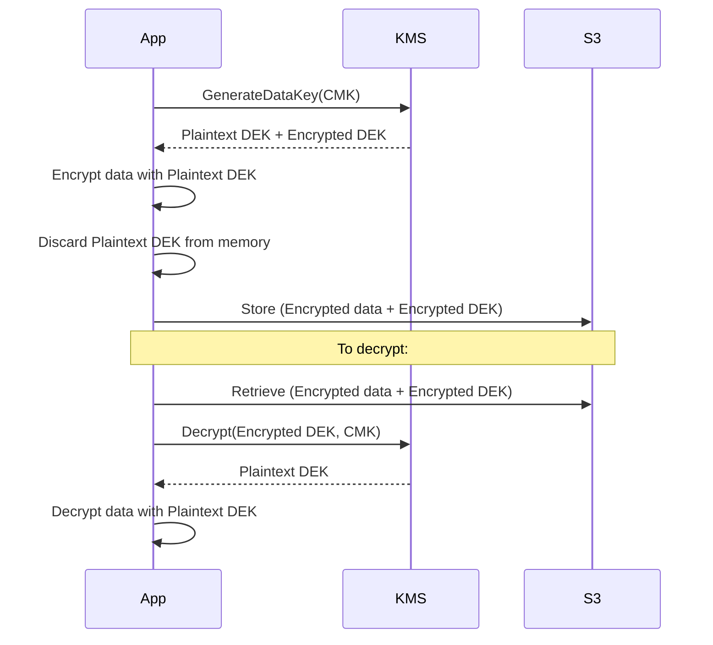

# AWS KMS (Key Management Service)

> Managed encryption key service. Create, rotate, and audit cryptographic keys — integrated with 100+ AWS services.

## Key Types

| Key Type | Who manages key material | Cost | Use case |
|----------|------------------------|------|----------|
| **AWS Owned Keys** | AWS | Free | Default encryption for managed services (S3 SSE-S3) |
| **AWS Managed Keys** | AWS (auto-rotate annually) | Free | Service-default CMKs (S3 SSE-KMS, RDS) |
| **Customer Managed Keys (CMK)** | You | $1/key/month | Full control, custom rotation, cross-account |
| **External Key Material** | You import | $1/key/month | Bring your own key, compliance requirements |

## Envelope Encryption

KMS never encrypts large data directly — it uses **envelope encryption**:



**Why envelope encryption?** KMS has a 4KB data limit. Encrypting with a DEK (Data Encryption Key) locally is much faster than sending all data to KMS. The DEK is small enough for KMS to encrypt.

## Key Policy

Every CMK has a **key policy** (resource-based policy) — IAM permissions alone are not enough:

```json
{
  "Statement": [
    {
      "Sid": "Allow root account full access",
      "Effect": "Allow",
      "Principal": {"AWS": "arn:aws:iam::123456789012:root"},
      "Action": "kms:*",
      "Resource": "*"
    },
    {
      "Sid": "Allow EC2 role to use the key",
      "Effect": "Allow",
      "Principal": {"AWS": "arn:aws:iam::123456789012:role/MyEC2Role"},
      "Action": ["kms:Decrypt", "kms:GenerateDataKey"],
      "Resource": "*"
    },
    {
      "Sid": "Allow cross-account access",
      "Effect": "Allow",
      "Principal": {"AWS": "arn:aws:iam::999999999999:root"},
      "Action": ["kms:Decrypt", "kms:DescribeKey"],
      "Resource": "*"
    }
  ]
}
```

**Key policy vs IAM:** The key policy is the primary access control. IAM can further restrict (you need BOTH key policy + IAM policy to allow an action).

## Key Rotation

```bash
# Enable automatic annual rotation (CMK only)
aws kms enable-key-rotation --key-id alias/my-key

# Check rotation status
aws kms get-key-rotation-status --key-id alias/my-key
```

Rotation creates new key material but keeps the same Key ID — old data (encrypted with old material) is still decryptable. AWS keeps old key material indefinitely.

## Grants

Temporary, targeted permissions — useful for cross-account or time-limited access without modifying key policies:

```bash
aws kms create-grant \
  --key-id alias/my-key \
  --grantee-principal arn:aws:iam::123:role/WorkerRole \
  --operations Decrypt GenerateDataKey
```

## CloudTrail Integration

Every KMS API call is logged in CloudTrail — who used which key, when, from where. Essential for compliance auditing.

## Common Integrations

| Service | How KMS is used |
|---------|----------------|
| S3 | SSE-KMS encrypts object data keys |
| EBS | CMK encrypts volume data keys |
| RDS / Aurora | CMK encrypts database storage |
| Secrets Manager | Encrypts secret values |
| EKS etcd | Envelope encryption for K8s Secrets at rest |
| Lambda | Environment variable encryption |

## Common Interview Questions

**Q: Why use envelope encryption instead of encrypting data directly with KMS?**
Two reasons: (1) KMS has a 4KB limit on plaintext — most data is larger. (2) Performance — generating a DEK locally is milliseconds; every Decrypt call to KMS adds latency. Envelope encryption means one KMS call to get the DEK, then fast local AES encryption for all the data.

**Q: Key policy vs IAM policy — which takes precedence?**
Both must allow the action. The key policy is the primary control — by default (if you use the console), the key policy grants the account root access, which allows IAM policies to delegate further. Without the `Principal: root` statement, IAM can't grant any access to that key regardless of what's in the IAM policy.

**Q: How do you grant cross-account KMS access?**
Two-step: (1) Add the external account's root principal to the key policy. (2) In the external account, create an IAM policy that allows the specific KMS actions on that key ARN and attach it to the relevant role. Both sides must allow.

**Q: What happens if you delete a CMK?**
7-30 day waiting period before deletion (configurable). During this time, you can cancel. After deletion: all data encrypted with that key (including DEKs) is permanently unrecoverable. AWS recommends disabling the key first rather than deleting.
