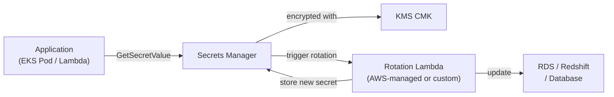
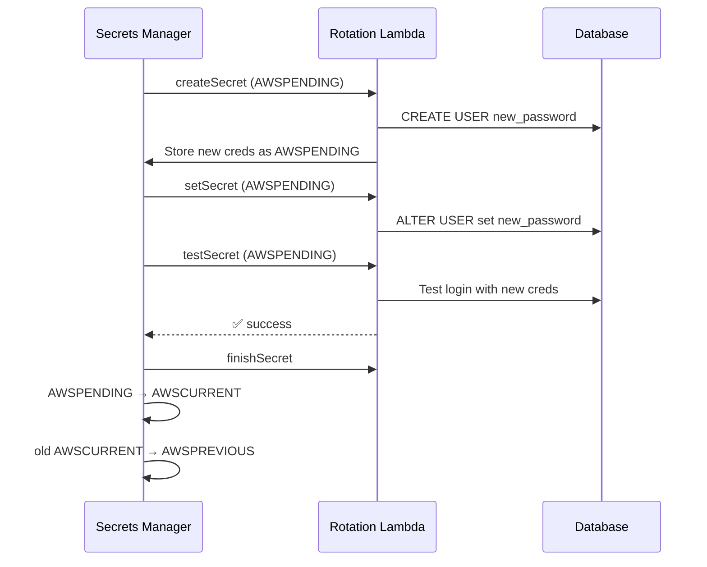

# AWS Secrets Manager

> Managed secret storage with automatic rotation. Store, retrieve, and automatically rotate database credentials, API keys, and other secrets.

## Architecture



## Secret Structure

```bash
# Create a secret
aws secretsmanager create-secret \
  --name /prod/myapp/db-credentials \
  --secret-string '{"username":"admin","password":"s3cr3t","host":"db.cluster.local","port":5432}'

# Retrieve a secret
aws secretsmanager get-secret-value \
  --secret-id /prod/myapp/db-credentials \
  --query SecretString --output text | jq .
```

## Automatic Rotation — The Key Feature

Rotation uses a Lambda function with a 4-stage protocol:



**Why the AWSPENDING stage?** During rotation, both old (AWSCURRENT) and new (AWSPENDING) passwords work simultaneously — zero-downtime rotation. Existing connections keep using the old password until they reconnect.

## Rotation Configuration

```bash
# Enable rotation for RDS credentials (AWS manages the Lambda)
aws secretsmanager rotate-secret \
  --secret-id /prod/myapp/db-credentials \
  --rotation-lambda-arn arn:aws:lambda:us-east-1:123:function:SecretsManagerRDSRotation \
  --rotation-rules '{"AutomaticallyAfterDays": 30}'
```

AWS provides managed rotation Lambdas for: RDS MySQL, RDS PostgreSQL, RDS Oracle, RDS MariaDB, Redshift, DocumentDB.

## Versioning

Each secret stores multiple versions:

| Label | Meaning |
|-------|---------|
| `AWSCURRENT` | Active version — what apps should use |
| `AWSPENDING` | New version during rotation |
| `AWSPREVIOUS` | Previous version — kept during rotation window |

```bash
# Get a specific version
aws secretsmanager get-secret-value \
  --secret-id /prod/myapp/db-credentials \
  --version-stage AWSPREVIOUS
```

## Secrets Manager vs SSM Parameter Store

| Feature | Secrets Manager | Parameter Store |
|---------|----------------|-----------------|
| **Purpose** | Rotating secrets (DB creds, API keys) | Config + non-rotating secrets |
| **Cost** | $0.40/secret/month + $0.05/10K API calls | Free (Standard) / $0.05/param/mo (Advanced) |
| **Auto-rotation** | ✅ Built-in | ❌ (manual) |
| **Cross-account** | ✅ Resource policy | ✅ Resource policy |
| **Size limit** | 65KB | 4KB (Standard) / 8KB (Advanced) |
| **Secret versioning** | CURRENT/PENDING/PREVIOUS | By version ID |

**Rule of thumb:**
- DB credentials, API keys → Secrets Manager (rotation justifies the cost)
- App config, feature flags, non-rotating values → Parameter Store (cheaper)

## Access from EKS (Two Options)

**Option 1: External Secrets Operator (ESO)**

```yaml
apiVersion: external-secrets.io/v1beta1
kind: ExternalSecret
metadata:
  name: db-credentials
spec:
  refreshInterval: 1h
  secretStoreRef:
    name: aws-secretsmanager
    kind: ClusterSecretStore
  target:
    name: db-credentials    # name of the K8s Secret to create
  data:
    - secretKey: password
      remoteRef:
        key: /prod/myapp/db-credentials
        property: password
```

**Option 2: AWS Secrets and Configuration Provider (ASCP) + Secrets Store CSI Driver**

```yaml
apiVersion: secrets-store.csi.x-k8s.io/v1
kind: SecretProviderClass
metadata:
  name: db-credentials-spc
spec:
  provider: aws
  parameters:
    objects: |
      - objectName: "/prod/myapp/db-credentials"
        objectType: secretsmanager
        jmesPath:
          - path: password
            objectAlias: db-password
```

## Common Interview Questions

**Q: How does rotation work without downtime?**
The AWSPENDING stage — during rotation, the new password is set on the database but the old password (AWSCURRENT) remains valid. The Lambda tests the new password, then Secrets Manager promotes AWSPENDING to AWSCURRENT. Existing connections using the old password continue to work until they reconnect (they then read the new AWSCURRENT).

**Q: Secrets Manager vs Parameter Store — when to choose?**
Secrets Manager when: you need automatic rotation, cross-service secret sharing, fine-grained access auditing. Parameter Store when: storing app config (database host, feature flags, non-sensitive settings) — it's free for standard parameters. Cost-wise: 100 non-rotating secrets in Parameter Store = $0; in Secrets Manager = $40/month.

**Q: How do you use Secrets Manager secrets in an EKS pod?**
Two approaches: (1) External Secrets Operator — syncs secrets to K8s Secrets on a schedule (poll-based, simpler). (2) Secrets Store CSI Driver + ASCP — mounts secrets as a volume into pods (no K8s Secret created on disk — more secure, but requires CSI setup). Both use IRSA for IAM auth.

**Q: What is resource-based policy in Secrets Manager?**
A JSON policy attached to the secret itself (like S3 bucket policy). Used for cross-account access — in the secret's resource policy, allow the external account's IAM role. The external role's IAM policy must also allow the action. Both sides must explicitly permit.
