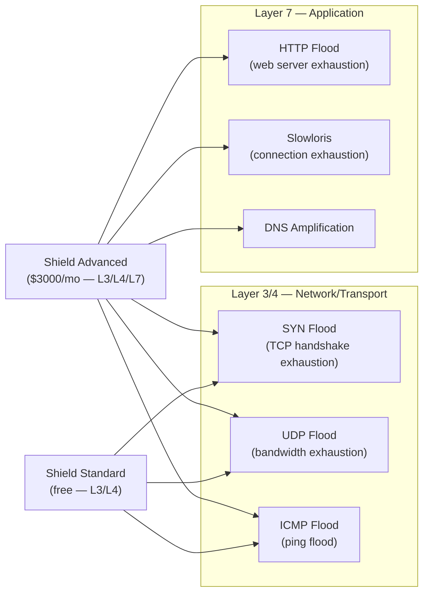

- AWS Shield is a managed DDoS protection service from AWS.
It protects your web applications and infrastructure from Distributed Denial of Service (DDoS) attacks.

- Think of AWS Shield as a security wall that blocks large-scale internet attacks trying to take down your website or service by overwhelming it with traffic.

# What is a DDoS Attack?

- A DDoS (Distributed Denial of Service) attack is when attackers flood your application with a massive number of fake requests to crash it or make it unavailable to real users.

# AWS Shield Has Two Tiers:

1. AWS Shield Standard (✅ Free by default)
Automatically active for all AWS customers

Protects against common & most frequent DDoS attacks

No setup needed

Protects services like:

CloudFront

Route 53

Elastic Load Balancing (ALB/NLB)

Global Accelerator

2. AWS Shield Advanced (💵 Paid, for enterprises)
Adds enhanced protection against larger/more sophisticated attacks

Includes:

24/7 DDoS response team (DRT)

Real-time metrics and alerts

WAF integration

Application layer (L7) attack protection

Cost protection: AWS credits you for scaling charges from attacks

# How Does It Work?
You host a site (e.g., via CloudFront, ALB, or API Gateway).

If a DDoS attack starts:

Shield Standard automatically blocks common floods (e.g., SYN floods, UDP floods).

Shield Advanced analyzes traffic, gives deeper visibility, and engages AWS support if needed.

Your application stays available and stable, even during the attack.

---

## DDoS Attack Layers



## Shield Standard vs Advanced

| Feature | Shield Standard | Shield Advanced |
|---------|----------------|----------------|
| **Cost** | Free (always on) | $3,000/month + data transfer |
| **Protection** | L3/L4 DDoS | L3/L4/L7 DDoS |
| **Attack visibility** | Basic metrics | Real-time detailed metrics |
| **DRT access** | ❌ | ✅ 24/7 DDoS Response Team |
| **WAF integration** | ❌ | ✅ (auto WAF rules during attacks) |
| **Cost protection** | ❌ | ✅ (AWS credits scaling charges) |
| **Attack notifications** | ❌ | ✅ (SNS alerts) |
| **Health-based detection** | ❌ | ✅ (Route 53 health checks) |
| **Protected resources** | CloudFront, Route 53, ELB | + EC2 EIPs, Global Accelerator |

## Shield Advanced — Key Features

### 1. DDoS Response Team (DRT)

```bash
# Contact DRT during an attack
# Shield Advanced customers get a dedicated support line
# DRT can:
#   - Analyze attack traffic in real-time
#   - Create and deploy WAF rules during the attack
#   - Escalate with AWS network team if needed
#   - Provide post-attack report
```

### 2. Cost Protection

During a DDoS attack, AWS auto-scaling might launch extra EC2/ALB capacity to absorb traffic. Shield Advanced credits the excess costs — you don't pay for resources launched in response to a DDoS attack.

### 3. Proactive Engagement

```bash
# Enable proactive DRT engagement (they call you during severe attacks)
aws shield update-proactive-engagement --proactive-engagement-status ENABLED

aws shield associate-drt-role \
  --role-arn arn:aws:iam::123:role/AWSShieldDRTAccessRole

# Register resources with Shield Advanced
aws shield create-protection \
  --name "prod-alb-protection" \
  --resource-arn arn:aws:elasticloadbalancing:us-east-1:123:loadbalancer/app/my-alb/abc
```

### 4. Shield Advanced + WAF Integration

```bash
# Shield Advanced can automatically create WAF rules during an attack
# Associate WAF Web ACL with Shield Advanced protection
aws shield associate-drt-log-bucket --log-bucket my-waf-logs-bucket

# Enable automatic layer 7 mitigation
aws shield update-protection-group \
  --protection-group-id prod-resources \
  --pattern BY_RESOURCE_TYPE \
  --resource-type APPLICATION_LOAD_BALANCER \
  --aggregation MEAN
```

## Monitoring DDoS Attacks

```bash
# CloudWatch metrics available with Shield
# DDoSAttackBitsPerSecond — attack traffic volume
# DDoSAttackPacketsPerSecond — packet rate
# DDoSAttackRequestsPerSecond — for L7 attacks

# Create alarm for DDoS detection
aws cloudwatch put-metric-alarm \
  --alarm-name "ddos-attack-detected" \
  --namespace AWS/DDoSProtection \
  --metric-name DDoSDetected \
  --threshold 1 \
  --comparison-operator GreaterThanOrEqualToThreshold \
  --alarm-actions arn:aws:sns:us-east-1:123:ops-critical
```

## Common Interview Questions

**Q: Shield Standard vs Advanced — when do you need Advanced?**
Standard (free) handles most volumetric L3/L4 attacks automatically. Advanced is needed when: you've been targeted before and need expert DRT support, you need detailed attack visibility and notifications, you have financial exposure from scaling charges during attacks (cost protection), you need L7 (application layer) DDoS protection, or compliance/contractual requirements. Most applications are fine with Standard + WAF.

**Q: How does Shield work with WAF?**
Shield Standard protects at the network/transport layer (L3/L4). WAF protects at the application layer (L7 — HTTP). They're complementary. Shield Advanced integrates with WAF: during a Layer 7 attack, the DRT can deploy WAF rules in real-time to block malicious traffic patterns. Using both together gives full-stack DDoS protection.

**Q: DDoS attack detected — what do you do?**
Standard response: (1) Check CloudWatch Shield metrics to understand attack type and volume. (2) If using Shield Advanced, contact DRT immediately. (3) Enable WAF count mode to identify malicious traffic patterns. (4) Create WAF rules to block the attack pattern (specific user agents, IP ranges, request patterns). (5) Check Auto Scaling is functioning (absorb traffic). (6) If severe, consider activating CloudFront in front of the origin to absorb traffic at edge.
