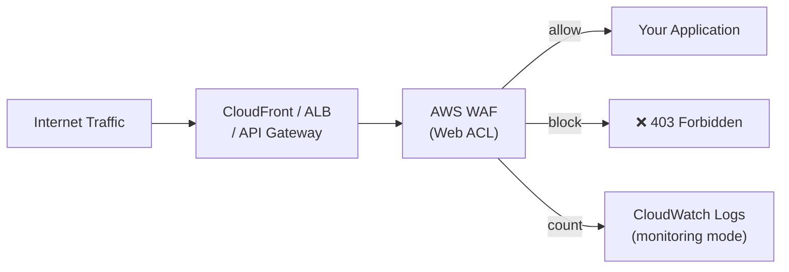

- AWS WAF (Web Application Firewall) is a security service that protects your web applications from common internet threats and malicious traffic.

- AWS WAF acts like a security guard for your website or API.
It checks incoming requests and blocks the bad ones (like hackers, bots, or known attack patterns), and lets good traffic through.

# What can AWS WAF protect?
It works with:

Amazon CloudFront (CDN)

Application Load Balancer (ALB)

Amazon API Gateway

AWS App Runner

# How It Works:

You create a Web ACL (Access Control List)

Add rules to allow, block, or count requests

Attach this Web ACL to your CloudFront, ALB, or API Gateway

WAF starts inspecting each request using your rules

---

## Architecture



## Rule Types

| Rule Type | Description | Example |
|-----------|-------------|---------|
| **AWS Managed Rules** | Pre-built rule groups by AWS | AWSManagedRulesCommonRuleSet (OWASP Top 10) |
| **Rate-based rules** | Block IPs exceeding request/min threshold | Block after 1000 req/5min |
| **IP Set rules** | Block/allow specific IPs or CIDRs | Allow only office IPs |
| **Geo match** | Block/allow by country | Block CN, RU for US-only app |
| **String match** | Match request body/headers/URI | Block SQL injection patterns |
| **Regex match** | Pattern matching | Block specific user agents |
| **Custom Lambda** | Call Lambda for custom logic | Verify HMAC signature |

## AWS Managed Rule Groups

```bash
# Most used managed rule groups
aws wafv2 list-available-managed-rule-groups --scope REGIONAL

# Key managed rule sets:
# AWSManagedRulesCommonRuleSet      — OWASP Top 10 (SQLi, XSS, etc.)
# AWSManagedRulesKnownBadInputsRuleSet — Log4Shell, Spring4Shell, etc.
# AWSManagedRulesBotControlRuleSet  — Bot detection
# AWSManagedRulesAmazonIpReputationList — Malicious IP list (AWS threat intel)
# AWSManagedRulesSQLiRuleSet        — SQL injection
# AWSManagedRulesLinuxRuleSet       — Linux-specific attacks
```

## Web ACL Configuration

```yaml
# CloudFormation WAF Web ACL
Type: AWS::WAFv2::WebACL
Properties:
  Name: my-app-waf
  Scope: REGIONAL         # or CLOUDFRONT (for CF distributions)
  DefaultAction:
    Allow: {}              # default allow, rules block
  VisibilityConfig:
    SampledRequestsEnabled: true
    CloudWatchMetricsEnabled: true
    MetricName: my-app-waf
  Rules:
    # 1. Rate limit by IP
    - Name: rate-limit-per-ip
      Priority: 1
      Action:
        Block: {}
      Statement:
        RateBasedStatement:
          Limit: 2000               # max 2000 requests per 5 minutes per IP
          AggregateKeyType: IP
      VisibilityConfig:
        SampledRequestsEnabled: true
        CloudWatchMetricsEnabled: true
        MetricName: rate-limit

    # 2. AWS Managed Rules — OWASP Top 10
    - Name: aws-common-rules
      Priority: 2
      OverrideAction:
        None: {}
      Statement:
        ManagedRuleGroupStatement:
          VendorName: AWS
          Name: AWSManagedRulesCommonRuleSet
      VisibilityConfig:
        SampledRequestsEnabled: true
        CloudWatchMetricsEnabled: true
        MetricName: common-rules

    # 3. Geo block
    - Name: block-high-risk-countries
      Priority: 3
      Action:
        Block: {}
      Statement:
        GeoMatchStatement:
          CountryCodes: [KP, RU, CN]   # adjust per your requirements
      VisibilityConfig:
        SampledRequestsEnabled: true
        CloudWatchMetricsEnabled: true
        MetricName: geo-block
```

## WAF Logging

```bash
# Enable WAF logging to S3 + Kinesis Firehose
aws wafv2 put-logging-configuration \
  --logging-configuration '{
    "ResourceArn": "arn:aws:wafv2:us-east-1:123:regional/webacl/my-waf/abc",
    "LogDestinationConfigs": ["arn:aws:firehose:us-east-1:123:deliverystream/waf-logs"],
    "RedactedFields": [{"SingleHeader": {"Name": "authorization"}}]
  }'

# Query WAF logs with Athena
SELECT action, httprequest.clientip, httprequest.uri, timestamp
FROM waf_logs
WHERE action = 'BLOCK'
  AND timestamp BETWEEN 1718000000 AND 1718086400
ORDER BY timestamp DESC
LIMIT 100;
```

## WAF vs Shield vs Security Groups

| | WAF | Shield | Security Groups |
|--|-----|--------|----------------|
| Layer | L7 (HTTP) | L3/L4 + L7 | L3/L4 (VPC) |
| Blocks | SQLi, XSS, bad bots | DDoS floods | Port/IP rules |
| Cost | $5/WAF + $1/million req | Standard: free, Advanced: $3000/mo | Free |
| Works with | CloudFront, ALB, API GW | CloudFront, ALB, Route 53, EC2 | All VPC resources |

**Use together:** Security Groups for VPC-level port filtering → WAF for HTTP-level filtering → Shield for DDoS protection.

## Common Interview Questions

**Q: WAF rate-based rules — how do they work?**
Rate-based rules count requests from a single IP over a 5-minute rolling window. If the count exceeds the threshold (e.g., 2000 requests/5min), subsequent requests from that IP are blocked until the rate drops below the threshold. Useful against brute-force login attacks and credential stuffing.

**Q: WAF managed rules vs custom rules — when to use each?**
AWS Managed Rules for: OWASP Top 10 (SQLi, XSS), known bad IPs, bot detection — maintained by AWS, updated as new vulnerabilities emerge. Custom rules for: application-specific logic (block specific user agents, require specific headers for internal APIs, whitelist specific IP ranges). Use managed rules as the foundation, custom rules on top for your specific requirements.

**Q: How do you test WAF rules without blocking production traffic?**
Use `Count` mode instead of `Block` on new rules — requests are counted and logged but not blocked. Monitor CloudWatch WAF metrics and logs for false positives. Once confident, switch to `Block`. This "monitor mode" approach prevents accidentally breaking legitimate traffic when deploying new rules.

