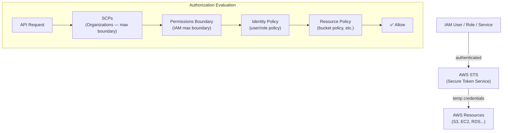

# Intro

- AWS IAM (Identity and Access Management) is a global service that allows you to securely control access to AWS services and resources. It’s free to use and is critical for managing authentication and authorization across your AWS infrastructure.
- IAM is not region-specific. It applies across all AWS regions. So, IAM users and roles you define are valid globally.

# IAM Core Concepts

1. user 
    - Individual identities (e.g., developers, admins). Represent a person or service.

2. Groups
    - Collections of users with common permissions (e.g., Admins, Developers).

3. Roles
    - AWS identities that are assumed temporarily by users, services, or applications. 
    - Roles don’t have long-term credentials.

4. Policies
    - JSON documents that define permissions (what actions are allowed/denied on which resources)
    - Attached to Users, Groups, or Roles

```
{
  "Version": "2012-10-17",
  "Statement": [{
    "Effect": "Allow",    # Allow or Deny
    "Action": ["s3:PutObject", "s3:GetObject"],     #What operation 
    "Resource": "arn:aws:s3:::my-bucket/*"       #What resource
  }]
}
```
- **Types**
  - *Managed Policies*
    - AWS-managed (predefined)
    - Customer-managed (custom policies you define)
  - *Inline Policies*
    - Embedded directly in a single user, group, or role
    - Harder to reuse or audit
  - *Permissions Boundaries*
    - Advanced feature to limit the maximum permissions an entity can have (e.g., sandboxing developers)


#Condition: Optional, for fine-grained control (e.g., time of day, IP, MFA)


5. Principals
    - 	Any entity (user, role, federated user, service) that can make a request to AWS.


# OIDC

**Federation**
- Federation is the process of trusting an external identity system (like Google, Okta, Azure AD, or GitHub) to authenticate users or systems, and then granting access to your own system (like AWS, Kubernetes, or any app) based on that trust.

🧠 In short:
- "You log in somewhere else (trusted identity provider), but get access here."

- Both OIDC (OpenID Connect) and SAML (Security Assertion Markup Language) are federation protocols used for Single Sign-On (SSO). They let you use external identity providers (IdPs) like Google, Azure AD, Okta, or Keycloak to authenticate users, and then grant access to AWS resources without creating IAM users.

```
Feature	                         OIDC	                        SAML
Protocol Type	        Modern (OAuth 2.0-based)	        XML-based (older, enterprise-grade)
Format	                    JSON Web Tokens (JWT)	        XML Assertions
Common Use	            Apps, CI/CD, Mobile, Web SSO	    Enterprise SSO, AD Integration
AWS Support	            Web Identity Federation,        	SAML Federation for IAM roles
                           OIDC Federation
```

**Real life Usecases:**
1. Github Actions > AWS
    - GitHub Actions authenticates via short-lived JWT tokens
    - AWS trusts GitHub to assume a specific IAM role
    - No secrets stored in GitHub
    - *Flow*
      - Add GitHub as an OIDC Provider in AWS   
      `Provider URL: https://token.actions.githubusercontent.com
       Audience: sts.amazonaws.com` 
      - Create an IAM Role GitHub Can Assume
      - Update the trust policy of the role with the specific OIDC 
        ```
            {
        "Version": "2012-10-17",
        "Statement": [
            {
            "Effect": "Allow",
            "Principal": {
                "Federated": "arn:aws:iam::<ACCOUNT_ID>:oidc-provider/token.actions.githubusercontent.com"
            },
            "Action": "sts:AssumeRoleWithWebIdentity",
            "Condition": {
                "StringLike": {
                "token.actions.githubusercontent.com:sub": "repo:<org>/<repo>:ref:refs/heads/<branch>"
                }
            }
            }
        ]
        }
        ```
      - Attach Permissions to the Role
      - Update GitHub Actions Workflow to assume the role
        ```
        name: Deploy to S3

        on:
        push:
            branches:
            - main

        permissions:
        id-token: write  # 🔥 Required to request OIDC token
        contents: read

        jobs:
        deploy:
            runs-on: ubuntu-latest

            steps:
            - name: Checkout repo
                uses: actions/checkout@v3

            - name: Configure AWS credentials from OIDC
                uses: aws-actions/configure-aws-credentials@v4
                with:
                role-to-assume: arn:aws:iam::<ACCOUNT_ID>:role/github-actions-deploy-role
                aws-region: us-east-1

            - name: Upload to S3
                run: aws s3 cp ./dist s3://my-bucket/ --recursive
        ```


2. K8s sa > AWS
    - *High-Level Flow:*
      - You create a Service Account in Kubernetes, annotated with a desired IAM Role.
      - The pod uses that SA.
      - The pod’s identity is projected into the pod as a JWT token (via a volume mount).
      - The AWS SDK inside the pod calls STS (AWS Security Token Service) with the JWT to assume the IAM Role.
      - AWS validates the token via OIDC using the EKS cluster’s OIDC provider.
      - Temporary credentials are issued to the pod. 

    - *Full Flow*
      - When you create an EKS cluster you can associate an OIDC identity provider to your cluster
      `https://oidc.eks.<region>.amazonaws.com/id/<eks-cluster-id>`
      This becomes a trusted source for AWS IAM federation

      - Create an IAM Role that trusts tokens issued by the OIDC provider, with the specific SA + namespace
        ```
            {
        "Effect": "Allow",
        "Principal": {
            "Federated": "arn:aws:iam::<ACCOUNT_ID>:oidc-provider/oidc.eks.<region>.amazonaws.com/id/<eks-cluster-id>"
        },
        "Action": "sts:AssumeRoleWithWebIdentity",
        "Condition": {
            "StringEquals": {
            "oidc.eks.<region>.amazonaws.com/id/<eks-cluster-id>:sub": "system:serviceaccount:<namespace>:<service-account-name>"
            }
        }
        }
        ```

      - Then attach required permissions to this role
      - Annotate the Kubernetes Service Account
      - Use the Service Account in Pod Spec
      - How the Pod Gets Credentials
        - Kube API generates a JWT token for the SA
        - This token is mounted into the pod at:
         `/var/run/secrets/eks.amazonaws.com/serviceaccount/token`
        - AWS SDKs inside the pod (Go, Python, Node, etc.) will: Read the token > Call sts:AssumeRoleWithWebIdentity > Get temporary IAM credentials > Use those to access AWS APIs

---

## IAM Architecture Overview



## IAM Policy Evaluation Logic

**Deny always wins.** AWS evaluates in this order:

```
1. Explicit Deny anywhere → DENY
2. SCPs allow? → if NO → DENY
3. Permissions Boundary allows? → if NO → DENY
4. Session Policy allows? → if NO → DENY
5. Identity Policy OR Resource Policy allows? → if YES → ALLOW
6. Otherwise → DENY (implicit deny)
```

## Permissions Boundary

Limits the maximum permissions a user or role can have, even if they have a broader IAM policy:

```json
{
  "Version": "2012-10-17",
  "Statement": [
    {
      "Effect": "Allow",
      "Action": ["s3:*", "ec2:Describe*"],
      "Resource": "*"
    }
  ]
}
```

```bash
# Create role with permissions boundary (sandbox devs can't exceed this)
aws iam create-role \
  --role-name SandboxDeveloper \
  --assume-role-policy-document file://trust.json \
  --permissions-boundary arn:aws:iam::123:policy/SandboxBoundary
```

Even if the role is given `AdministratorAccess`, they can only do what the boundary allows.

## IAM Roles — Common Patterns

### Cross-Account Role

```json
// Trust policy on Role in Account B — allows Account A to assume it
{
  "Effect": "Allow",
  "Principal": {
    "AWS": "arn:aws:iam::ACCOUNT-A:role/MyRole"
  },
  "Action": "sts:AssumeRole"
}
```

```bash
# Assume cross-account role
aws sts assume-role \
  --role-arn arn:aws:iam::ACCOUNT-B:role/CrossAccountRole \
  --role-session-name my-session \
  --query 'Credentials.[AccessKeyId,SecretAccessKey,SessionToken]'
```

### Service Role

```json
// Trust policy: only EC2 can assume this role
{
  "Effect": "Allow",
  "Principal": {"Service": "ec2.amazonaws.com"},
  "Action": "sts:AssumeRole"
}
```

Instance Profile wraps the service role and attaches it to EC2 instances.

## IAM Best Practices

| Practice | Why |
|----------|-----|
| **Never use root** | Root has all permissions, no MFA by default — lock away keys immediately |
| **MFA on all human users** | Stolen credentials are useless without MFA |
| **Use roles, not users** | Roles have no long-term credentials — automatically rotated |
| **Least privilege** | Start with minimal permissions, add as needed |
| **Resource-based policies** | Prefer S3 bucket policies for cross-account vs complex IAM |
| **Conditions** | Add MFA conditions, IP conditions, time conditions |
| **CloudTrail** | All IAM API calls logged automatically |
| **Access Analyzer** | Identify resources accessible from outside account |

## IAM Access Analyzer

```bash
# Find externally accessible resources (S3, SQS, KMS, Secrets Manager...)
aws accessanalyzer create-analyzer \
  --analyzer-name my-org-analyzer \
  --type ORGANIZATION     # or ACCOUNT

# List findings (external access)
aws accessanalyzer list-findings \
  --analyzer-arn arn:aws:access-analyzer:us-east-1:123:analyzer/my-org-analyzer

# Generate least-privilege policy from CloudTrail
aws accessanalyzer generate-policy \
  --cloudtrail-details '{
    "trailArn": "arn:aws:cloudtrail:us-east-1:123:trail/my-trail",
    "startTime": "2026-06-01T00:00:00Z",
    "endTime": "2026-06-16T00:00:00Z"
  }'
```

## Common IAM Conditions

```json
// Require MFA
"Condition": {
  "BoolIfExists": {"aws:MultiFactorAuthPresent": "true"}
}

// Restrict to specific region
"Condition": {
  "StringEquals": {"aws:RequestedRegion": "us-east-1"}
}

// Require specific tags on resources being created
"Condition": {
  "StringEquals": {
    "aws:RequestTag/Environment": "production",
    "aws:RequestTag/Team": "platform"
  }
}

// Source IP restriction
"Condition": {
  "IpAddress": {"aws:SourceIp": ["10.0.0.0/8", "203.0.113.0/24"]}
}
```

## Common Interview Questions

**Q: IAM evaluation order — what wins, Allow or Deny?**
Explicit Deny always wins, in any policy at any level. Evaluation: (1) Explicit Deny anywhere → DENY. (2) SCP allows? → if not → DENY. (3) Permissions Boundary allows? → if not → DENY. (4) Identity or Resource Policy allows? → ALLOW. Otherwise → implicit DENY. Adding an explicit Deny is a stronger guarantee than removing an Allow.

**Q: IRSA (IAM Roles for Service Accounts) — how does it work?**
The EKS OIDC provider is registered in AWS IAM. A K8s ServiceAccount is annotated with an IAM role ARN. When a pod uses that SA, EKS injects a projected volume with a JWT token signed by the OIDC provider. The AWS SDK in the pod calls `sts:AssumeRoleWithWebIdentity` with the JWT. STS verifies the token with the EKS OIDC endpoint, validates the `sub` claim matches the namespace/SA, and returns temporary credentials. No static keys anywhere.

**Q: Permissions Boundary vs SCP — what's the difference?**
Permissions Boundary: applied to an individual IAM user or role — limits what that entity can do even if given broader policies. SCP: applied to an AWS account or OU in Organizations — limits what any identity in that account can do. SCPs are an account-level ceiling; Permissions Boundaries are a user/role-level ceiling. Both can constrain but neither grants permissions.

**Q: What is an IAM Access Analyzer and when should you use it?**
It analyzes resource-based policies to find resources accessible from outside your account or organization (potential unintended public or cross-account access). Run it continuously (not just at deployment) since policies can drift. Use it to: audit existing S3 bucket policies, find publicly accessible SQS queues, identify KMS keys shared with unknown accounts. The policy generation feature analyzes CloudTrail events to generate minimum-privilege policies for roles.

