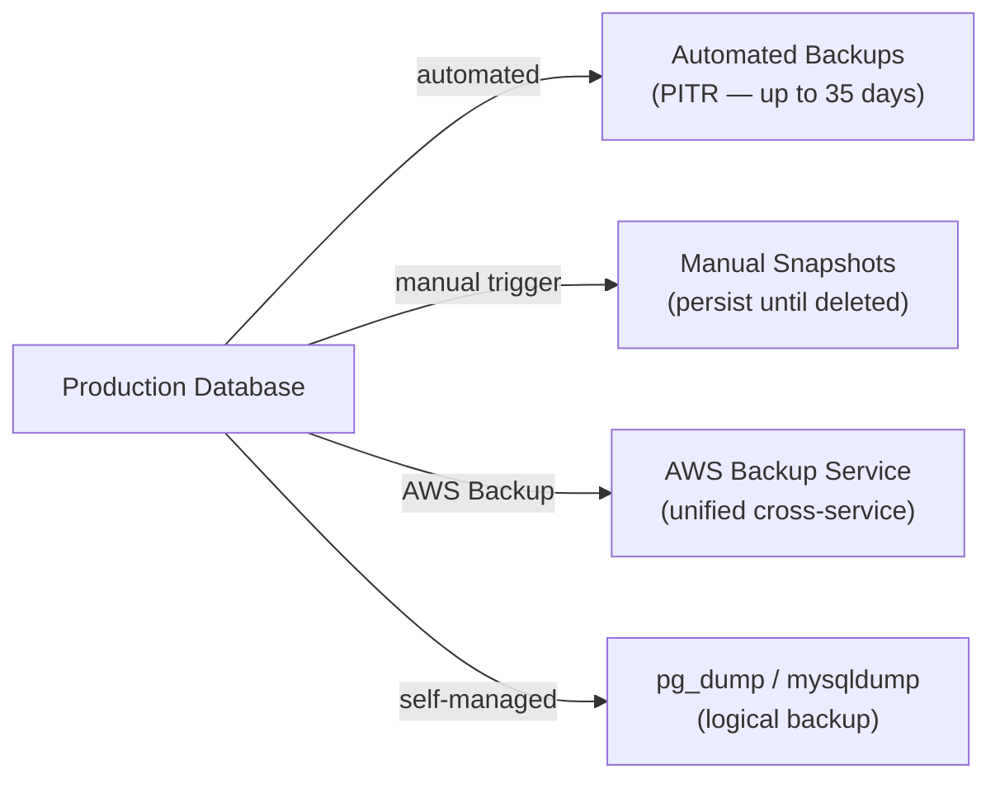

# Database Backup Strategies

> Not to be confused with AWS Backup service. This covers backup concepts and strategies specific to database engines — RDS, Aurora, DynamoDB, and self-managed databases.

## Backup Types



## RDS Backup

| Feature | Automated Backups | Manual Snapshots |
|---------|-----------------|-----------------|
| Trigger | AWS automatically | Manual or AWS Backup |
| Retention | 1–35 days (configure) | Permanent (until deleted) |
| Survives deletion | ❌ Deleted with instance | ✅ Persists independently |
| PITR | ✅ Any second in window | ❌ Snapshot point only |
| Storage | S3 (no charge up to DB size) | $0.095/GB-month |
| Cross-region | ❌ (enable replication) | ✅ Manual copy |

```bash
# Enable automated backups (1-35 day window)
aws rds modify-db-instance \
  --db-instance-identifier prod-db \
  --backup-retention-period 14 \
  --preferred-backup-window "02:00-03:00" \
  --apply-immediately

# Create manual snapshot before risky operations
aws rds create-db-snapshot \
  --db-instance-identifier prod-db \
  --db-snapshot-identifier before-migration-2026-06-16

# Restore to point-in-time
aws rds restore-db-instance-to-point-in-time \
  --source-db-instance-identifier prod-db \
  --target-db-instance-identifier prod-db-restored \
  --restore-time 2026-06-15T14:30:00Z
```

**Critical:** Always create a manual snapshot before deleting a production RDS instance — automated backups are deleted automatically with the instance.

## Aurora Backup

Aurora maintains **6 copies of data across 3 AZs** continuously (not traditional snapshots). Benefits:

- Automated backups in S3 (1-35 days)
- PITR within the backup retention window
- **Backtrack** — rewind the cluster to any point in the last 72 hours (Aurora MySQL)
- Fast database cloning from snapshots (shared storage, copy-on-write)

```bash
# Enable backtrack (Aurora MySQL)
aws rds modify-db-cluster \
  --db-cluster-identifier prod-aurora \
  --backtrack-window 86400  # 24 hours in seconds

# Backtrack to a specific time (rewind without restore)
aws rds backtrack-db-cluster \
  --db-cluster-identifier prod-aurora \
  --backtrack-to "2026-06-15T10:00:00Z"

# Clone for dev/testing (near-instant, copy-on-write)
aws rds restore-db-cluster-to-point-in-time \
  --db-cluster-identifier prod-aurora-clone \
  --source-db-cluster-identifier prod-aurora \
  --restore-type copy-on-write \
  --use-latest-restorable-time
```

## DynamoDB Backup

```bash
# On-demand backup (manual)
aws dynamodb create-backup \
  --table-name orders \
  --backup-name orders-backup-2026-06-16

# Enable PITR (continuous backup — last 35 days)
aws dynamodb update-continuous-backups \
  --table-name orders \
  --point-in-time-recovery-specification PointInTimeRecoveryEnabled=true

# Restore from PITR
aws dynamodb restore-table-to-point-in-time \
  --source-table-name orders \
  --target-table-name orders-restored \
  --restore-date-time 2026-06-15T10:00:00Z

# Export to S3 (for analytics, doesn't consume RCUs)
aws dynamodb export-table-to-point-in-time \
  --table-arn arn:aws:dynamodb:us-east-1:123:table/orders \
  --s3-bucket my-backup-bucket \
  --export-format DYNAMODB_JSON
```

## Logical Backups — pg_dump / mysqldump

For self-managed databases or when you need portable backups:

```bash
# PostgreSQL — pg_dump
pg_dump \
  --host=mydb.rds.amazonaws.com \
  --port=5432 \
  --username=admin \
  --format=custom \           # compressed, parallel restore
  --jobs=4 \                  # parallel dump of tables
  --file=mydb-$(date +%Y%m%d).dump \
  mydb

# Restore
pg_restore \
  --host=newdb.rds.amazonaws.com \
  --username=admin \
  --jobs=4 \
  --dbname=mydb \
  mydb-20260616.dump

# MySQL — mysqldump
mysqldump \
  --host=mydb.rds.amazonaws.com \
  --user=admin \
  --single-transaction \       # consistent snapshot for InnoDB
  --routines \                 # include stored procedures
  --triggers \
  mydb | gzip > mydb-$(date +%Y%m%d).sql.gz

# Restore
zcat mydb-20260616.sql.gz | mysql -h newdb.rds.amazonaws.com -u admin mydb
```

## Backup Retention Strategy (3-2-1 Rule)

```
3 copies of data
2 different storage media/services
1 offsite copy (different account or region)
```

| Tier | Retention | Storage | Use |
|------|-----------|---------|-----|
| Daily | 35 days | S3 (auto) | PITR, quick restore |
| Weekly | 12 weeks | S3 Glacier Instant | Weekly snapshots |
| Monthly | 12 months | S3 Glacier Deep Archive | Compliance, audit |
| Annual | 7 years | S3 Glacier Deep Archive | Legal requirements |

## Backup Testing — The Most Important Step

```bash
# Quarterly restore test
aws rds restore-db-instance-from-db-snapshot \
  --db-instance-identifier backup-test-$(date +%Y%m) \
  --db-snapshot-identifier prod-db-snapshot-identifier

# Verify data integrity
psql -h backup-test-instance.rds.amazonaws.com \
  -c "SELECT COUNT(*) FROM orders WHERE created_at > NOW() - INTERVAL '30 days';"

# Delete test instance after verification
aws rds delete-db-instance \
  --db-instance-identifier backup-test-$(date +%Y%m) \
  --skip-final-snapshot
```

**An untested backup is not a backup.** Test restores at least quarterly.

## Common Interview Questions

**Q: RDS automated backups vs manual snapshots — key differences?**
Automated backups support PITR (restore to any second within retention window) and are deleted when the instance is deleted. Manual snapshots are point-in-time only but persist indefinitely until explicitly deleted. Best practice: create a manual snapshot before any risky operation (migration, schema change, deletion) since it won't be deleted automatically.

**Q: Aurora Backtrack vs PITR restore?**
Backtrack: rewrites the cluster in-place to a past state — fast (minutes) but destructive (affects current data), available only for Aurora MySQL, max 72 hours back. PITR restore: creates a new cluster from backup — slower but non-destructive (original cluster intact). Use Backtrack for "oops I ran DELETE without WHERE"; use PITR restore for DR or environment cloning.

**Q: How do you design a zero-data-loss backup strategy for a critical database?**
Layer multiple mechanisms: (1) Enable PITR (RDS automated backup, 35 days) for any-second recovery. (2) Create daily manual snapshots with AWS Backup (retained 35 days, copied to DR region/account). (3) For absolute zero RPO: Multi-AZ provides synchronous replication — failover loses zero committed transactions. (4) For cross-region: Aurora Global Database replicates with <1 second lag. Test restore quarterly.
