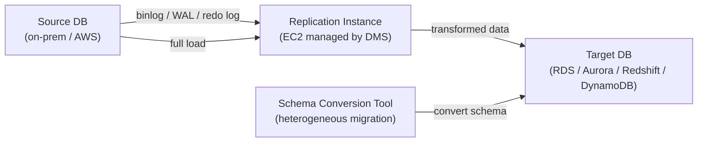
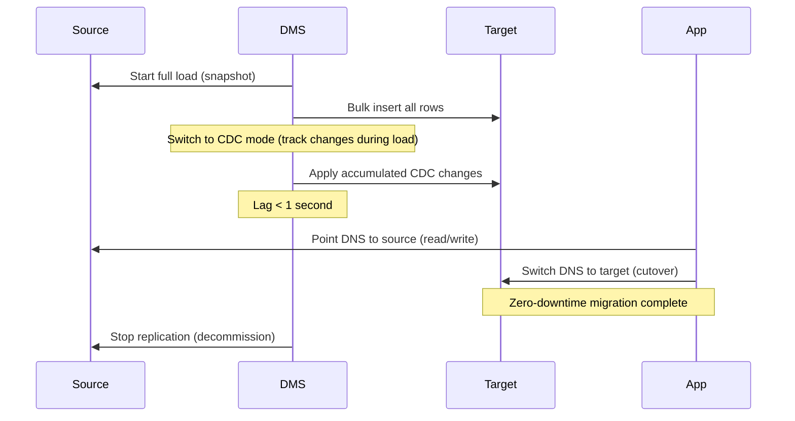

# AWS Database Migration Service (DMS)

> Migrate databases to AWS with minimal downtime. Supports homogeneous (MySQL→MySQL) and heterogeneous (Oracle→PostgreSQL) migrations. CDC enables near-zero-downtime cutovers.

## Architecture



## Migration Task Types

| Type | Description | Use case |
|------|-------------|---------|
| **Full load** | Snapshot current data, bulk load to target | Offline migration, acceptable downtime |
| **CDC only** | Replicate ongoing changes | Already loaded, need to catch up |
| **Full load + CDC** | Full load, then switch to CDC automatically | **Minimal downtime** production migrations |

## Full Load + CDC — Zero-Downtime Migration



**Cutover window:** Wait for DMS lag to reach near-zero → switch application connection string → verify → decommission source.

## Source Database CDC Mechanisms

| Source | CDC Mechanism | Pre-requisite |
|--------|--------------|---------------|
| MySQL | Binary log (binlog) | `binlog_format=ROW`, `binlog_row_image=FULL` |
| PostgreSQL | Logical replication | `wal_level=logical`, replication slot created |
| Oracle | Redo log (LogMiner or Binary Reader) | Supplemental logging enabled |
| SQL Server | MS-CDC or MS-Replication | CDC enabled on tables |

```sql
-- MySQL: enable binlog for DMS
SET GLOBAL binlog_format = 'ROW';
SET GLOBAL binlog_row_image = 'FULL';

-- PostgreSQL: enable logical replication
ALTER SYSTEM SET wal_level = logical;
ALTER SYSTEM SET max_replication_slots = 5;
```

## DMS Configuration

```bash
# Create replication instance
aws dms create-replication-instance \
  --replication-instance-identifier my-dms-instance \
  --replication-instance-class dms.r5.large \
  --allocated-storage 100 \
  --multi-az \
  --publicly-accessible false

# Create source endpoint
aws dms create-endpoint \
  --endpoint-identifier source-mysql \
  --endpoint-type source \
  --engine-name mysql \
  --server-name db.on-prem.company.com \
  --port 3306 \
  --username dms_user \
  --password "password" \
  --database-name mydb

# Create target endpoint
aws dms create-endpoint \
  --endpoint-identifier target-aurora \
  --endpoint-type target \
  --engine-name aurora \
  --server-name aurora-cluster.cluster-abc.us-east-1.rds.amazonaws.com \
  --port 3306

# Create migration task (Full Load + CDC)
aws dms create-replication-task \
  --replication-task-identifier my-migration \
  --source-endpoint-arn arn:aws:dms:... \
  --target-endpoint-arn arn:aws:dms:... \
  --replication-instance-arn arn:aws:dms:... \
  --migration-type full-load-and-cdc \
  --table-mappings '{"rules":[{"rule-type":"selection","rule-id":"1","rule-name":"1","object-locator":{"schema-name":"%","table-name":"%"},"rule-action":"include"}]}'
```

## DMS vs Native Tools

| | AWS DMS | pg_dump/mysqldump | pglogical/BDR |
|--|---------|-------------------|---------------|
| Downtime | Minimal (CDC) | Full (dump + restore) | Minimal |
| Heterogeneous | ✅ | ❌ | ❌ |
| Large DBs | ✅ (parallel load) | Slow | ✅ |
| Managed | ✅ | Manual | Manual |
| Cost | Per instance-hour | Free | OSS |
| Monitoring | DMS console, CloudWatch | None built-in | Manual |
| Schema convert | Via SCT | Manual | ❌ |

**Use DMS when:** minimal downtime required, heterogeneous migration, large database (TB scale), or you want managed tooling. Use native tools for: small databases, same-engine migrations with acceptable downtime (pg_dump to RDS is often simpler for < 50GB PostgreSQL).

## Schema Conversion Tool (SCT)

For heterogeneous migrations (Oracle→PostgreSQL, SQL Server→MySQL) — SCT converts:
- Table schemas (data types, constraints)
- Stored procedures, functions, triggers
- Views and indexes

```bash
# Install SCT locally (Java app) or use AWS SCT in console
# Run assessment report first — see what needs manual conversion
# SCT marks items as: auto-converted, needs review, manual only
```

**Rule of thumb:** SCT handles ~60-80% of conversions automatically. The remaining 20-40% requires manual work (complex PL/SQL → PL/pgSQL).

## DMS Fleet Advisor

Auto-discover on-premise databases for migration planning:

- Install DMS Agent on on-prem servers
- Fleet Advisor scans all database instances
- Provides: size, engine version, schema complexity, migration effort estimate
- Recommends target database size on AWS

## Common Interview Questions

**Q: How does zero-downtime migration work with DMS CDC?**
Two phases: (1) Full load — DMS reads a consistent snapshot and bulk-inserts to target while the source continues operating. DMS tracks all changes during this phase in a CDC buffer. (2) CDC phase — DMS replays all changes that occurred during the full load, then continuously applies ongoing changes. When replication lag reaches near-zero (seconds), you cut over by updating the application connection string. Total downtime = the cutover seconds only.

**Q: DMS vs native pg_dump/mysqldump — when to use DMS?**
DMS for: minimal downtime (CDC), heterogeneous migration (Oracle→Aurora), TB-scale databases, managed monitoring/alerting, or parallel table loading. Native tools (pg_dump) for: simple same-engine migration (PostgreSQL→RDS PostgreSQL), small databases where downtime is acceptable, or when DMS cost isn't justified.

**Q: What prerequisites does MySQL need for DMS CDC?**
Binary logging must be enabled (`binlog_format=ROW`, `binlog_row_image=FULL`), the DMS user needs `REPLICATION SLAVE` and `REPLICATION CLIENT` privileges, and binary logs must be retained long enough for DMS to catch up after a pause (`expire_logs_days >= 3`). For RDS MySQL, set these in the parameter group.

**Q: What is SCT and when is it needed?**
Schema Conversion Tool is needed for **heterogeneous** migrations (different source and target engines). DMS handles data migration, but SCT converts the schema first — table definitions, indexes, stored procedures, triggers. For homogeneous migrations (MySQL→MySQL, PostgreSQL→PostgreSQL), SCT isn't needed — schemas are compatible.
