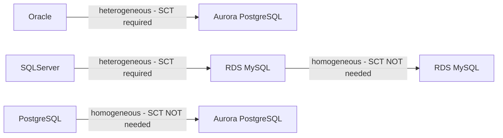
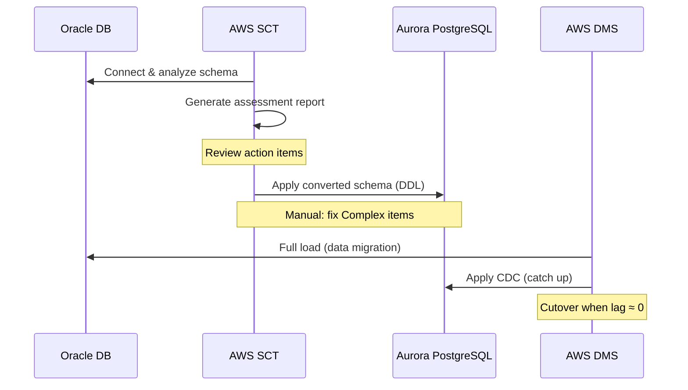

# AWS Schema Conversion Tool (SCT)

> Free desktop application that automatically converts source database schemas and most database code objects to a format compatible with the target database. Required for **heterogeneous migrations** (different engines).

## When to Use SCT



**Homogeneous** (same engine): Skip SCT — schemas are natively compatible. Just use DMS for data.

**Heterogeneous** (different engine): Use SCT first to convert schema, then DMS for data migration.

## What SCT Converts

| Object | Auto-converted | Manual effort needed |
|--------|---------------|---------------------|
| Tables, data types | ~90-95% | Type mapping edge cases |
| Indexes, constraints | ~90% | Expression-based indexes |
| Views | ~80% | Complex views with vendor syntax |
| Stored procedures | ~50-70% | Complex PL/SQL → PL/pgSQL |
| Triggers | ~50-60% | Trigger syntax differences |
| Functions | ~60-70% | Vendor-specific functions |
| Packages (Oracle) | ~40-60% | Oracle packages → PG schemas |

**Rule of thumb:** SCT auto-converts ~60-80% of a schema. The remaining 20-40% — especially complex PL/SQL, Oracle packages, and triggers — requires manual refactoring.

## Migration Assessment Report

```bash
# 1. Install SCT (Java app) from AWS download page
# 2. Connect to source database
# 3. Run Assessment Report before migration

# The report shows:
# ✅ Objects that convert automatically (action required: None)
# ⚠️  Objects needing manual review (action required: Simple)
# ❌  Objects requiring significant rewrite (action required: Complex)
```

**Assessment categories:**
- **Action required: None** → converts automatically
- **Action required: Simple** → minor manual changes
- **Action required: Complex** → significant rewrite (estimate effort carefully)
- **Action required: Manual** → must be rewritten from scratch (e.g., Oracle UTL_FILE → S3 operations)

## Migration Conversion Workflow



## Common Oracle → PostgreSQL Challenges

| Oracle Feature | PostgreSQL Equivalent | Notes |
|---------------|----------------------|-------|
| `NUMBER(p,s)` | `NUMERIC(p,s)` | SCT converts automatically |
| `VARCHAR2(n)` | `VARCHAR(n)` | SCT converts automatically |
| `SYSDATE` | `NOW()` | SCT converts automatically |
| `ROWNUM` | `ROW_NUMBER() OVER()` | SCT handles most cases |
| `DECODE()` | `CASE WHEN` | SCT converts |
| `NVL()` | `COALESCE()` | SCT converts |
| PL/SQL packages | PG schemas + functions | Manual rewrite often needed |
| Oracle sequences | PG sequences | SCT converts |
| `CONNECT BY` hierarchical | Recursive CTEs | Manual rewrite |
| `ROWID` | No equivalent | Must refactor queries |
| `UTL_FILE` (file I/O) | S3 / PG `COPY` | Manual rewrite |
| `DBMS_SCHEDULER` | pg_cron / Lambda | Manual replacement |

## SCT Extension Pack

For Oracle features with no direct PostgreSQL equivalent, SCT installs an **Extension Pack** — a set of PostgreSQL functions that emulate Oracle behavior:

```sql
-- SCT creates these emulation functions in PostgreSQL
-- Example: Oracle's TRUNC(date) → extension pack function
SELECT aws_oracle_ext.trunc(now(), 'MONTH');
```

Extension pack functions allow more of the code to convert automatically, but they add overhead — evaluate whether native PG rewrites would be cleaner.

## Common Interview Questions

**Q: SCT vs DMS — what does each do?**
SCT converts the database **schema** (tables, views, stored procedures, indexes) from one engine's DDL to another. DMS migrates the **data** (rows). They're complementary: for heterogeneous migration, run SCT first (schema), then DMS (data). For homogeneous migration, DMS handles everything — SCT isn't needed.

**Q: What percentage of schema objects does SCT typically auto-convert?**
~60-80% auto-conversion is typical for Oracle → PostgreSQL. Simple tables, views, and most stored procedures convert cleanly. Complex PL/SQL (packages, dynamic SQL, Oracle-specific built-ins like UTL_FILE, DBMS_SCHEDULER) requires manual rewriting. Always run the Assessment Report first to understand the actual effort before committing to a migration timeline.

**Q: What is the SCT Extension Pack?**
A set of PL/pgSQL functions SCT installs in the target database to emulate Oracle-specific behavior that has no native PostgreSQL equivalent (e.g., certain Oracle date functions, DBMS_OUTPUT behavior). It allows more auto-conversion but the emulation layer has performance overhead. For high-throughput paths, consider rewriting natively rather than using the extension pack.
