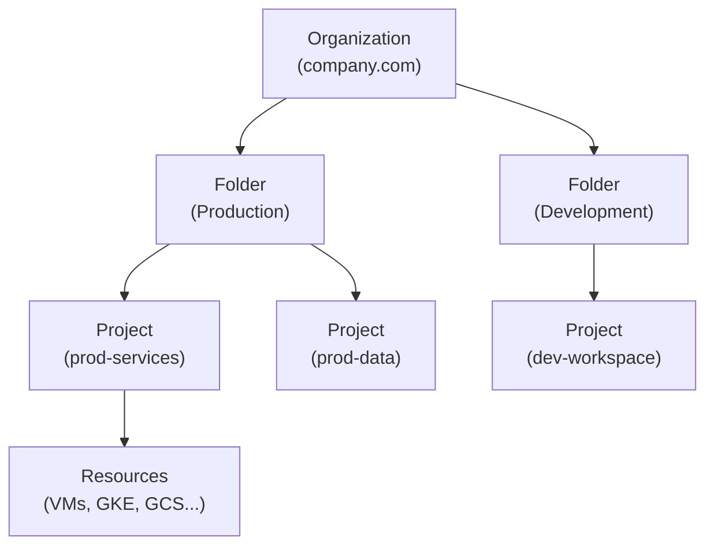

# Google Cloud Platform (GCP)

> AWS competitor with strengths in data analytics (BigQuery), AI/ML (Vertex AI), Kubernetes (GKE — Google invented K8s), and networking (private backbone). Key differences from AWS in terminology and architecture.

## GCP vs AWS Service Mapping

| Category | AWS | GCP |
|----------|-----|-----|
| **Compute** | EC2 | Compute Engine |
| **Containers (managed K8s)** | EKS | GKE (Google Kubernetes Engine) |
| **Serverless** | Lambda | Cloud Functions / Cloud Run |
| **Container Registry** | ECR | Artifact Registry / GCR |
| **Object Storage** | S3 | Cloud Storage (GCS) |
| **Block Storage** | EBS | Persistent Disk |
| **File Storage** | EFS | Filestore |
| **SQL DB** | RDS | Cloud SQL |
| **NoSQL** | DynamoDB | Firestore / Bigtable |
| **Analytics** | Redshift | BigQuery |
| **Message Queue** | SQS | Pub/Sub |
| **Event bus** | EventBridge | Eventarc |
| **CI/CD** | CodePipeline | Cloud Build |
| **IaC** | CloudFormation | Deployment Manager / Terraform |
| **Monitoring** | CloudWatch | Cloud Monitoring (Stackdriver) |
| **Load Balancer** | ALB/NLB | Cloud Load Balancing |
| **DNS** | Route 53 | Cloud DNS |
| **CDN** | CloudFront | Cloud CDN |
| **VPN** | VPN Gateway | Cloud VPN |
| **Secret Manager** | Secrets Manager | Secret Manager |
| **IAM** | IAM | Cloud IAM |
| **Org Management** | AWS Organizations | Resource Hierarchy (Org/Folder/Project) |

## Resource Hierarchy



All resources live in a **Project**. Projects are the billing unit and permission boundary in GCP (equivalent to AWS Account).

## GKE — Google Kubernetes Engine

```bash
# Create GKE Autopilot cluster (managed node pools — no node management)
gcloud container clusters create-auto my-cluster \
  --region us-central1

# Standard cluster with node pool
gcloud container clusters create my-cluster \
  --region us-central1 \
  --num-nodes 3 \
  --machine-type n2-standard-4 \
  --enable-autoscaling \
  --min-nodes 1 \
  --max-nodes 10

# Get credentials
gcloud container clusters get-credentials my-cluster --region us-central1

# GKE Standard vs Autopilot
# Standard: you manage nodes (OS, capacity planning)
# Autopilot: GKE manages nodes, you pay per pod CPU/memory only
```

## Cloud IAM

```bash
# Grant role to user
gcloud projects add-iam-policy-binding my-project \
  --member "user:pawan@company.com" \
  --role "roles/container.admin"

# Grant to service account (like AWS IAM Role for services)
gcloud iam service-accounts create my-sa \
  --display-name "My Service Account"

gcloud projects add-iam-policy-binding my-project \
  --member "serviceAccount:my-sa@my-project.iam.gserviceaccount.com" \
  --role "roles/storage.objectViewer"

# Workload Identity — K8s SA to GCP SA mapping (like IRSA in AWS)
gcloud iam service-accounts add-iam-policy-binding \
  my-sa@my-project.iam.gserviceaccount.com \
  --member "serviceAccount:my-project.svc.id.goog[my-namespace/my-k8s-sa]" \
  --role "roles/iam.workloadIdentityUser"
```

## Cloud Storage (GCS)

```bash
# Create bucket
gsutil mb -l us-central1 gs://my-bucket

# Copy files
gsutil cp local-file.txt gs://my-bucket/
gsutil rsync -r ./local-dir gs://my-bucket/dir/

# Set lifecycle policy (delete objects after 90 days)
gsutil lifecycle set lifecycle.json gs://my-bucket

# Signed URL (like S3 pre-signed URL)
gsutil signurl -d 1h service-account-key.json gs://my-bucket/file.txt
```

## BigQuery — Data Warehouse

```sql
-- Query petabytes with serverless SQL
SELECT
    user_id,
    COUNT(*) as purchases,
    SUM(amount) as total_spent
FROM `my-project.sales.transactions`
WHERE DATE(created_at) BETWEEN '2026-01-01' AND '2026-06-01'
GROUP BY user_id
ORDER BY total_spent DESC
LIMIT 1000;

-- Partition by date for cost optimization
CREATE TABLE `my-project.sales.daily_summary`
PARTITION BY DATE(event_date)
AS SELECT DATE(created_at) as event_date, SUM(amount) as total
FROM `my-project.sales.transactions`
GROUP BY 1;
```

**BigQuery key features:**
- Serverless: no clusters to manage, pay per query (TB scanned)
- Columnar storage — fast analytical queries
- Streaming inserts for real-time analytics
- Pub/Sub → BigQuery for event pipelines

## Cloud Pub/Sub

```python
# Publisher (like SNS)
from google.cloud import pubsub_v1

publisher = pubsub_v1.PublisherClient()
topic_path = publisher.topic_path('my-project', 'my-topic')
message = b'Hello, World!'
future = publisher.publish(topic_path, message)

# Subscriber (like SQS)
from google.cloud import pubsub_v1

subscriber = pubsub_v1.SubscriberClient()
subscription_path = subscriber.subscription_path('my-project', 'my-subscription')

def callback(message):
    print(f"Received: {message.data}")
    message.ack()

streaming_pull_future = subscriber.subscribe(subscription_path, callback=callback)
```

## Cloud Build — CI/CD

```yaml
# cloudbuild.yaml
steps:
  - name: 'gcr.io/cloud-builders/docker'
    args: ['build', '-t', 'gcr.io/$PROJECT_ID/my-app:$COMMIT_SHA', '.']

  - name: 'gcr.io/cloud-builders/docker'
    args: ['push', 'gcr.io/$PROJECT_ID/my-app:$COMMIT_SHA']

  - name: 'gcr.io/cloud-builders/kubectl'
    args:
      - 'set'
      - 'image'
      - 'deployment/my-app'
      - 'my-app=gcr.io/$PROJECT_ID/my-app:$COMMIT_SHA'
    env:
      - 'CLOUDSDK_COMPUTE_REGION=us-central1'
      - 'CLOUDSDK_CONTAINER_CLUSTER=my-cluster'

images:
  - 'gcr.io/$PROJECT_ID/my-app:$COMMIT_SHA'
```

## Common Interview Questions

**Q: GCP resource hierarchy vs AWS account structure?**
GCP: Organization → Folders → Projects → Resources. Projects are the billing/permission boundary (like AWS Accounts). IAM policies inherit downward (org policy applies to all folders/projects). AWS: Organization → OUs → Accounts → Resources. AWS uses SCPs for policy inheritance. GCP's folder/project structure is more flexible for complex organizations; AWS multi-account is more common in enterprises.

**Q: GKE Autopilot vs Standard — when to use each?**
Autopilot: GKE manages nodes — you just define pods. Pay per pod CPU/memory, not per node. No node pool management, no system DaemonSet worries. Best for teams wanting managed Kubernetes. Standard: you manage node pools — more control over machine types, spot/preemptible nodes, GPUs, and DaemonSets. Required for: Windows nodes, specific hardware (TPUs/GPUs), DaemonSets that need specific node configs.

**Q: GCP Workload Identity vs AWS IRSA?**
Both solve the same problem: bind a Kubernetes ServiceAccount to a cloud IAM identity so pods can access cloud APIs without static credentials. IRSA: K8s SA annotated with IAM Role ARN → OIDC token → STS AssumeRole. Workload Identity: K8s SA bound to GCP Service Account → requests are automatically authenticated as that GCP SA. GCP Workload Identity is slightly simpler to configure (no separate OIDC provider setup).
