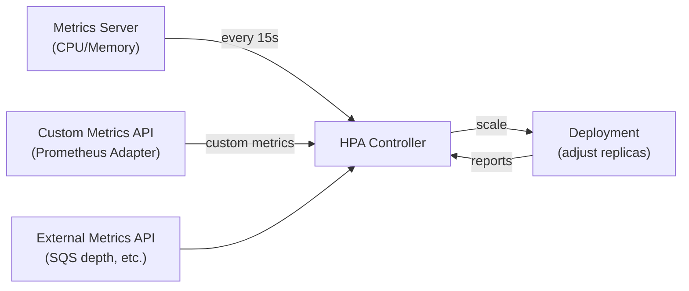
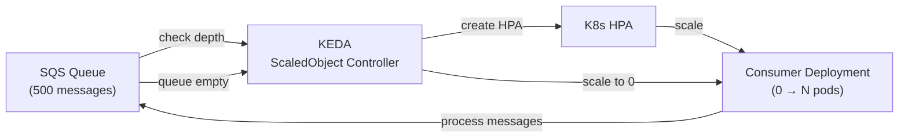

# Kubernetes Autoscaling

> Three mechanisms to automatically adjust workload capacity: HPA (horizontal pods), VPA (vertical pod resources), and KEDA (event-driven scale-to-zero).

## HPA — Horizontal Pod Autoscaler

Scales the **number of pod replicas** based on metrics.

### HPA Control Loop



### Scaling Algorithm

```
desiredReplicas = ceil(currentReplicas × (currentMetricValue / desiredMetricValue))
```

Example: 3 pods at 90% CPU, target 50% → `ceil(3 × 90/50)` = `ceil(5.4)` = 6 pods

### CPU/Memory HPA

```yaml
apiVersion: autoscaling/v2
kind: HorizontalPodAutoscaler
metadata:
  name: my-app
spec:
  scaleTargetRef:
    apiVersion: apps/v1
    kind: Deployment
    name: my-app
  minReplicas: 2
  maxReplicas: 20
  metrics:
    - type: Resource
      resource:
        name: cpu
        target:
          type: Utilization
          averageUtilization: 50    # scale when avg CPU across pods > 50%
    - type: Resource
      resource:
        name: memory
        target:
          type: AverageValue
          averageValue: 500Mi
  behavior:
    scaleUp:
      stabilizationWindowSeconds: 60   # wait 60s before scaling up again
      policies:
        - type: Percent
          value: 100                    # max double replicas per minute
          periodSeconds: 60
    scaleDown:
      stabilizationWindowSeconds: 300  # wait 5min before scaling down (prevents thrash)
      policies:
        - type: Percent
          value: 25                     # scale down max 25% per minute
          periodSeconds: 60
```

### Scaling on Custom Metrics (Prometheus Adapter)

```yaml
# Scale on requests-per-second from Prometheus
metrics:
  - type: Pods
    pods:
      metric:
        name: http_requests_per_second
      target:
        type: AverageValue
        averageValue: "100"   # 100 RPS per pod
```

### Scaling on External Metrics (SQS Queue Depth)

```yaml
# Scale consumers based on SQS queue depth
metrics:
  - type: External
    external:
      metric:
        name: sqs_messages_visible
        selector:
          matchLabels:
            queue: my-queue
      target:
        type: AverageValue
        averageValue: "30"    # 30 messages per consumer pod
```

---

## VPA — Vertical Pod Autoscaler

Adjusts **CPU and memory requests/limits** on existing pods.

### VPA Components

| Component | Role |
|-----------|------|
| **Recommender** | Analyzes historical usage, suggests request/limit values |
| **Updater** | Evicts pods so they restart with new resource values |
| **Admission Controller** | Mutates new pods with VPA-recommended values at creation |

### VPA Modes

| Mode | Behavior | Use case |
|------|----------|----------|
| `Off` | Only produces recommendations, no action | Observe before committing |
| `Initial` | Apply recommendations only on new pods | Safe for production |
| `Recreate` | Evict pods to apply recommendations | Testing |
| `Auto` | Like Recreate but uses in-place update when supported | Future default |

```yaml
apiVersion: autoscaling.k8s.io/v1
kind: VerticalPodAutoscaler
metadata:
  name: my-app-vpa
spec:
  targetRef:
    apiVersion: apps/v1
    kind: Deployment
    name: my-app
  updatePolicy:
    updateMode: "Off"    # Start with Off — check recommendations first
  resourcePolicy:
    containerPolicies:
      - containerName: app
        minAllowed:
          cpu: 100m
          memory: 128Mi
        maxAllowed:
          cpu: 2
          memory: 2Gi
```

Check recommendations: `kubectl describe vpa my-app-vpa`

### HPA vs VPA — Can You Use Both?

❌ **Do NOT run HPA (CPU/Memory) + VPA (Auto) simultaneously** — they fight each other. VPA changes requests → HPA sees different utilization → triggers unnecessary scale-out.

✅ **Safe combo:** HPA on custom metrics (RPS, queue depth) + VPA on CPU/Memory for right-sizing

---

## KEDA — Kubernetes Event-Driven Autoscaler

Scales from **0 to N and back to 0** based on external event sources. HPA can't scale to zero.



### ScaledObject Example (SQS)

```yaml
apiVersion: keda.sh/v1alpha1
kind: ScaledObject
metadata:
  name: sqs-consumer-scaler
spec:
  scaleTargetRef:
    name: sqs-consumer
  minReplicaCount: 0       # scale to zero when queue empty!
  maxReplicaCount: 50
  pollingInterval: 15      # check every 15s
  cooldownPeriod: 60       # wait 60s before scaling to 0
  triggers:
    - type: aws-sqs-queue
      metadata:
        queueURL: https://sqs.us-east-1.amazonaws.com/123456/my-queue
        queueLength: "10"   # 1 pod per 10 messages
        awsRegion: us-east-1
      authenticationRef:
        name: keda-aws-credentials
```

### KEDA Scalers

| Scaler | Source |
|--------|--------|
| `aws-sqs-queue` | SQS queue depth |
| `kafka` | Kafka consumer group lag |
| `prometheus` | Any PromQL query result |
| `cron` | Time-based scaling |
| `azure-service-bus` | Azure Service Bus |
| `rabbitmq` | RabbitMQ queue depth |

---

## Common Interview Questions

**Q: What's the difference between HPA, VPA, and KEDA?**
HPA scales pod count based on CPU/memory/custom metrics. VPA adjusts CPU/memory requests on existing pods (not replicas). KEDA extends HPA to support 50+ external event sources and enables scale-to-zero. Use HPA for stateless HTTP services, VPA for right-sizing batch jobs, KEDA for queue consumers and event-driven workloads.

**Q: Why can't you run HPA and VPA (Auto mode) on the same deployment?**
VPA changes the resource requests on pods. HPA uses resource utilization (actual usage / requested) to decide scaling. When VPA reduces a pod's request to match actual usage, HPA sees 100% utilization and immediately scales out — creating a feedback loop. Safe combo: HPA on custom metrics + VPA in `Off` or `Initial` mode for right-sizing recommendations.

**Q: How does HPA cooldown work and why does it matter?**
`scaleDown.stabilizationWindowSeconds` (default 300s) prevents thrashing: HPA collects all desired replica counts from the last N seconds and takes the maximum. This means it won't scale down until there's sustained evidence of low load. Scale-up has a 60s stabilization by default — it scales up faster than it scales down.

**Q: What happens if metrics-server is down?**
HPA stops receiving metrics. After `--horizontal-pod-autoscaler-sync-period` (default 15s), the HPA controller marks the HPA as unable to compute metrics. The last known replica count is kept — no scale-up or scale-down happens until metrics are available again.
