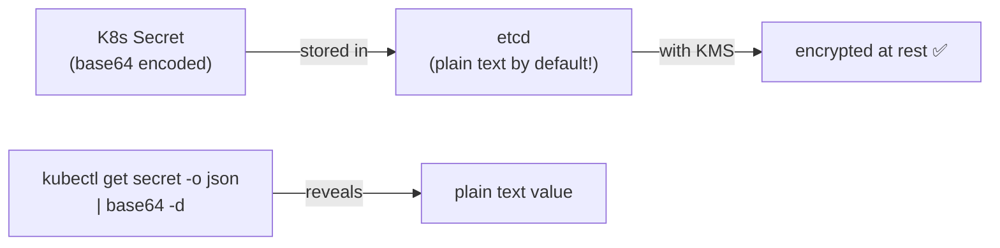

# Kubernetes ConfigMap & Secret

## ConfigMap — Externalizing Configuration

Decouple configuration from container images. Stores non-sensitive key-value pairs or entire config files.

### Creating ConfigMaps

```yaml
apiVersion: v1
kind: ConfigMap
metadata:
  name: app-config
data:
  DATABASE_HOST: "postgres.prod.svc"
  DATABASE_PORT: "5432"
  LOG_LEVEL: "info"
  # Multi-line config file embedded as a value
  app.properties: |
    max.connections=100
    timeout.ms=5000
    retry.attempts=3
```

```bash
kubectl create configmap app-config --from-file=app.properties      # from file
kubectl create configmap nginx-conf --from-file=./nginx/             # from directory
kubectl create configmap env-config --from-literal=ENV=production    # from literal
```

### Using ConfigMaps in Pods

```yaml
spec:
  containers:
    - name: app
      # Method 1: individual env var
      env:
        - name: DB_HOST
          valueFrom:
            configMapKeyRef:
              name: app-config
              key: DATABASE_HOST

      # Method 2: all keys as env vars
      envFrom:
        - configMapRef:
            name: app-config

      # Method 3: volume mount (auto-refreshed when CM changes)
      volumeMounts:
        - name: config-vol
          mountPath: /etc/app/config
          readOnly: true

  volumes:
    - name: config-vol
      configMap:
        name: app-config
```

**Key difference:** Env vars from ConfigMap are **not auto-refreshed** — pod restart required. Volume-mounted ConfigMaps are **auto-refreshed** by kubelet (~1 min sync period).

### Immutable ConfigMaps

```yaml
immutable: true   # no updates allowed — kubelet skips watches, improves cluster perf
```

---

## Secret — Sensitive Configuration

Works like ConfigMap but with extra controls:
- Stored in etcd (encrypted at rest if EncryptionConfiguration + KMS is enabled)
- Mounted in-memory (`tmpfs`) — never written to node disk
- RBAC can restrict `get/list` access separately from ConfigMaps

### Secret Types

| Type | Use case |
|------|---------|
| `Opaque` | Any arbitrary data (default) |
| `kubernetes.io/tls` | TLS cert + private key |
| `kubernetes.io/dockerconfigjson` | Container registry auth |
| `kubernetes.io/service-account-token` | SA tokens (auto-created) |
| `kubernetes.io/basic-auth` | Username + password |

```yaml
apiVersion: v1
kind: Secret
metadata:
  name: db-creds
type: Opaque
# Values must be base64-encoded (NOT encrypted!)
data:
  username: YWRtaW4=      # base64("admin")
  password: c3VwZXJzZWNyZXQ=
# OR use stringData (plain text — K8s auto-encodes)
stringData:
  api-key: "sk-abc123"
```

```bash
kubectl create secret generic db-creds \
  --from-literal=username=admin \
  --from-literal=password=supersecret

kubectl create secret tls my-tls \
  --cert=tls.crt --key=tls.key
```

### Using Secrets in Pods

```yaml
spec:
  containers:
    - name: app
      # Method 1: env var (risk — visible in /proc/<pid>/environ, crash dumps)
      env:
        - name: DB_PASSWORD
          valueFrom:
            secretKeyRef:
              name: db-creds
              key: password

      # Method 2: volume mount (preferred — in-memory, auto-refreshed)
      volumeMounts:
        - name: secret-vol
          mountPath: /etc/secrets
          readOnly: true

  volumes:
    - name: secret-vol
      secret:
        secretName: db-creds
        defaultMode: 0400   # owner read-only
```

---

## ⚠️ K8s Secrets Are NOT Secure by Default



**Base64 is encoding, not encryption.** Anyone with `kubectl get secret` RBAC access can decode it instantly.

### Fix 1: Encryption at Rest (KMS)

```yaml
# /etc/kubernetes/manifests/encryption-config.yaml on API server
apiVersion: apiserver.config.k8s.io/v1
kind: EncryptionConfiguration
resources:
  - resources: [secrets]
    providers:
      - kms:
          name: aws-kms
          endpoint: unix:///tmp/kms.sock
          cachesize: 1000
      - identity: {}  # fallback (unencrypted — remove in production)
```

### Fix 2: RBAC — Least Privilege Access

```yaml
rules:
  - apiGroups: [""]
    resources: ["secrets"]
    resourceNames: ["db-creds"]   # specific secret, not all
    verbs: ["get"]                 # no list/watch
```

---

## External Secrets Operator (ESO)

Sync secrets from AWS Secrets Manager / SSM automatically into K8s Secrets:

```yaml
apiVersion: external-secrets.io/v1beta1
kind: ClusterSecretStore
metadata:
  name: aws-secretsmanager
spec:
  provider:
    aws:
      service: SecretsManager
      region: us-east-1
      auth:
        jwt:
          serviceAccountRef:
            name: external-secrets-sa
            namespace: external-secrets
---
apiVersion: external-secrets.io/v1beta1
kind: ExternalSecret
metadata:
  name: db-creds
  namespace: my-app
spec:
  refreshInterval: 1h
  secretStoreRef:
    name: aws-secretsmanager
    kind: ClusterSecretStore
  target:
    name: db-creds           # K8s Secret name to create/update
    creationPolicy: Owner
  data:
    - secretKey: password    # key in K8s Secret
      remoteRef:
        key: /prod/my-app/db # AWS Secrets Manager path
        property: password   # JSON field within the secret
```

ESO reconciles the K8s Secret every `refreshInterval` — if the upstream secret rotates, the K8s Secret automatically updates.

---

## Sealed Secrets — GitOps Safe

Encrypt secrets for safe storage in Git using the cluster's public key:

```bash
# Install controller
kubectl apply -f https://github.com/bitnami-labs/sealed-secrets/releases/download/v0.24.0/controller.yaml

# Seal a secret (encrypted with cluster public key — only cluster can decrypt)
kubectl create secret generic db-creds \
  --from-literal=password=supersecret \
  --dry-run=client -o yaml | \
  kubeseal --format yaml > sealed-db-creds.yaml

# Commit sealed-db-creds.yaml to Git safely
git add sealed-db-creds.yaml && git commit -m "add db credentials"
```

The SealedSecret CRD is committed to Git. The controller decrypts it with the cluster private key and creates the actual K8s Secret.

## ESO vs Sealed Secrets

| | ESO | Sealed Secrets |
|--|-----|---------------|
| Secret source | AWS SM / SSM / Vault | Cluster's asymmetric key |
| Rotation | Auto-syncs from upstream | Manual re-seal |
| Multi-cluster | Same secret, different IRSA | Must re-seal per cluster |
| External dependency | AWS (IRSA + SM) | None (self-contained) |
| GitOps | Stores ExternalSecret in Git | Stores encrypted SealedSecret in Git |
| Best for | AWS-native teams | Teams without secret management service |

## Common Interview Questions

**Q: Why are K8s Secrets not secure by default?**
Base64 is reversible encoding — it protects against accidental display but provides zero security. etcd stores Secrets in plaintext by default. Anyone with `kubectl get secret` access can `base64 -d` the value. Real security requires: (1) etcd encryption at rest with KMS, (2) strict RBAC (limit who can `get/list` Secrets), (3) audit logging for all Secret access.

**Q: ConfigMap env vars vs volume mount — which to use?**
Volume mount is preferred: files are auto-updated (~1 min) when ConfigMap/Secret changes, Secrets are stored in tmpfs (never on disk), and permissions can be fine-grained. Env vars require pod restart to pick up changes and can appear in crash dumps or `ps aux` output (visible environment).

**Q: ESO vs Sealed Secrets — when to choose each?**
ESO: when you already have AWS Secrets Manager / SSM — it's the single source of truth, supports rotation, works across multiple clusters with IRSA. Sealed Secrets: simpler setup with no external dependency — just the cluster's key. ESO for production teams with centralized secret management; Sealed Secrets for smaller setups or teams that want full self-containment.

**Q: How do you rotate a secret without restarting pods?**
Volume-mounted secrets: kubelet syncs the mount from the API server periodically. When the K8s Secret is updated (by ESO or manually), the file in the pod's volume is automatically updated. The app must either watch the file (`inotify`) or reload periodically. Env var secrets: must restart the pod — no auto-refresh mechanism.
