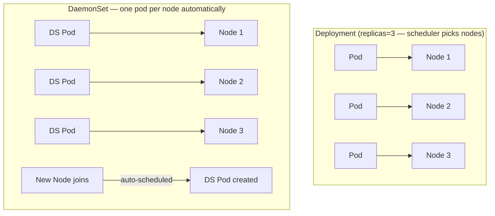

# Kubernetes DaemonSet

> Ensures **exactly one pod** runs on every node (or a filtered subset). Pod lifecycle follows node lifecycle — new node joins → pod created; node removed → pod deleted.

## DaemonSet vs Deployment



| | DaemonSet | Deployment |
|--|-----------|-----------|
| Replicas | One per node (no `replicas` field) | Specified count |
| Placement | Every node (or subset via nodeSelector) | Any available node |
| New node joins | Pod auto-created | No change |
| Node removed | Pod auto-removed | Pod rescheduled elsewhere |
| Use case | Node-level infrastructure agents | Application workloads |

## Common Use Cases

| Use Case | Examples |
|----------|---------|
| **Log collection** | Fluent Bit, Fluentd — read `/var/log/pods/` on each node |
| **Metrics collection** | node-exporter, CloudWatch Agent — node-level metrics |
| **CNI plugins** | AWS VPC CNI, Calico, Cilium — network setup per node |
| **CSI drivers** | EBS CSI, EFS CSI — storage attachment per node |
| **Security agents** | Falco, Datadog agent, CrowdStrike Falcon sensor |
| **Proxy / Service mesh** | Envoy (when not using sidecar injection) |

## Complete Example — Fluent Bit DaemonSet

```yaml
apiVersion: apps/v1
kind: DaemonSet
metadata:
  name: fluent-bit
  namespace: monitoring
spec:
  selector:
    matchLabels:
      app: fluent-bit
  updateStrategy:
    type: RollingUpdate
    rollingUpdate:
      maxUnavailable: 1        # update one node at a time
  template:
    metadata:
      labels:
        app: fluent-bit
    spec:
      serviceAccountName: fluent-bit
      priorityClassName: system-node-critical  # schedule even under resource pressure

      # Allow scheduling on ALL nodes including tainted ones
      tolerations:
        - key: node-role.kubernetes.io/control-plane
          operator: Exists
          effect: NoSchedule
        - operator: Exists     # catch-all: tolerate ANY taint

      containers:
        - name: fluent-bit
          image: fluent/fluent-bit:2.1
          resources:
            requests:
              cpu: 100m
              memory: 128Mi
            limits:
              memory: 256Mi
          volumeMounts:
            - name: varlog
              mountPath: /var/log
              readOnly: true
            - name: containers
              mountPath: /var/lib/docker/containers
              readOnly: true
            - name: config
              mountPath: /fluent-bit/etc/

      volumes:
        - name: varlog
          hostPath:
            path: /var/log           # node's log directory
        - name: containers
          hostPath:
            path: /var/lib/docker/containers
        - name: config
          configMap:
            name: fluent-bit-config
```

## Tolerations — Run on Control-Plane Nodes

Control-plane nodes have taint `node-role.kubernetes.io/control-plane:NoSchedule`. Without tolerating it, DaemonSet won't run there:

```yaml
tolerations:
  - key: node-role.kubernetes.io/control-plane
    operator: Exists
    effect: NoSchedule
  - operator: Exists   # tolerate ALL taints (GPU, spot, etc.)
```

Critical infrastructure (CNI, CSI, log collectors) should always run on all nodes including control-plane.

## nodeSelector — Restrict to Subset of Nodes

```yaml
spec:
  template:
    spec:
      nodeSelector:
        nvidia.com/gpu: "true"   # only GPU nodes

      # Or use nodeAffinity for complex rules
      affinity:
        nodeAffinity:
          requiredDuringSchedulingIgnoredDuringExecution:
            nodeSelectorTerms:
              - matchExpressions:
                  - key: node.kubernetes.io/instance-type
                    operator: In
                    values: [g4dn.xlarge, g4dn.2xlarge]
```

## Update Strategies

| Strategy | Behavior | Use case |
|----------|----------|---------|
| **RollingUpdate** | Update one pod at a time (maxUnavailable) | Default, zero-downtime |
| **OnDelete** | Only update pod when manually deleted | Tight control over timing |

```bash
# Monitor rollout
kubectl rollout status daemonset/fluent-bit -n monitoring

# Roll back
kubectl rollout undo daemonset/fluent-bit -n monitoring
```

## hostNetwork, hostPID, hostPath

DaemonSets often need node-level access:

```yaml
spec:
  hostNetwork: true    # CNI plugins, network monitoring
  hostPID: true        # security agents (Falco — see host processes)
  containers:
    - securityContext:
        privileged: true          # CNI/CSI drivers need full node access
        # OR use fine-grained capabilities:
        capabilities:
          add: [NET_ADMIN, SYS_PTRACE]
```

**Rule:** Use `privileged: true` only for CNI/CSI drivers. Prefer specific capabilities for everything else.

## Common Interview Questions

**Q: DaemonSet vs Deployment — when to choose?**
DaemonSet when: the workload must run on every node regardless of capacity (log collection, metrics, network agents, security). Deployment when: you control replica count and any node is acceptable. DaemonSets scale automatically with your cluster — add a node, get a pod automatically.

**Q: How does a DaemonSet ensure pods run on new nodes?**
The DaemonSet controller watches node join events. When a new node is registered (not cordoned or matching label selector), the controller immediately creates a pod on it — no manual step needed. This is why CNI plugins are deployed as DaemonSets: the network plugin must be running before any other pod can start.

**Q: Why tolerate ALL taints (`operator: Exists`)?**
Nodes can have custom taints — GPU taints, spot-instance taints, customer taints for isolation. A log collector or security agent that doesn't tolerate these taints would silently skip those nodes, leaving them unmonitored. Using `operator: Exists` with no key ensures the DaemonSet runs everywhere, which is correct for node-level infrastructure.

**Q: hostPath volumes in DaemonSets — security concerns?**
hostPath mounts the node's actual filesystem. If the container has write access to sensitive paths, a compromised container could tamper with node-level files. Best practices: mount as `readOnly: true` wherever possible, scope the path to the minimum needed (e.g., `/var/log/pods/` not `/`), and pair with a restrictive securityContext.
