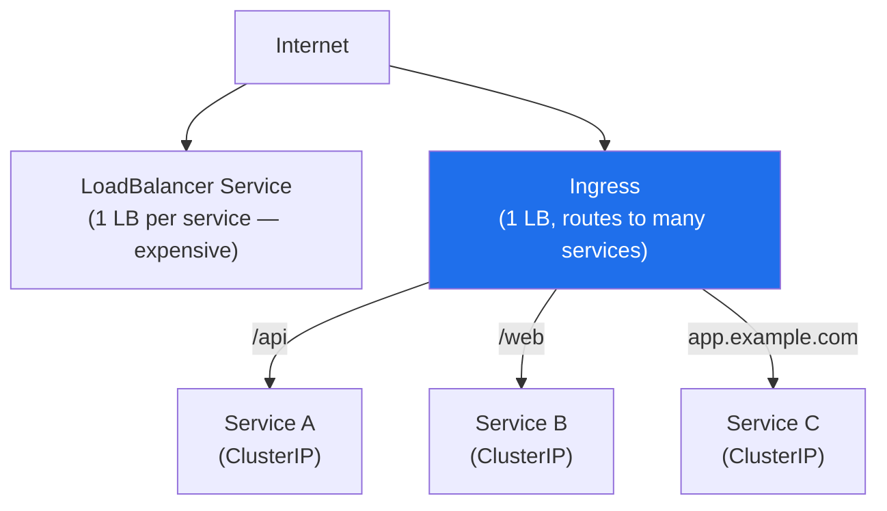

# Kubernetes Ingress

> L7 HTTP/HTTPS routing rules that expose multiple services through a single external load balancer. Ingress requires an Ingress Controller — the rules are useless without one.

## Ingress vs Service Types



| Type | Use case | External IP | Cost |
|------|----------|-------------|------|
| ClusterIP | Internal only | No | None |
| NodePort | Dev/test | Via Node IP | None |
| LoadBalancer | One service exposed | Yes | One LB per service ($) |
| **Ingress** | Multiple services, one LB | Yes (via controller) | One LB total |

## Nginx Ingress Controller

Most common self-managed Ingress controller. Runs as a Deployment, watches Ingress objects:

```yaml
# Host-based routing
apiVersion: networking.k8s.io/v1
kind: Ingress
metadata:
  name: my-app-ingress
  annotations:
    nginx.ingress.kubernetes.io/rewrite-target: /
    nginx.ingress.kubernetes.io/rate-limit: "100"
    nginx.ingress.kubernetes.io/ssl-redirect: "true"
spec:
  ingressClassName: nginx
  tls:
    - hosts:
        - api.example.com
      secretName: api-tls-cert       # created by cert-manager
  rules:
    - host: api.example.com
      http:
        paths:
          - path: /v1
            pathType: Prefix
            backend:
              service:
                name: api-v1
                port:
                  number: 80
          - path: /v2
            pathType: Prefix
            backend:
              service:
                name: api-v2
                port:
                  number: 80
    - host: app.example.com
      http:
        paths:
          - path: /
            pathType: Prefix
            backend:
              service:
                name: frontend
                port:
                  number: 80
```

### Useful Nginx Annotations

```yaml
annotations:
  # Backend protocol
  nginx.ingress.kubernetes.io/backend-protocol: "HTTPS"

  # Canary release (send 10% to new version)
  nginx.ingress.kubernetes.io/canary: "true"
  nginx.ingress.kubernetes.io/canary-weight: "10"

  # Custom timeouts
  nginx.ingress.kubernetes.io/proxy-connect-timeout: "30"
  nginx.ingress.kubernetes.io/proxy-read-timeout: "60"

  # Body size limit
  nginx.ingress.kubernetes.io/proxy-body-size: "8m"

  # CORS
  nginx.ingress.kubernetes.io/enable-cors: "true"
  nginx.ingress.kubernetes.io/cors-allow-origin: "https://app.example.com"
```

## AWS ALB Ingress Controller (aws-load-balancer-controller)

Creates an Application Load Balancer per Ingress (or shared via `group.name`):

```yaml
apiVersion: networking.k8s.io/v1
kind: Ingress
metadata:
  name: my-alb-ingress
  annotations:
    kubernetes.io/ingress.class: alb
    alb.ingress.kubernetes.io/scheme: internet-facing
    alb.ingress.kubernetes.io/target-type: ip          # route directly to pod IPs
    alb.ingress.kubernetes.io/group.name: shared-alb   # share one ALB across ingresses
    alb.ingress.kubernetes.io/listen-ports: '[{"HTTPS":443}]'
    alb.ingress.kubernetes.io/ssl-policy: ELBSecurityPolicy-TLS13-1-2-2021-06
    alb.ingress.kubernetes.io/certificate-arn: arn:aws:acm:us-east-1:123:certificate/abc
    alb.ingress.kubernetes.io/wafv2-acl-arn: arn:aws:wafv2:...   # attach WAF
spec:
  ingressClassName: alb
  rules:
    - host: api.example.com
      http:
        paths:
          - path: /
            pathType: Prefix
            backend:
              service:
                name: api-service
                port:
                  number: 80
```

### Nginx vs ALB Controller

| Feature | Nginx Ingress | AWS ALB Controller |
|---------|---------------|--------------------|
| Load balancer type | NLB/NodePort (nginx pods) | Native ALB |
| Target type | Pod (via nginx proxy) | Pod IP directly (ip mode) |
| Cost | NLB + EC2 nodes | ALB per ingress (or shared) |
| WAF integration | ModSecurity plugin | Native WAFv2 |
| WebSocket | ✅ | ✅ |
| TLS termination | In-cluster | At ALB |
| Multi-namespace groups | Via controller | `group.name` annotation |

## TLS with cert-manager

```yaml
# ClusterIssuer for Let's Encrypt
apiVersion: cert-manager.io/v1
kind: ClusterIssuer
metadata:
  name: letsencrypt-prod
spec:
  acme:
    server: https://acme-v02.api.letsencrypt.org/directory
    email: admin@example.com
    privateKeySecretRef:
      name: letsencrypt-prod
    solvers:
      - http01:
          ingress:
            class: nginx
```

cert-manager watches Ingress objects with `cert-manager.io/cluster-issuer` annotation, automatically issues/renews certificates, and stores them in Secrets.

## IngressClass

Multiple controllers can coexist in a cluster. `IngressClass` selects which controller handles an Ingress:

```yaml
apiVersion: networking.k8s.io/v1
kind: IngressClass
metadata:
  name: nginx-internal
  annotations:
    ingressclass.kubernetes.io/is-default-class: "false"
spec:
  controller: k8s.io/ingress-nginx
  parameters:
    apiGroup: k8s.nginx.org
    kind: IngressClassParameters
    name: internal-lb-config
```

## Gateway API (Next-Gen Ingress)

Gateway API is the Kubernetes SIG-Network successor to Ingress — more expressive, role-oriented:

```yaml
# HTTPRoute (equivalent of Ingress rule)
apiVersion: gateway.networking.k8s.io/v1
kind: HTTPRoute
metadata:
  name: my-route
spec:
  parentRefs:
    - name: prod-gateway
  hostnames:
    - api.example.com
  rules:
    - matches:
        - path:
            type: PathPrefix
            value: /v2
      backendRefs:
        - name: api-v2
          port: 80
          weight: 90
        - name: api-v2-canary
          port: 80
          weight: 10    # 10% canary traffic
```

## Common Interview Questions

**Q: What is IngressClass and why does it matter?**
IngressClass identifies which Ingress controller should process an Ingress object. Without it, all controllers claim all Ingresses — causing conflicts. You can have nginx for internal services and ALB for external-facing APIs in the same cluster, distinguished by `ingressClassName`.

**Q: Nginx Ingress vs ALB controller — which to use in AWS?**
ALB controller for production: traffic terminates at ALB (AWS-managed, native WAF, no nginx pods in critical path). Nginx for: multi-cloud, WebSocket heavy workloads, complex nginx configs, or when you need more control. ALB controller with `target-type: ip` also eliminates a network hop (traffic goes pod→ALB directly, not pod→nginx→pod).

**Q: How does cert-manager auto-renew TLS certificates?**
cert-manager stores the certificate's renewal time. ~30 days before expiry, it creates a new ACME challenge, completes HTTP-01 or DNS-01 validation, obtains a new certificate from Let's Encrypt, and updates the Kubernetes Secret. The Ingress controller picks up the new cert automatically. Zero manual intervention.

**Q: What is Gateway API and how is it different from Ingress?**
Gateway API is role-oriented: infra team manages the `Gateway` resource (the LB), app teams manage `HTTPRoute` resources (the routing rules) in their own namespaces. Ingress mixes these concerns. Gateway API also natively supports traffic splitting (canary), header-based routing, and multi-protocol — things Ingress requires vendor-specific annotations for.
