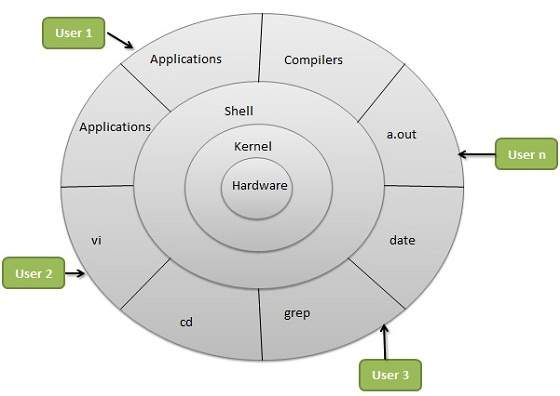

# Introduction

- Linux is an open-source operating system (OS) that acts as an interface between a computer's hardware and the software you run.

- It is based on Unix, and it’s widely used in servers, desktops, embedded systems, and mobile devices (like Android).

- It’s made up of different components like:

    1. The kernel (core part)
    2. System libraries (to interact with the kernel)
    3. System utilities (like ls, cp, top)
    4. User interfaces (CLI or GUI)

- Examples of Linux distributions:

    1. Ubuntu
    2. Fedora
    3. CentOS (now replaced by CentOS Stream)
    4. Debian
    5. Arch Linux

#  Linux Kernel

- The Linux kernel is the core of the Linux operating system.

- It directly interacts with the hardware and provides key services to the rest of the OS.

- It handles:

    - Memory management

    - Process scheduling

    - Device drivers

    - System calls

    - File systems

- It’s monolithic in architecture, meaning most OS services run in kernel space for performance.


# LILO (Linux Loader)

- LILO is a boot loader for Linux. It was one of the earliest boot loaders for Linux systems.

- When you turn on your computer, LILO loads the Linux kernel into memory and starts it.

- It's installed in the Master Boot Record (MBR) or boot sector of the hard disk.

- It allows booting multiple operating systems (multi-boot).

- It’s no longer widely used today—GRUB (GRand Unified Bootloader) has mostly replaced it.

⚠️ LILO is not dynamic:

- If you change your kernel or configuration, you must reinstall LILO using lilo command.

# Linux Components



1. Kernel

2. System Libraries

   - These are standard functions that applications use to communicate with the kernel without dealing with low-level details.

   - Examples:
        - glibc – GNU C Library (provides basic C functions like printf, malloc, open)

        - libm – Math functions like sin(), cos(), sqrt()

        - libpthread – POSIX threads for multithreading

        - OpenSSL, libcurl, libxml2 – Used for cryptography, HTTP requests, and XML parsing

3. System Utilities

- These are essential programs and tools that provide basic functions for system administration.

```
File Utilities	       cp, mv, rm, find, ls	                 Manage files
Process Utilities	   ps, top, kill, nice	                 Manage running processes
Networking	           ping, ifconfig, netstat, curl, wget	 Monitor and configure networks
Archiving	            tar, gzip, zip	                     Manage archives
Disk Utilities	        fdisk, df, mount, umount	         Manage disks and partitions
Package Managers	    apt, yum, dnf, pacman	             Install/update software
```

4. Shell (Command Interpreter)

The shell is the user interface for access to the OS services. It's a CLI (Command-Line Interface).

Popular Shells:
bash – Bourne Again Shell (most common)

zsh – Powerful shell with themes and plugins

sh – Bourne Shell (older)

fish, csh, ksh – Other variants

Functions:
Reads and interprets user commands

Supports scripting (control flow, variables, functions)

Provides piping and redirection


5.  User Applications
   
Applications written by users that run in user space. These could be:

Command-line tools: vim, nano, htop

GUI Applications: Firefox, LibreOffice, VS Code

Services (daemons): sshd, cron, systemd, nginx

Applications interact with:

Shell (user input/output)

System libraries (for file access, networking, etc.)

Kernel (indirectly through system calls)


6. Graphical Subsystem (Optional)

If you're using a graphical desktop environment (GUI), Linux includes several components:
```
Component	Description
X Window System (X11)	Core graphical layer that manages windows and input devices
Wayland	A modern replacement for X11
Window Manager	Controls the appearance of windows (e.g., i3, Mutter, KWin)
Desktop Environment	Full UI experience (GNOME, KDE, XFCE, etc.)
```

7. Init System / Service Manager

The init system is the first program that runs when Linux boots. It sets up and manages user-space services.

Init System	Description
systemd	Modern and widely used, parallel booting, dependency-based
SysVinit	Traditional sequential booting
OpenRC, runit, s6	Lightweight alternatives

systemd Services:
systemctl start nginx

systemctl status sshd

journalctl -xe for logs


8. Package Management System

Used to install, update, remove software.

Package System	Used by	Tools
DEB	Debian, Ubuntu	apt, dpkg
RPM	Red Hat, Fedora, CentOS	yum, dnf, rpm
Pacman	Arch Linux	pacman
Snap/Flatpak	Universal formats	snap, flatpak

