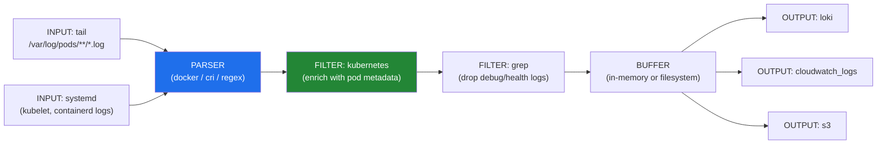

# Fluent Bit

> Lightweight, high-performance log processor and forwarder. Written in C — tiny memory footprint (~450KB), ideal for running as a DaemonSet on every Kubernetes node.

## Fluent Bit vs Fluentd vs Logstash

| Feature | Fluent Bit | Fluentd | Logstash |
|---------|------------|---------|----------|
| Language | C | Ruby | JRuby |
| Memory | ~450KB | ~40MB | ~500MB+ |
| CPU | Very low | Low | High |
| Plugins | ~100 | ~1000+ (rich ecosystem) | ~200+ |
| Best for | K8s node-level collection | Aggregation layer | Elasticsearch-heavy pipelines |
| Common pattern | Fluent Bit → Fluentd → storage | Aggregator | ELK stack |

**Rule of thumb:** Use Fluent Bit on nodes (as DaemonSet) for lightweight collection. If you need complex routing or many output plugins, add Fluentd as an aggregation tier.

## Pipeline Architecture



## Key Configuration Example

```ini
# fluent-bit.conf
[SERVICE]
    Flush         5
    Daemon        off
    Log_Level     info
    Parsers_File  parsers.conf

[INPUT]
    Name              tail
    Tag               kube.*
    Path              /var/log/containers/*.log
    multiline.parser  docker, cri
    DB                /var/log/flb_kube.db    # track read position
    Mem_Buf_Limit     50MB
    Skip_Long_Lines   On

[FILTER]
    Name                kubernetes
    Match               kube.*
    Kube_URL            https://kubernetes.default.svc:443
    Kube_CA_File        /var/run/secrets/kubernetes.io/serviceaccount/ca.crt
    Kube_Token_File     /var/run/secrets/kubernetes.io/serviceaccount/token
    Merge_Log           On       # merge JSON log fields into record
    Keep_Log            Off      # drop original 'log' field after merging
    Annotations         Off      # skip pod annotations (reduce noise)
    Labels              On       # include pod labels

[FILTER]
    Name    grep
    Match   kube.*
    Exclude log .*health.*      # drop health check noise

[OUTPUT]
    Name            loki
    Match           kube.*
    Host            loki.monitoring.svc
    Port            3100
    Labels          job=fluentbit, namespace=$kubernetes['namespace_name'], app=$kubernetes['labels']['app']
    Auto_Kubernetes_Labels On

[OUTPUT]
    Name              cloudwatch_logs
    Match             kube.*
    region            us-east-1
    log_group_name    /eks/my-cluster/application
    log_stream_prefix ${HOSTNAME}-
    auto_create_group On
```

## Kubernetes DaemonSet Deployment

```yaml
apiVersion: apps/v1
kind: DaemonSet
metadata:
  name: fluent-bit
  namespace: monitoring
spec:
  selector:
    matchLabels:
      app: fluent-bit
  template:
    spec:
      serviceAccountName: fluent-bit
      tolerations:
        - operator: Exists   # run on ALL nodes including control-plane
      containers:
        - name: fluent-bit
          image: fluent/fluent-bit:2.1
          resources:
            limits:
              memory: 200Mi
            requests:
              cpu: 50m
              memory: 100Mi
          volumeMounts:
            - name: varlog
              mountPath: /var/log
              readOnly: true
            - name: config
              mountPath: /fluent-bit/etc/
      volumes:
        - name: varlog
          hostPath:
            path: /var/log
        - name: config
          configMap:
            name: fluent-bit-config
```

## Multiline Log Parsing

Applications that span a log entry across multiple lines (Java stack traces, Python tracebacks) need special handling:

```ini
[INPUT]
    Name              tail
    Path              /var/log/containers/java-app*.log
    multiline.parser  java   # built-in Java multiline parser

# Custom multiline rule
[MULTILINE_PARSER]
    name          python_traceback
    type          regex
    flush_timeout 1000
    rules:
        start_state  /^[^\s]/       # new log starts with non-whitespace
        cont         /^\s+/          # continuation = whitespace-indented line
```

## Backpressure Handling

When output is slow (Loki down, network issue), Fluent Bit buffers in memory up to `Mem_Buf_Limit`. When that fills, it pauses INPUT collection (backpressure signal). To prevent log loss, enable filesystem buffering:

```ini
[OUTPUT]
    Name          loki
    storage.type  filesystem    # spill to disk if memory full
```

## Common Interview Questions

**Q: How does Fluent Bit collect Kubernetes pod logs?**
Fluent Bit DaemonSet mounts the node's `/var/log` (hostPath volume). It tails `/var/log/containers/*.log` (symlinks to `/var/log/pods/`). The Kubernetes filter plugin enriches each log line with pod metadata (namespace, pod name, labels) by querying the K8s API using the pod name parsed from the file path.

**Q: Fluent Bit vs Fluentd — when to use each?**
Fluent Bit for node-level collection — it's lightweight enough to run on every node without significantly impacting node resources. Fluentd as an aggregation tier when you need complex routing, buffering across many sources, or access to its 1000+ plugin ecosystem. A common pattern: Fluent Bit (DaemonSet) → Fluentd (Deployment, aggregator) → Elasticsearch/Loki/S3.

**Q: How does Fluent Bit handle log ordering?**
It doesn't guarantee ordering within a stream. Logs are processed as they arrive. For distributed systems, rely on timestamps (parsed from log content) rather than ingestion order. The `kubernetes` filter's `Merge_Log On` ensures structured JSON logs are properly parsed before filtering.

**Q: What is the `DB` option in the tail input?**
The DB option persists the file read offset to disk. Without it, Fluent Bit restarts from the beginning of log files after a crash/restart, causing duplicate log ingestion. The DB file acts as a checkpoint — when Fluent Bit restarts, it resumes from where it left off.
