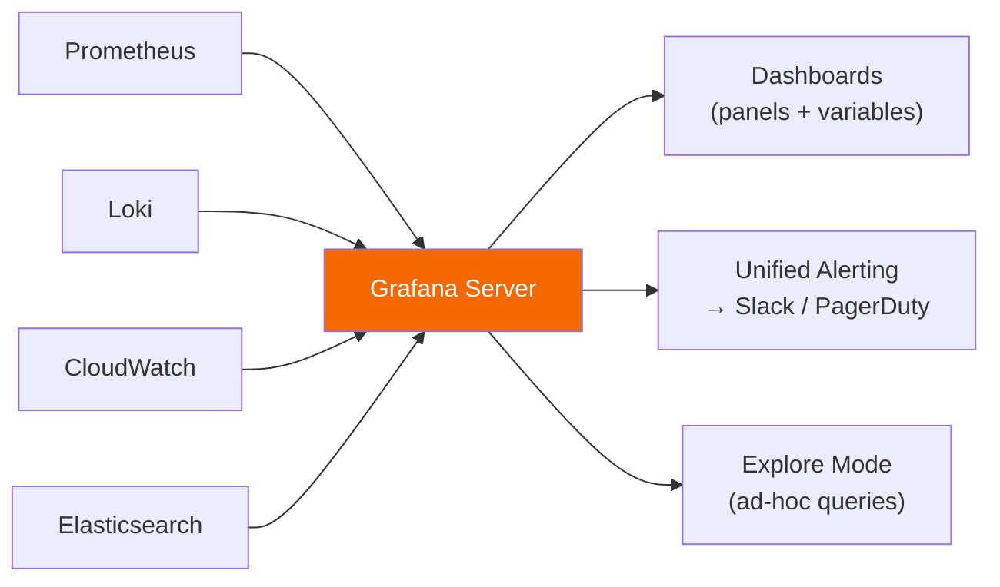

# Grafana

> Open-source observability visualization platform. Connects to any data source — Prometheus, Loki, CloudWatch, Elasticsearch, and 50+ others.

## Architecture & Data Flow



## Core Concepts

| Concept | Description |
|---------|-------------|
| **Dashboard** | Collection of panels, saved as JSON |
| **Panel** | Single visualization (graph, table, stat, heatmap) |
| **Data Source** | Connection to a backend (Prometheus, Loki, etc.) |
| **Variable** | Template variable for dynamic dashboards (`$namespace`, `$pod`) |
| **Annotation** | Mark events on graph (deploys, incidents) |
| **Folder** | Organize dashboards — maps to RBAC permissions |
| **Playlist** | Auto-cycle through dashboards (NOC screens) |

## Dashboard Variables

Variables make dashboards reusable across environments:

```json
{
  "name": "namespace",
  "type": "query",
  "datasource": "Prometheus",
  "query": "label_values(kube_pod_info, namespace)",
  "multi": true,
  "includeAll": true
}
```

Panel query using variable: `sum(rate(http_requests_total{namespace="$namespace"}[5m])) by (pod)`

## Unified Alerting (Grafana 8+)

Grafana's built-in alerting — no need for a separate Alertmanager for non-Prometheus sources:

```yaml
# Grafana alert rule (configured in UI or provisioning)
apiVersion: 1
groups:
  - orgId: 1
    name: SLO Alerts
    folder: Production
    rules:
      - uid: error-rate-alert
        title: High Error Rate
        condition: C
        data:
          - refId: A
            datasourceUid: prometheus-uid
            model:
              expr: sum(rate(http_requests_total{status=~"5.."}[5m]))
          - refId: C
            type: math
            model:
              expression: $A > 10
        noDataState: NoData
        execErrState: Error
        for: 5m
        labels:
          severity: critical
        annotations:
          summary: "Error rate exceeded threshold"
```

## Provisioning (Dashboards as Code)

Avoid manual dashboard creation — provision from files for GitOps:

```yaml
# /etc/grafana/provisioning/dashboards/default.yaml
apiVersion: 1
providers:
  - name: default
    type: file
    options:
      path: /var/lib/grafana/dashboards
      foldersFromFilesStructure: true
```

```yaml
# /etc/grafana/provisioning/datasources/prometheus.yaml
apiVersion: 1
datasources:
  - name: Prometheus
    type: prometheus
    url: http://prometheus:9090
    isDefault: true
    jsonData:
      httpMethod: POST
      exemplarTraceIdDestinations:
        - name: traceID
          datasourceUid: tempo-uid
```

## Grafana Agent (All-in-One Collector)

Replaces Prometheus + Promtail + OpenTelemetry Collector as a single binary:

```yaml
# grafana-agent.yaml
metrics:
  configs:
    - name: default
      scrape_configs:
        - job_name: kubernetes-pods
          kubernetes_sd_configs:
            - role: pod
      remote_write:
        - url: http://mimir:9009/api/v1/push

logs:
  configs:
    - name: default
      clients:
        - url: http://loki:3100/loki/api/v1/push
      positions:
        filename: /tmp/positions.yaml
      scrape_configs:
        - job_name: kubernetes
          kubernetes_sd_configs:
            - role: pod
```

## Grafana LGTM Stack

| Component | Role |
|-----------|------|
| **L**oki | Log aggregation |
| **G**rafana | Visualization |
| **T**empo | Distributed tracing |
| **M**imir | Long-term metrics storage |

All Grafana Labs open-source projects — designed to work together with Grafana as the single pane of glass.

## Grafana vs CloudWatch Dashboards

| Feature | Grafana | CloudWatch Dashboards |
|---------|---------|----------------------|
| Data sources | 50+ (multi-cloud) | AWS only |
| Cost | Free (OSS) | $3/dashboard/month |
| Query language | Native (PromQL, LogQL, etc.) | CloudWatch Metrics Insights |
| Alerting | Unified, multi-source | CloudWatch Alarms only |
| Dashboard as code | JSON + provisioning | CloudFormation / CDK |
| Community dashboards | Thousands on grafana.com | Limited |

## Common Interview Questions

**Q: How do you set up Grafana alerting vs using Prometheus Alertmanager?**
Use Prometheus Alertmanager when all your data is in Prometheus — it's purpose-built for routing/dedup/silence. Use Grafana unified alerting when you need multi-source alerts (e.g., Loki log pattern + Prometheus metric together, or CloudWatch). Both can route to PagerDuty/Slack.

**Q: How do you manage Grafana dashboards as code?**
Export dashboard JSON from UI → store in Git → use provisioning directory or Grafana Operator (K8s) to deploy. Tools like `grizzly` or `grafana-operator` help manage dashboards declaratively. Avoid manual clicking in production — changes get lost.

**Q: What's Grafana Agent vs running Prometheus + Promtail separately?**
Grafana Agent is a single binary that replaces Prometheus (scraping + remote_write), Promtail (log shipping), and an OTel collector. Reduces operational overhead — one DaemonSet instead of three. Supports Flow mode (HCL-based) for more dynamic configuration.

**Q: How do Grafana dashboard variables work?**
Variables are template parameters injected into queries. They populate from data sources (e.g., all Prometheus label values, all K8s namespaces). Chained variables let a "pod" dropdown show only pods in the selected namespace. Essential for reusable multi-environment dashboards.
