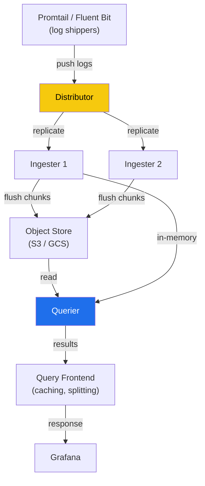

# Loki

> Log aggregation system by Grafana Labs. "Like Prometheus, but for logs." Indexes labels, not log content — making it cheap to operate at scale.

## Architecture



## Loki vs ELK Stack

| Feature | Loki | Elasticsearch (ELK) |
|---------|------|---------------------|
| Indexing | Labels only (like Prometheus) | Full-text index on all content |
| Storage cost | Low (only labels indexed, log lines in object store) | High (full index is large) |
| Query speed | Fast for label queries, slower for content search | Very fast full-text search |
| Operational complexity | Low (stateless + object store) | High (shards, replicas, heap tuning) |
| Multi-tenancy | Built-in (X-Scope-OrgID header) | Requires index-per-tenant pattern |
| Best for | Log streams with structured labels | Full-text search, analytics |

**Choose Loki** when: you already use Prometheus labels, storage cost matters, you don't need full-text search.
**Choose ELK** when: you need full-text search, complex analytics, or regex on any field.

## Log Streams and Labels

A **log stream** = unique set of labels (like a Prometheus time series):

```
{app="nginx", namespace="production", pod="nginx-abc123"} → log lines
```

**Cardinality rules (same as Prometheus):**
- ✅ Good labels: `app`, `namespace`, `environment`, `level`
- ❌ Bad labels: `pod_name` (changes constantly), `request_id`, `user_id`

High-cardinality labels = too many streams = OOM on ingesters.

## LogQL — Query Language

```logql
# Basic log filter
{app="nginx", namespace="production"} |= "error"

# Regex filter
{app="nginx"} |~ "5[0-9]{2}"

# JSON parser + filter on extracted field
{app="api"} | json | status_code >= 500

# Pattern parser (extract without JSON)
{app="nginx"} | pattern `<ip> - - [<_>] "<method> <path> <_>" <status> <bytes>`

# Log metric — count errors per minute
sum(rate({app="api"} |= "error" [1m])) by (namespace)

# 95th percentile latency from logs
histogram_quantile(0.95,
  sum(rate({app="api"} | json | unwrap latency_ms [5m])) by (le)
)
```

## Promtail — Log Shipper

Promtail runs as a DaemonSet, reads pod logs from `/var/log/pods`, and ships to Loki:

```yaml
scrape_configs:
  - job_name: kubernetes-pods
    kubernetes_sd_configs:
      - role: pod
    pipeline_stages:
      - docker: {}          # parse Docker JSON log format
      - json:               # parse structured JSON logs
          expressions:
            level: level
            msg: message
      - labels:             # promote parsed fields to labels
          level:
      - drop:               # drop debug logs to reduce volume
          source: level
          expression: "debug"
    relabel_configs:
      - source_labels: [__meta_kubernetes_pod_name]
        target_label: pod
      - source_labels: [__meta_kubernetes_namespace]
        target_label: namespace
```

## Multi-tenancy

Loki uses the `X-Scope-OrgID` header for tenant isolation. Each tenant's data is stored separately:

```yaml
# In Grafana data source config:
httpHeaders:
  X-Scope-OrgID: team-platform

# Or in Promtail config:
clients:
  - url: http://loki:3100/loki/api/v1/push
    tenant_id: team-platform
```

## Loki Deployment Modes

| Mode | Description | Use case |
|------|-------------|----------|
| **Monolithic** | All components in one binary | Development, small scale |
| **Simple scalable** | Read path + Write path separated | Medium scale (most common) |
| **Microservices** | Each component runs separately | Large scale, fine-grained scaling |

## Common Interview Questions

**Q: Why does Loki index labels instead of log content?**
Full-text indexing (like Elasticsearch) is expensive — the index can be as large as the data itself. Loki only indexes metadata labels (same as Prometheus), storing raw log chunks in cheap object storage (S3). You pay more at query time (scans chunks), but storage costs are 10-100x lower.

**Q: How does label cardinality affect Loki performance?**
Each unique label combination creates a new log stream (an open file descriptor on the ingester). Too many streams → too many open files → OOM on ingesters. The `pod_name` label sounds useful but creates a stream per pod × per deploy → huge churn. Use `namespace` + `app` labels instead.

**Q: How does LogQL differ from SQL or PromQL?**
LogQL is two-stage: first a log stream selector `{labels}` (like a WHERE on label index), then a pipeline of transformations `| json | level="error"` (like SELECT/FILTER on log content). Metric queries wrap log queries with aggregation functions (like PromQL). No JOINs — purely stream processing.

**Q: How do you reduce Loki costs in production?**
1. Drop noisy/debug logs in Promtail pipeline before sending to Loki
2. Use recording rules for common metric queries instead of scanning logs each time
3. Set short retention for high-volume namespaces (Loki per-stream retention)
4. Avoid high-cardinality labels — profile with `loki_ingester_streams_created_total`
