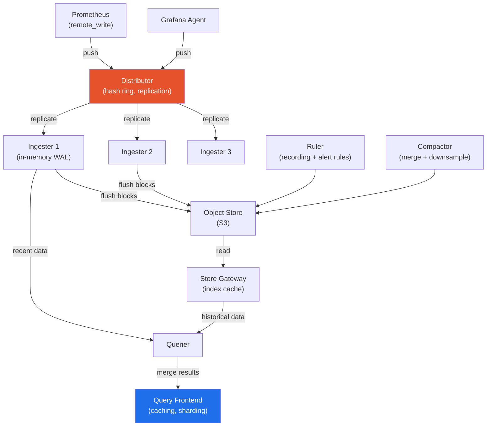

# Grafana Mimir

> Horizontally scalable, highly available, multi-tenant long-term Prometheus metrics storage. The successor to Cortex — built for operating Prometheus at massive scale.

## Mimir vs Alternatives

| Feature | Mimir | Thanos | Cortex | Amazon AMP |
|---------|-------|--------|--------|-----------|
| Origin | Grafana Labs (Cortex fork) | CNCF project | CNCF project | AWS managed |
| Multi-tenancy | ✅ Built-in | ❌ (workarounds) | ✅ | ✅ (workspaces) |
| Object storage | S3/GCS/Azure | S3/GCS/Azure | S3/GCS/Azure | AWS-managed |
| Horizontal scale | ✅ All components | ✅ (query layer) | ✅ | ✅ AWS handles |
| Global query view | ✅ (native) | ✅ (query) | ✅ | Per-workspace |
| Operational burden | Medium | Medium-High | Medium | None |
| Query sharding | ✅ | ✅ | Partial | AWS managed |

## Architecture



## Component Roles

| Component | Responsibility |
|-----------|---------------|
| **Distributor** | Receives remote_write, validates, replicates to ingesters via consistent hash ring |
| **Ingester** | Stores recent metrics in memory (WAL for durability), flushes blocks to S3 |
| **Store Gateway** | Reads historical blocks from S3, maintains an index cache |
| **Querier** | Fan-out queries to ingesters (recent) + store gateways (historical), merges results |
| **Query Frontend** | Caches query results, splits large queries into parallel sub-queries |
| **Compactor** | Merges small blocks into larger ones, applies retention, downsamples old data |
| **Ruler** | Evaluates recording rules and alert rules at scale, stores results back to Mimir |

## Multi-tenancy

Each tenant is isolated by an `X-Scope-OrgID` header — data, rules, and limits are all per-tenant:

```yaml
# Configure Prometheus to push to Mimir with tenant ID
remote_write:
  - url: http://mimir-distributor:8080/api/v1/push
    headers:
      X-Scope-OrgID: team-platform
    queue_config:
      max_samples_per_send: 1000
      capacity: 10000

# Mimir per-tenant limits (mimir.yaml)
limits:
  ingestion_rate: 10000        # samples/sec per tenant
  max_label_names_per_series: 30
  max_series_per_user: 1000000
  compactor_blocks_retention_period: 90d
```

## Deployment with Helm

```bash
helm repo add grafana https://grafana.github.io/helm-charts
helm install mimir grafana/mimir-distributed \
  --namespace monitoring \
  --set mimir.structuredConfig.common.storage.backend=s3 \
  --set mimir.structuredConfig.common.storage.s3.bucket_name=my-mimir-metrics \
  --set mimir.structuredConfig.common.storage.s3.region=us-east-1
```

## Querying Mimir from Grafana

```yaml
# Grafana data source for Mimir
apiVersion: 1
datasources:
  - name: Mimir
    type: prometheus
    url: http://mimir-query-frontend:8080/prometheus
    httpHeaders:
      X-Scope-OrgID: team-platform
    jsonData:
      httpMethod: POST
      prometheusType: Mimir
```

## Query Sharding

For expensive queries over millions of series, Mimir's Query Frontend splits the query into parallel sub-queries across time:

```
# Query for 30d = automatically split into 30 × 1d sub-queries
# Each runs in parallel → linear speedup with more queriers
histogram_quantile(0.95, sum(rate(http_request_duration_seconds_bucket[5m])) by (le))
```

Enable with `query_sharding_total_shards: 16` in frontend config.

## Common Interview Questions

**Q: When should I use Mimir vs Thanos?**
Mimir for a greenfield deployment or if you're already in the Grafana ecosystem (Loki, Tempo) — it has better multi-tenancy, query sharding, and is designed as a single cohesive system. Thanos if you need to integrate with existing Prometheus deployments without changing their setup (Thanos Sidecar attaches to running Prometheus). Thanos has a larger CNCF community.

**Q: How does Mimir handle ingester failures?**
The Distributor uses a consistent hash ring with replication factor (default 3). When writing, it sends to 3 ingesters — data survives 1-2 ingester failures. The Distributor waits for a quorum (2/3 by default). Failed ingesters rejoin the ring after restart and re-sync from the WAL.

**Q: How is Mimir different from Amazon AMP?**
AMP is fully managed (no ops), AWS-native (IAM auth), and per-workspace multi-tenancy. Mimir is self-managed (you handle scaling, storage), more configurable, and has true multi-tenancy via headers. Use AMP if you want zero operational overhead in AWS. Use Mimir for multi-cloud, full control, or when you need advanced features like query sharding.

**Q: What does the Compactor do and why does it matter?**
Ingesters write small 2-hour TSDB blocks to S3. The Compactor merges these into larger blocks (reducing the number of files queriers must open) and applies downsampling (5min and 1hr resolution for old data). Without compaction, query performance degrades as thousands of tiny blocks accumulate in S3.
