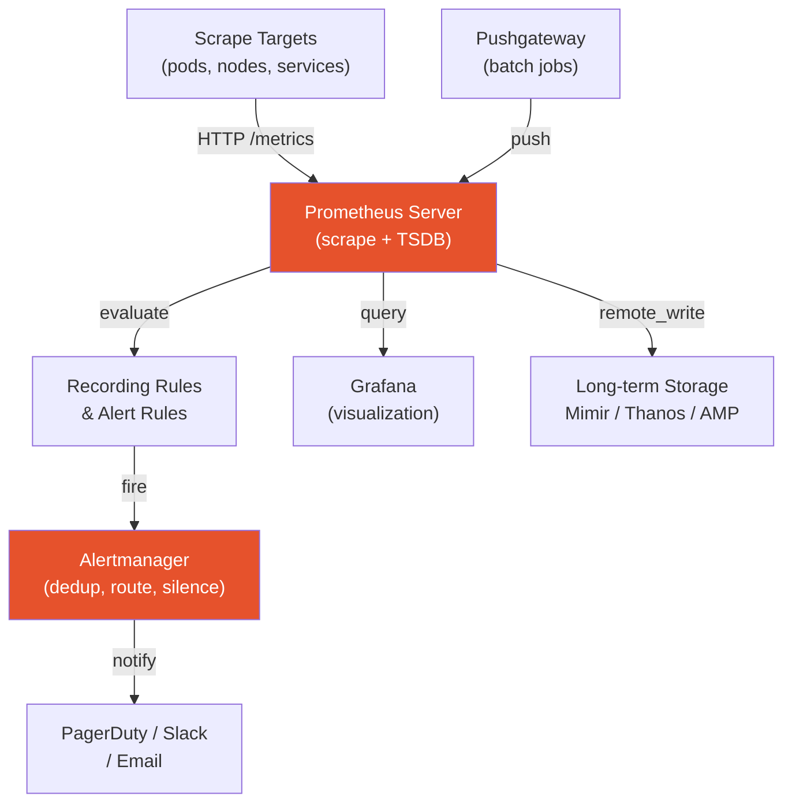

# Prometheus

> Pull-based metrics monitoring system and time-series database. The de-facto standard for Kubernetes observability.

## Architecture



## Metric Types

| Type | Description | Use case | Example |
|------|-------------|----------|---------|
| **Counter** | Monotonically increasing | requests, errors, bytes | `http_requests_total` |
| **Gauge** | Can go up or down | current memory, goroutines | `node_memory_MemAvailable_bytes` |
| **Histogram** | Bucketed observations | latency distribution, sizes | `http_request_duration_seconds` |
| **Summary** | Pre-calculated quantiles | latency quantiles (client-side) | `rpc_duration_seconds` |

Prefer **Histogram** over Summary for latency — histograms can be aggregated across instances, summaries cannot.

## Data Model

Every time series is identified by a **metric name** + **labels**:

```
http_requests_total{method="GET", status="200", handler="/api/v1/users"}
```

Labels are key-value pairs that create high cardinality when overused (avoid user IDs, IP addresses as labels — each unique combination = one time series).

## PromQL Essentials

```promql
# Request rate over 5 minutes
rate(http_requests_total[5m])

# Error ratio
sum(rate(http_requests_total{status=~"5.."}[5m])) / sum(rate(http_requests_total[5m]))

# 95th percentile latency
histogram_quantile(0.95, sum(rate(http_request_duration_seconds_bucket[5m])) by (le, service))

# Memory usage across all pods in a namespace
sum(container_memory_working_set_bytes{namespace="production"}) by (pod)

# CPU throttling percentage
sum(rate(container_cpu_throttled_seconds_total[5m])) by (pod)
  / sum(rate(container_cpu_usage_seconds_total[5m])) by (pod)
```

## Recording Rules

Pre-compute expensive queries to speed up dashboards and reduce query load:

```yaml
groups:
  - name: http_metrics
    interval: 30s
    rules:
      - record: job:http_requests:rate5m
        expr: sum(rate(http_requests_total[5m])) by (job)
      - record: job:http_error_ratio:rate5m
        expr: |
          sum(rate(http_requests_total{status=~"5.."}[5m])) by (job)
          / sum(rate(http_requests_total[5m])) by (job)
```

## Alerting Rules

```yaml
groups:
  - name: slo_alerts
    rules:
      - alert: HighErrorRate
        expr: job:http_error_ratio:rate5m > 0.05
        for: 5m
        labels:
          severity: warning
        annotations:
          summary: "{{ $labels.job }} error rate {{ $value | humanizePercentage }}"
          runbook_url: "https://runbook/high-error-rate"

      - alert: HighLatency
        expr: |
          histogram_quantile(0.95,
            sum(rate(http_request_duration_seconds_bucket[5m])) by (le, job)
          ) > 1.0
        for: 10m
        labels:
          severity: critical
```

## Prometheus Operator (Kubernetes)

The Prometheus Operator manages Prometheus as Kubernetes CRDs:

```yaml
# ServiceMonitor — tells Prometheus which services to scrape
apiVersion: monitoring.coreos.com/v1
kind: ServiceMonitor
metadata:
  name: my-app
  namespace: monitoring
spec:
  selector:
    matchLabels:
      app: my-app
  endpoints:
    - port: metrics
      interval: 30s
      path: /metrics
---
# PodMonitor — scrape pods directly (no Service needed)
apiVersion: monitoring.coreos.com/v1
kind: PodMonitor
metadata:
  name: my-pods
spec:
  selector:
    matchLabels:
      app: my-app
  podMetricsEndpoints:
    - port: metrics
```

## Cardinality — The #1 Prometheus Problem

High cardinality = too many unique label combinations = OOM crash.

**Bad:** `http_requests_total{user_id="12345"}` — millions of users = millions of series
**Good:** `http_requests_total{user_tier="premium"}` — bounded set of values

Monitor cardinality: `prometheus_tsdb_head_series` (should stay < 1M for most setups)

## Remote Write (Long-term Storage)

```yaml
# prometheus.yml
remote_write:
  - url: https://aps-workspaces.us-east-1.amazonaws.com/workspaces/ws-xxx/api/v1/remote_write
    sigv4:
      region: us-east-1
    queue_config:
      max_samples_per_send: 1000
      max_shards: 200
```

## Common Interview Questions

**Q: Why is Prometheus pull-based and what's the trade-off?**
Pull: Prometheus controls scrape rate, easy to detect dead targets (no scrapes = problem). Trade-off: doesn't work for short-lived jobs or targets behind NAT/firewall — use Pushgateway for those.

**Q: What's the difference between rate() and irate()?**
`rate()` uses the first and last data points in the range — smoothed, good for alerting and dashboards. `irate()` uses the last two data points — instant rate, spiky, good for real-time debugging. Use `rate()` for alerts.

**Q: How do recording rules improve performance?**
Recording rules pre-compute expensive aggregations on a schedule (e.g., every 30s) and store the result as a new time series. Dashboard queries then hit the pre-computed series instead of re-computing over millions of raw series on every load.

**Q: How do you monitor Kubernetes pods with Prometheus?**
Deploy Prometheus Operator → create ServiceMonitor/PodMonitor CRDs → Prometheus auto-discovers targets from K8s API. Use kube-state-metrics for pod/deployment metadata metrics, node-exporter for node-level metrics.

**Q: What happens when Prometheus scrapes a target that's down?**
The scrape fails, and Prometheus records `up{job="...", instance="..."} = 0`. You alert on `up == 0` to detect dead targets.
