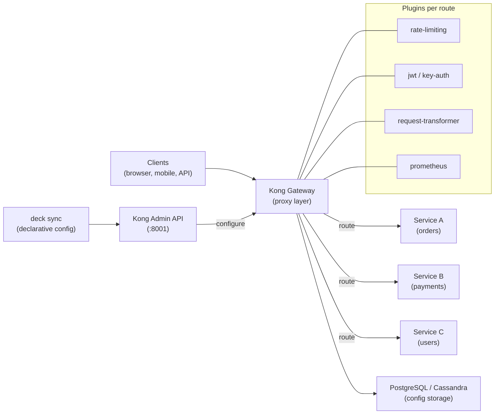

# Kong API Gateway

> Cloud-native API gateway built on Nginx/OpenResty. Handles auth, rate limiting, routing, observability, and transformations as plugins — no code changes required in services.

## Architecture



## Core Concepts

| Concept | Description |
|---------|-------------|
| **Service** | The upstream microservice Kong proxies to |
| **Route** | Match rule (host, path, method) → maps to a Service |
| **Plugin** | Middleware applied globally, per service, or per route |
| **Consumer** | A user/application that calls the API (for auth tracking) |
| **Upstream** | Load balancing target (multiple backends for a Service) |
| **Gateway** | The Kong proxy instance (port 8000 HTTP, 8443 HTTPS) |

## Deployment Modes

| Mode | Description | Use case |
|------|-------------|---------|
| **DB-backed** | Config in Postgres/Cassandra | Multi-node, HA |
| **DB-less (declarative)** | Config from YAML file | K8s, GitOps, immutable infra |
| **Hybrid** | Control plane (DB) + Data planes (DB-less agents) | Large scale, multi-region |
| **KIC** | Kong Ingress Controller — K8s CRDs as config | Kubernetes-native |

## Configuration — Declarative (deck)

```yaml
# kong.yaml — manage with: deck sync -s kong.yaml
_format_version: "3.0"

services:
  - name: orders-service
    url: http://orders-api.default.svc.cluster.local:8080
    routes:
      - name: orders-route
        paths: ["/api/v1/orders"]
        methods: [GET, POST]
        strip_path: false
    plugins:
      - name: rate-limiting
        config:
          minute: 100
          hour: 1000
          policy: local
      - name: prometheus
        config:
          per_consumer: true

  - name: payments-service
    url: http://payments-api.default.svc.cluster.local:8080
    routes:
      - name: payments-route
        paths: ["/api/v1/payments"]
        methods: [POST]
    plugins:
      - name: jwt          # protect payments with JWT
      - name: request-size-limiting
        config:
          allowed_payload_size: 10  # 10 MB max

consumers:
  - username: mobile-app
    jwt_secrets:
      - key: mobile-app-key
        secret: "super-secret-jwt-signing-key"
```

```bash
# Apply config
deck sync -s kong.yaml --kong-addr http://localhost:8001

# Diff before applying
deck diff -s kong.yaml

# Export current state
deck dump -o current-state.yaml
```

## Key Plugins

### Rate Limiting

```yaml
plugins:
  - name: rate-limiting
    config:
      minute: 60            # 60 req/min per consumer
      hour: 1000
      day: 10000
      policy: redis         # redis for multi-node (not local)
      redis_host: redis.svc
      redis_port: 6379
      error_code: 429
      error_message: "Rate limit exceeded"
      limit_by: consumer    # consumer | ip | service | header
```

### JWT Authentication

```yaml
plugins:
  - name: jwt
    config:
      secret_is_base64: false
      claims_to_verify: [exp, nbf]   # verify expiry
      key_claim_name: iss             # use "iss" field to look up consumer
      cookie_names: [jwt]             # also check cookie
```

### Key Auth (API Keys)

```yaml
plugins:
  - name: key-auth
    config:
      key_names: [apikey, X-Api-Key]  # header or query param
      key_in_body: false
      hide_credentials: true           # strip key before forwarding to upstream
```

### Request Transformer

```yaml
plugins:
  - name: request-transformer
    config:
      add:
        headers:
          - X-Internal-User:$(consumer.username)
          - X-Request-ID:$(uuid)
      remove:
        headers:
          - Authorization   # strip before forwarding
```

### CORS

```yaml
plugins:
  - name: cors
    config:
      origins: ["https://app.company.com"]
      methods: [GET, POST, PUT, DELETE, OPTIONS]
      headers: [Authorization, Content-Type]
      exposed_headers: [X-Request-ID]
      max_age: 3600
      credentials: true
```

### mTLS (Client Certificate Auth)

```yaml
plugins:
  - name: mtls-auth
    config:
      ca_certificates:
        - id: "uuid-of-ca-cert"
      skip_consumer_lookup: false
      authenticated_group_by: CN     # use CN from cert as consumer
```

## Kong Ingress Controller (KIC) — Kubernetes

```yaml
# Install KIC
helm repo add kong https://charts.konghq.com
helm install kong kong/ingress -n kong --create-namespace

# KongPlugin CRD
apiVersion: configuration.konghq.com/v1
kind: KongPlugin
metadata:
  name: rate-limit-per-user
  namespace: production
plugin: rate-limiting
config:
  minute: 100
  policy: redis
  redis_host: redis.redis.svc.cluster.local
---
# Annotate Ingress to apply plugin
apiVersion: networking.k8s.io/v1
kind: Ingress
metadata:
  name: orders-ingress
  annotations:
    konghq.com/plugins: rate-limit-per-user, jwt-auth
    konghq.com/strip-path: "true"
spec:
  ingressClassName: kong
  rules:
    - host: api.company.com
      http:
        paths:
          - path: /orders
            pathType: Prefix
            backend:
              service:
                name: orders-svc
                port:
                  number: 8080
```

## Kong vs Other API Gateways

| | Kong | AWS API Gateway | Nginx Ingress | Istio |
|--|------|-----------------|---------------|-------|
| Plugin ecosystem | ✅ 50+ plugins | Limited | Via annotations | Via EnvoyFilter |
| GitOps (declarative) | ✅ deck | CloudFormation | YAML | YAML |
| Multi-cloud | ✅ | AWS only | ✅ | ✅ |
| Service mesh | Kong Mesh (optional) | ❌ | ❌ | ✅ built-in |
| Cost | OSS (free) + Enterprise | Per million calls | OSS | OSS |
| Rate limiting | ✅ per consumer/IP | ✅ usage plans | ❌ basic | ✅ Envoy |
| Auth | JWT, OAuth2, mTLS, LDAP | IAM, Cognito | basic-auth | mTLS, JWT |

## Common Interview Questions

**Q: Kong plugins — global vs service vs route level?**
Global: applies to all traffic (e.g., a global request-id generator). Service level: applies to all routes of a service (e.g., auth for all `/payments` endpoints). Route level: most specific, applies only to that route (e.g., stricter rate limits on `/payments/initiate`). More specific wins — Kong uses the most specific matching plugin config.

**Q: DB-backed vs DB-less Kong — when to use each?**
DB-backed: multiple Kong nodes share config via Postgres — supports live config changes via Admin API, needed for multi-node HA. DB-less: config loaded from a YAML file — ideal for Kubernetes (KIC), GitOps, immutable infrastructure. No Postgres dependency, simpler operational model. Hybrid mode: control plane uses DB, data planes are DB-less and pull config from CP.

**Q: How does Kong handle authentication vs authorization?**
Kong handles authentication (who are you?) via plugins: key-auth, jwt, oauth2, mtls-auth. Authorization (what can you do?) is handled by checking Consumer-to-Route permissions or via OPA (Open Policy Agent) as a custom plugin. Kong creates a `consumer` entity per authenticated identity — downstream services receive the consumer identity via headers (`X-Consumer-ID`, `X-Consumer-Username`).

**Q: How do you deploy Kong changes safely in production?**
Use `deck` (declarative config): (1) store `kong.yaml` in Git, (2) `deck diff` in CI to see what changes, (3) require review for changes to auth/rate-limiting plugins, (4) `deck sync` in CD pipeline only after approval. For KIC, changes go through standard K8s GitOps (PR → merge → ArgoCD sync). Never use Admin API directly in production — it bypasses auditability.
