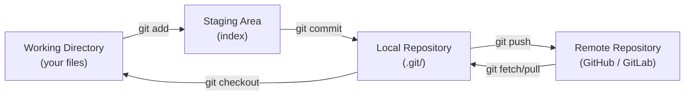
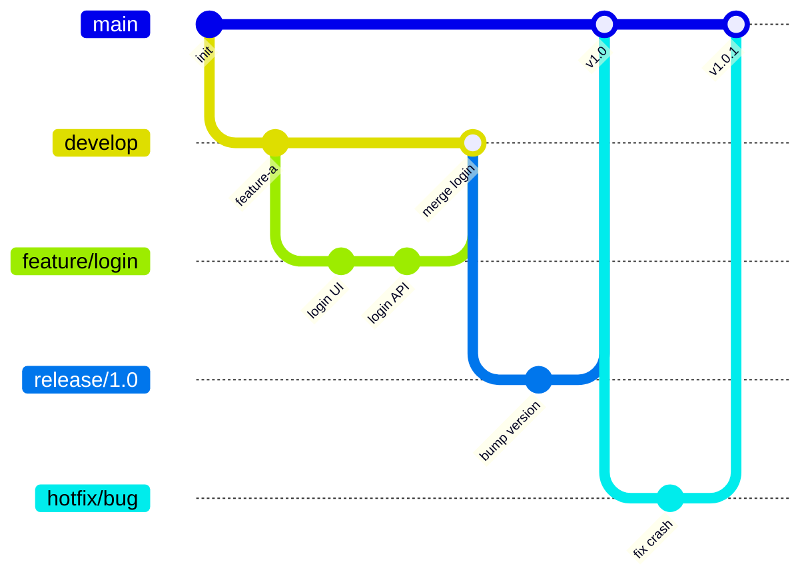
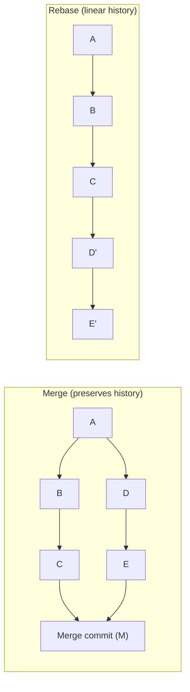

# Git — Version Control

> Distributed version control system. Every clone is a full repository. Enables parallel development, branching, merging, and a complete history of every change.

## Core Concepts



## Git Internals

| Object | Description |
|--------|-------------|
| **blob** | File content (no name, no path) |
| **tree** | Directory structure — maps names to blobs/trees |
| **commit** | Snapshot pointer: tree + parent + author + message |
| **tag** | Named pointer to a commit (annotated = GPG signed) |
| **ref** | Human-readable pointer to a SHA1 (branch = mutable ref) |

```bash
# See what's inside .git
git cat-file -t HEAD           # type: commit
git cat-file -p HEAD           # commit contents
git ls-tree HEAD               # tree contents
git log --graph --oneline      # DAG of commits
```

## Branching Strategies

### Git Flow



| Branch | Purpose |
|--------|---------|
| `main` | Production-ready code |
| `develop` | Integration branch for features |
| `feature/*` | Individual features |
| `release/*` | Release stabilization |
| `hotfix/*` | Emergency production patches |

### Trunk-Based Development (Preferred for CI/CD)

- All developers commit to `main` (or short-lived branches < 2 days)
- Feature flags control incomplete features in production
- Requires high automated test coverage
- Enables true continuous integration

```bash
# Short-lived branch pattern
git checkout -b feat/add-payment   # < 2 day branches
# ... code ...
git push origin feat/add-payment
gh pr create --base main           # auto-merge after CI passes
```

## Rebase vs Merge



| | Merge | Rebase |
|--|-------|--------|
| History | Preserves all branches | Linear, cleaner |
| Conflict handling | Once at merge | Per commit |
| Risk | Safe — never rewrites | Rewrites commits — danger on shared branches |
| Use case | Long-lived branches, team merges | Local cleanup before PR |

**Rule:** Never `git rebase` on a branch others are working on. Use for local cleanup only.

## Essential Commands

```bash
# Setup
git config --global user.name "Pawan Saini"
git config --global user.email "pawan@example.com"
git config --global core.editor vim
git config --global pull.rebase false   # merge on pull (safer default)

# Staging & committing
git add -p                              # interactive staging (patch by patch)
git commit --amend --no-edit            # add to last commit without new message
git commit -m "feat: add login"         # conventional commits

# Branch management
git branch -vv                          # show branches with tracking info
git checkout -b feature/x origin/main  # create tracking branch
git branch -d feature/x                # delete merged branch
git push origin --delete feature/x     # delete remote branch

# Undoing changes
git restore file.txt                   # discard working dir changes
git restore --staged file.txt          # unstage (keep changes)
git reset HEAD~1                        # undo last commit (keep changes staged)
git reset --hard HEAD~1                 # undo last commit (DESTROY changes)
git revert HEAD                         # create new commit that undoes last (safe)

# Stash
git stash push -m "WIP: payment form"  # save working dir
git stash list
git stash pop                           # restore latest stash
git stash apply stash@{2}              # restore specific stash

# Diff & log
git log --oneline --graph --all        # visual branch graph
git log -p -- path/to/file             # history of a specific file
git diff HEAD~3..HEAD                  # last 3 commits diff
git diff --stat main..feature/x        # file-level summary

# Remote
git fetch --prune                       # sync + remove deleted remote branches
git pull --rebase origin main          # rebase on latest main
git push --force-with-lease            # safer force push (fails if remote changed)
```

## Conflict Resolution

```bash
# After merge conflict
git status                             # shows conflicted files
# Edit files — remove <<<<, ====, >>>> markers
git add resolved-file.txt
git merge --continue                   # or git rebase --continue

# Abort if too messy
git merge --abort
git rebase --abort

# Use a merge tool
git mergetool                          # opens configured tool (vimdiff, VSCode, etc.)
```

## Git Hooks

Scripts that run at specific Git events:

```bash
# .git/hooks/ — local only (not committed)
# Must be executable: chmod +x .git/hooks/pre-commit

# Pre-commit: run linter/formatter before every commit
cat > .git/hooks/pre-commit << 'EOF'
#!/bin/bash
golangci-lint run ./... || exit 1
EOF

# Commit-msg: enforce conventional commits
cat > .git/hooks/commit-msg << 'EOF'
#!/bin/bash
msg=$(cat "$1")
if ! echo "$msg" | grep -qE "^(feat|fix|docs|chore|refactor|test|ci):"; then
  echo "Error: Commit message must start with type: feat|fix|docs|chore|refactor|test|ci"
  exit 1
fi
EOF
```

For team-wide hooks, use `pre-commit` framework or `husky` (JS projects):

```bash
pip install pre-commit
# .pre-commit-config.yaml
repos:
  - repo: https://github.com/pre-commit/pre-commit-hooks
    rev: v4.5.0
    hooks:
      - id: trailing-whitespace
      - id: end-of-file-fixer
      - id: detect-private-key
```

## Signing Commits (GPG)

```bash
gpg --gen-key
gpg --list-secret-keys --keyid-format LONG
git config --global user.signingkey KEYID
git config --global commit.gpgsign true

git log --show-signature               # verify signed commits
```

## .gitignore Patterns

```gitignore
# Specific file
.env
secrets.yaml

# Directories
node_modules/
.terraform/
__pycache__/

# Pattern
*.tfstate
*.tfstate.*

# Negate (include despite pattern)
!.env.example

# Global gitignore (all repos)
git config --global core.excludesfile ~/.gitignore_global
```

## Common Interview Questions

**Q: Rebase vs merge — when to use each?**
Merge for: integrating completed features (PR merge), when you want full history of parallel work, on shared branches. Rebase for: local cleanup before creating a PR (squash WIP commits), keeping a feature branch up to date with main (`git rebase main`). Never rebase a branch that others have based work on — it rewrites commit SHAs and causes divergent history.

**Q: What is `git reset --hard` vs `git revert`?**
`git reset --hard HEAD~1`: erases the last commit from history — the commit is gone (works locally but breaks shared branches). `git revert HEAD`: creates a new commit that reverses the changes of HEAD — history is preserved, safe to push to shared branches. Use `revert` in production; use `reset` only for local cleanup.

**Q: What is `git push --force-with-lease`?**
Safer than `--force`. It checks that the remote branch hasn't changed since you last fetched — if someone else pushed to the branch, the force push fails instead of silently overwriting their work. Use whenever you need to push a rewritten branch (after rebase or amend).

**Q: Conventional commits — what are they and why?**
A commit message format: `type(scope): description`. Types: feat, fix, docs, chore, refactor, test, ci. Why: machine-readable → automated changelog generation (semantic-release), enforced by commit-msg hook or CI, clear PR descriptions at a glance. Example: `feat(auth): add JWT refresh token rotation`.
