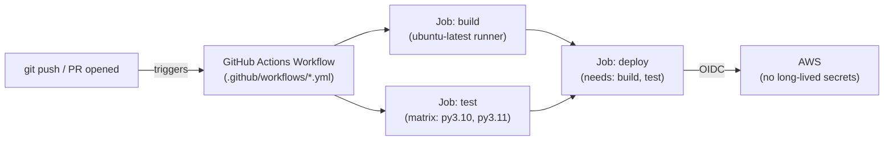
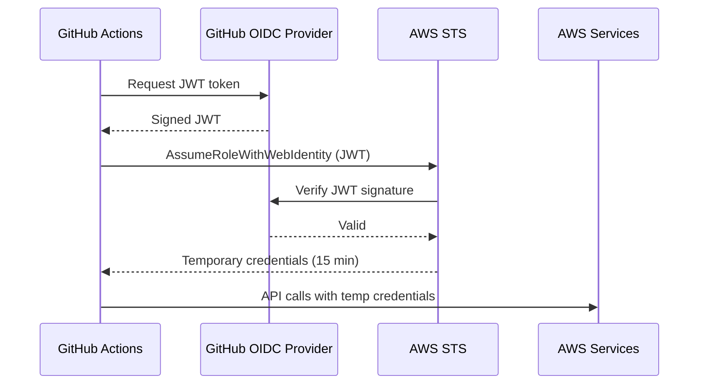

# GitHub — Platform & Actions

## GitHub Actions — CI/CD



### Workflow Structure

```yaml
name: CI/CD Pipeline

on:
  push:
    branches: [main]
  pull_request:
    branches: [main]
  workflow_dispatch:          # manual trigger from UI

env:
  REGISTRY: ghcr.io
  IMAGE_NAME: ${{ github.repository }}

jobs:
  test:
    runs-on: ubuntu-latest
    strategy:
      matrix:
        go-version: ["1.21", "1.22"]    # test on multiple versions
    steps:
      - uses: actions/checkout@v4
      - uses: actions/setup-go@v5
        with:
          go-version: ${{ matrix.go-version }}
          cache: true                   # auto-cache Go module cache

      - name: Run tests
        run: go test ./... -race -coverprofile=coverage.out

      - name: Upload coverage
        uses: codecov/codecov-action@v4
        with:
          file: ./coverage.out

  build-push:
    runs-on: ubuntu-latest
    needs: test                         # runs after test passes
    permissions:
      id-token: write                   # needed for OIDC
      contents: read
      packages: write                   # push to ghcr.io

    steps:
      - uses: actions/checkout@v4

      - name: Configure AWS credentials (OIDC — no secrets stored!)
        uses: aws-actions/configure-aws-credentials@v4
        with:
          role-to-assume: arn:aws:iam::123456789:role/github-actions-ecr
          aws-region: us-east-1

      - name: Login to Amazon ECR
        id: login-ecr
        uses: aws-actions/amazon-ecr-login@v2

      - name: Build and push Docker image
        uses: docker/build-push-action@v5
        with:
          context: .
          push: true
          tags: ${{ steps.login-ecr.outputs.registry }}/my-app:${{ github.sha }}
          cache-from: type=gha
          cache-to: type=gha,mode=max

      - name: Deploy to EKS
        run: |
          aws eks update-kubeconfig --name my-cluster --region us-east-1
          kubectl set image deployment/my-app app=${{ steps.login-ecr.outputs.registry }}/my-app:${{ github.sha }}
          kubectl rollout status deployment/my-app
```

## OIDC — AWS Without Secrets



```bash
# Setup: add GitHub as OIDC provider in AWS
aws iam create-open-id-connect-provider \
  --url https://token.actions.githubusercontent.com \
  --client-id-list sts.amazonaws.com \
  --thumbprint-list 6938fd4d98bab03faadb97b34396831e3780aea1
```

```json
// IAM Role trust policy — lock down to specific repo/branch
{
  "Effect": "Allow",
  "Principal": {
    "Federated": "arn:aws:iam::123456789:oidc-provider/token.actions.githubusercontent.com"
  },
  "Action": "sts:AssumeRoleWithWebIdentity",
  "Condition": {
    "StringLike": {
      "token.actions.githubusercontent.com:sub": "repo:myorg/myrepo:ref:refs/heads/main"
    }
  }
}
```

## Branch Protection Rules

```yaml
# Configure in: Settings → Branches → Branch protection rules

Branch name pattern: main

✅ Require a pull request before merging
  - Required approvals: 2
  - Dismiss stale reviews when new commits are pushed
  - Require review from code owners (CODEOWNERS file)

✅ Require status checks to pass before merging
  - Require branches to be up to date before merging
  - Status checks: ci/test, security/scan

✅ Require conversation resolution before merging

✅ Require signed commits (GPG)

✅ Include administrators (no bypassing)

✅ Require linear history (no merge commits — enforces squash/rebase merge)
```

### CODEOWNERS

```
# .github/CODEOWNERS
# Global: all files require review from platform team
*                 @org/platform-team

# Specific paths
/terraform/       @org/infrastructure
/src/auth/        @org/security-team
*.go              @org/backend-team
/docs/            @org/tech-writers
```

## GitHub Actions — Advanced Patterns

### Reusable Workflows

```yaml
# .github/workflows/reusable-deploy.yml
on:
  workflow_call:
    inputs:
      environment:
        required: true
        type: string
    secrets:
      ECR_ROLE_ARN:
        required: true

jobs:
  deploy:
    runs-on: ubuntu-latest
    environment: ${{ inputs.environment }}
    steps:
      - name: Deploy to ${{ inputs.environment }}
        run: echo "Deploying to ${{ inputs.environment }}"

# Caller workflow
jobs:
  deploy-staging:
    uses: ./.github/workflows/reusable-deploy.yml
    with:
      environment: staging
    secrets:
      ECR_ROLE_ARN: ${{ secrets.ECR_ROLE_ARN }}
```

### Matrix Strategy with Exclusions

```yaml
strategy:
  matrix:
    os: [ubuntu-latest, macos-latest]
    go: ["1.21", "1.22"]
    exclude:
      - os: macos-latest
        go: "1.21"     # skip this combination
  fail-fast: false      # don't cancel other jobs if one fails
```

### Concurrency — Cancel Superseded Runs

```yaml
concurrency:
  group: ${{ github.workflow }}-${{ github.ref }}
  cancel-in-progress: true   # cancel old run when new push on same branch
```

### Caching

```yaml
- name: Cache Go modules
  uses: actions/cache@v4
  with:
    path: |
      ~/.cache/go-build
      ~/go/pkg/mod
    key: ${{ runner.os }}-go-${{ hashFiles('**/go.sum') }}
    restore-keys: |
      ${{ runner.os }}-go-
```

## Dependabot — Automated Dependency Updates

```yaml
# .github/dependabot.yml
version: 2
updates:
  - package-ecosystem: "github-actions"
    directory: "/"
    schedule:
      interval: "weekly"

  - package-ecosystem: "gomod"
    directory: "/"
    schedule:
      interval: "daily"
    open-pull-requests-limit: 10
    groups:
      aws-sdk:
        patterns: ["github.com/aws/*"]

  - package-ecosystem: "docker"
    directory: "/"
    schedule:
      interval: "weekly"
```

## GitHub Environments (Deployment Gates)

```yaml
jobs:
  deploy-prod:
    runs-on: ubuntu-latest
    environment:
      name: production
      url: https://app.company.com   # shown as deployment link
    steps:
      - name: Deploy to production
        run: ./deploy.sh
```

Configure in: Settings → Environments → production:
- Required reviewers (manual approval before job runs)
- Wait timer (30 min delay for soak period)
- Environment secrets (scoped to this environment)
- Deployment branches (only `main` can deploy to production)

## Common Interview Questions

**Q: How does GitHub OIDC eliminate the need for AWS access keys in Actions?**
GitHub mints a short-lived JWT token for each workflow run. The IAM role's trust policy allows `sts:AssumeRoleWithWebIdentity` only for tokens from `token.actions.githubusercontent.com` matching a specific repo+branch claim. AWS STS validates the JWT with GitHub's OIDC endpoint and issues 15-minute temporary credentials. No static `AWS_ACCESS_KEY_ID` stored anywhere — nothing to rotate, nothing to leak.

**Q: Branch protection rules — what's the minimum recommended setup?**
Required: (1) require PRs (no direct push to main), (2) require 1+ approvals, (3) require CI status checks to pass, (4) dismiss stale reviews on new push. Also recommended: CODEOWNERS for sensitive paths, signed commits for auditability, linear history requirement (enforces clean commit graph).

**Q: Reusable workflows vs composite actions — when to use each?**
Reusable workflows: full workflow with jobs — runs in separate GitHub-hosted runner, can have secrets, used across repos. Composite actions: bundle multiple steps into one action — runs in the same job context, can access the same runner environment. Use reusable workflows for full CI/CD pipelines; composite actions for wrapping repeated step sequences (e.g., setup-and-test as one action call).

**Q: How do you ensure only tested code reaches production in GitHub Actions?**
Chain jobs with `needs`: `test` → `build` → `deploy-staging` → `deploy-prod`. Use environment protection rules on `production` environment (required reviewers, deployment branch `main` only). Use concurrency groups to cancel superseded runs. Require all status checks to pass in branch protection. For extra safety: require linear history and signed commits.
